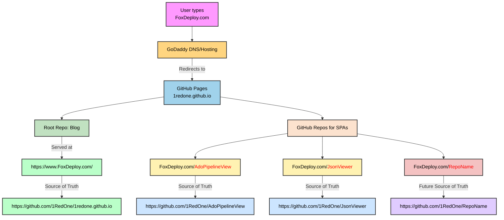

# 🔧 Deployment Notes: AdoPipelineView and other Single page app (SPA) and Blog Integration Details

## 🧠 Context

The FoxDeploy blog  is part of a multi-repo setup used to host:

- 📰 A **Jekyll-based blog** at **https://www.foxdeploy.com/**
- ⚙️ Some **standalone Single Page Applications (SPA)** at:
- - **https://www.foxdeploy.com/AdoPipelineView/**
- - **https://www.foxdeploy.com/ArmJsonOsTargetingConditionParser/**

The SPA and blog are hosted via **GitHub Pages**, but they live in **separate repositories** for clarity and cleaner dev workflows.

---

## 🌐 Domain + URL Structure

| URL | Purpose | Hosted From |
|-----|---------|-------------|
| `https://www.foxdeploy.com/` | Main Jekyll blog | [`1redone.github.io`](https://github.com/1RedOne/1redone.github.io) |
| `https://www.foxdeploy.com/AdoPipelineView/` | Deployed SPA | [`AdoPipelineView`](https://github.com/1RedOne/AdoPipelineView) |
| `https://www.foxdeploy.com/ArmJsonOsTargetingConditionParser/` | Deployed SPA | [`OS Condition Targeting Parser`](https://github.com/1RedOne/ArmJsonOsTargetingConditionParser/tree/main) |

---

## 📦 Where is the SPA code?

The SPA source code is **NOT inside the blog repo** (`1redone.github.io`) — instead, it is located in its own repository:

> [`1RedOne/AdoPipelineView`](https://github.com/1RedOne/AdoPipelineView)
> [`1RedOne/ArmJsonParser`](https://github.com/1RedOne/ArmJsonOsTargetingConditionParser)

This repo builds a single-page app (`index.html`, etc.) and publishes it to GitHub Pages using the classic GitHub pages *DeployFromBranch* model, deploying from the `main` or `master` branches.

You can confirm it is published successfully at:

>https://github.com/1RedOne/AdoPipelineView/settings/pages
>https://github.com/1RedOne/ArmJsonOsTargetingConditionParser/deployments/github-pages

---

## 🔍 Why is this split across multiple repos?

Keeping the SPA separate helps because the main repo for the blog is already bound to the root of the FoxDeploy.com domain name.

These additional repos automatically inherit the FoxDeploy.com domain name when Pages are enabled, allowing their repo name to handle routing.  Some other benefits are :

- Independent deployments (no interference with Jekyll builds)
- Smaller repos, faster CI
- Easier separation of concerns

The blog can safely link to the SPA without needing to embed or bundle it.

#### Traffic Flow Chart



## 🧪 How to test changes to the SPA

If you need to make changes to the SPA:

1. Go to [`1RedOne/AdoPipelineView`](https://github.com/1RedOne/AdoPipelineView)
2. Edit the SPA source files (`index.html`, JS/CSS/etc.)
3. Push to the branch configured for GitHub Pages (e.g., `main`, `gh-pages`, or `/docs`)
4. GitHub Pages will auto-deploy to:

### 🧭 How to Add Additional Single-Page Apps (SPAs) to FoxDeploy

Want to host another standalone tool or SPA at `https://www.foxdeploy.com/YourNewTool/`? Here's the full process:

---

#### ✅ Step-by-Step Instructions

**Step 1: Create a New Repo**  
Make a new GitHub repository for your SPA.  
Give it a name like `CoolNewViewer`, `MyStaticTool`, etc.  
This keeps the app self-contained and versionable.

---

**Step 2: Configure GitHub Pages for the SPA Repo**  
In the **new repo**:

- Go to **Settings → Pages**
- Set the **Source** to:
  - `gh-pages` branch (recommended), **or**
  - `/docs` folder (if using `main`)
- Set the **custom path** to match your desired sub-URL  
  → For example, `/CoolNewViewer/` will publish at:  https://www.foxdeploy.com/CoolNewViewer/


---

**Step 3: Upload the `index.html` File**  
Make sure your repo contains at least: `index.html`

Test your deployment by visiting the live link. You should see your SPA appear at the custom subfolder.

---

**Step 4: Update Blog Navigation**  
In the **main blog repo** (`1redone.github.io`):

- Open: `_data/navigation.yml` or wherever your nav is configured
- Add a new entry pointing to your SPA subpath:
  ```yaml
  - title: Cool New Viewer
    url: /CoolNewViewer/

#### Step 5: Brag with a Blog Post
Write a new post in your blog's _posts folder to:

Announce the new tool 🎉

Explain what it does


Link to https://www.foxdeploy.com/CoolNewViewer/

Boom — you're done. Your new app is live, linked, and documented.
