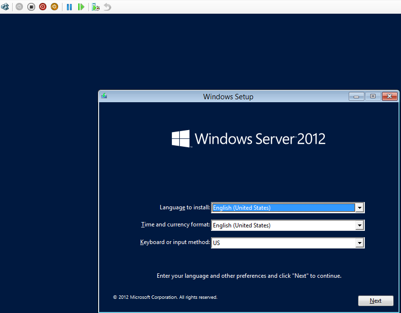
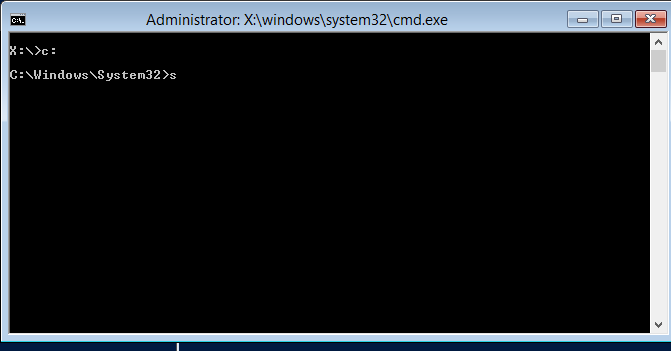
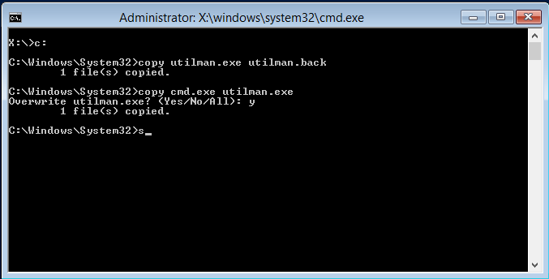
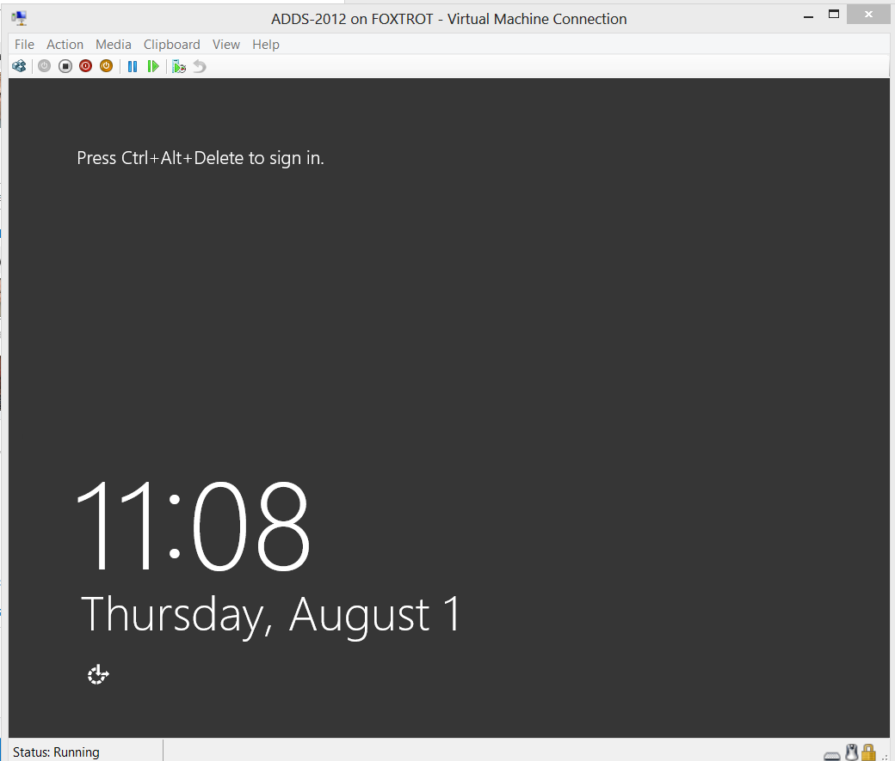
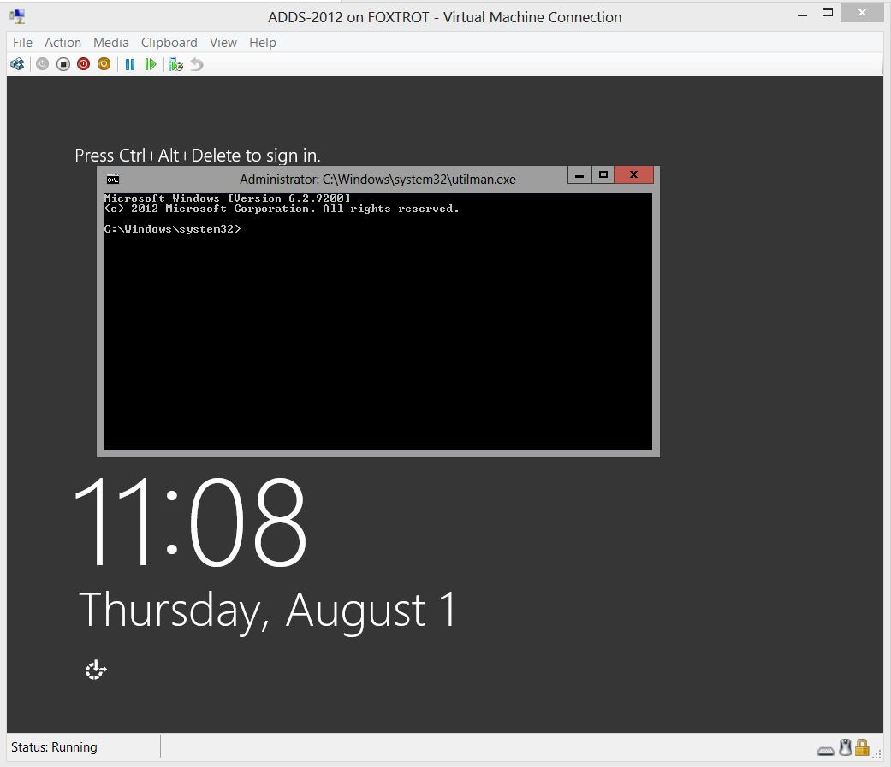
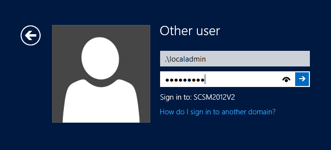
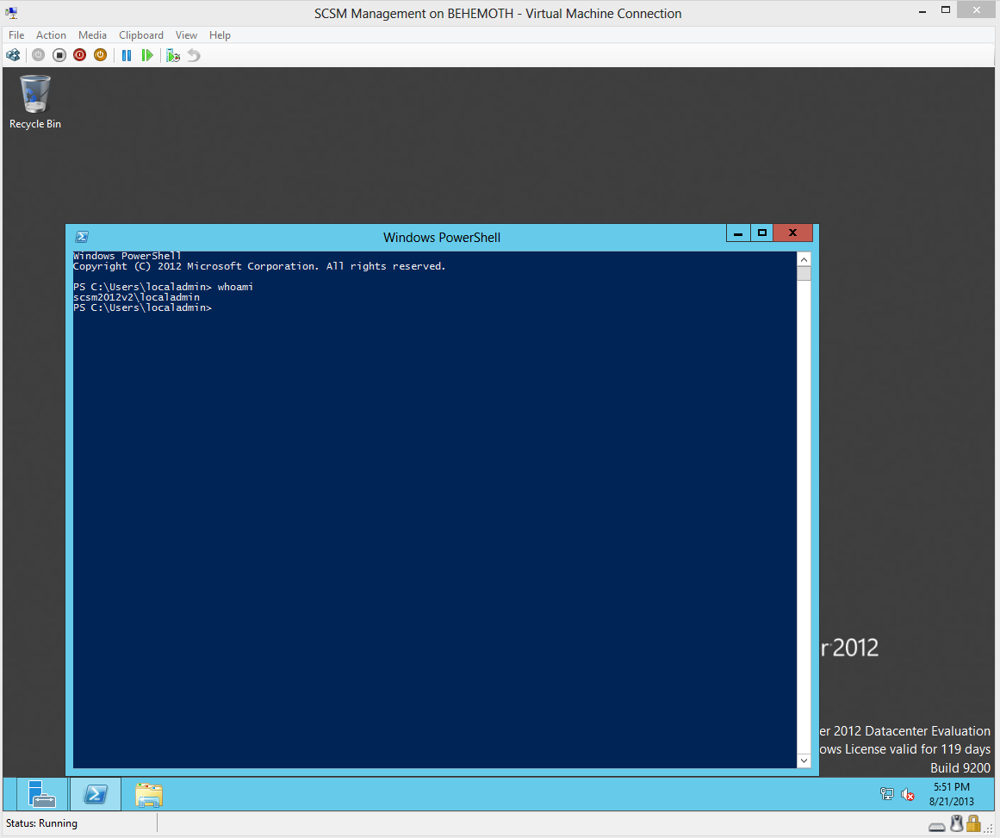
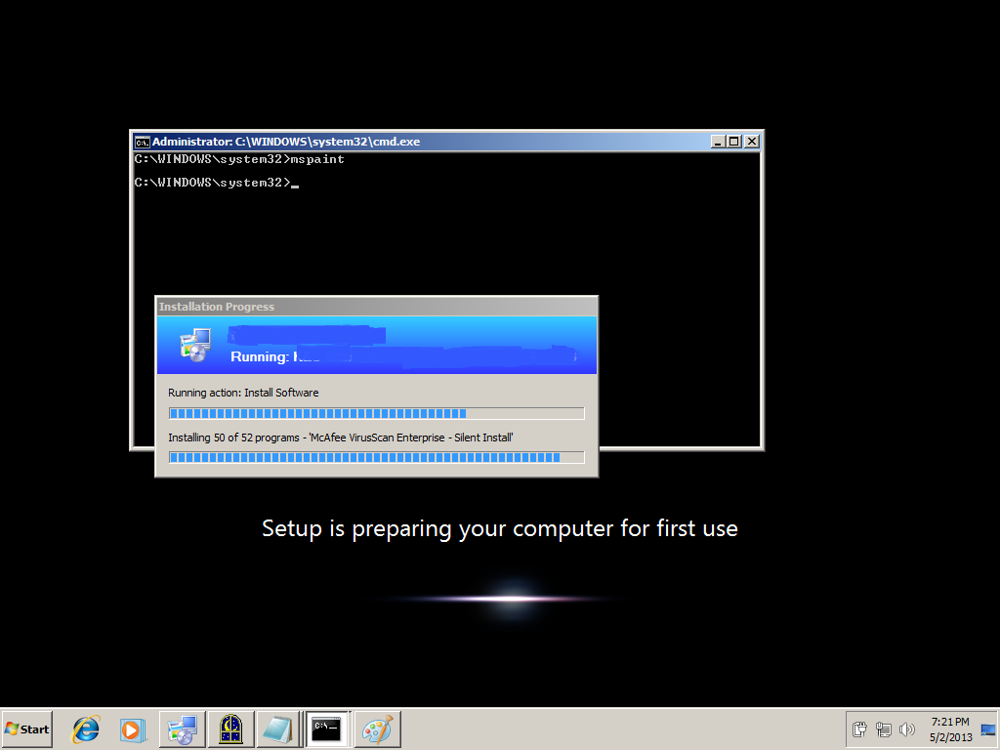

Do you ever get that sinking feeling, when you've forgotten the root password to your test lab?  Again?

I hate it too!  So I decided to figure out a way around it, using an work around.

Reboot your VM with your Windows OS or Server install disc.  Any version will work.

<!--more-->

Hit Shift+F10 for a command prompt.

Next, browse to your windows\\system32 directory.  We're going to make a copy of utilman.exe and replace the original binary with a copy of CMD.exe.  This will allow us to use an ages-old trick to launch a command prompt as the System account from the logon screen.

Once completed, restart the system.

At this point, clicking the Accessibility Icon in the bottom-left hand corner, or hitting left-shift 5 times will call the UtilMan.exe, which we earlier replaced with cmd.exe. This means you now have access to a system authority level account without needing to logon!  You can have a lot of fun with this.  More on that later.

We are now just a few short steps away from a localadmin account.

The quickest way to do this is to create an account:

> net user /add localadmin Dr0wssap!

Now give the account privilege.

> net localgroup administrators localadmin /add

Now simply logon with these credentials.

To save on keystrokes, you can use .\\ notation to log on to the local system.

And you're in!

From here, you can use other means to reset your domain accounts to gain access to your lab again.

As I mentioned earlier, the ability to launch a privileged command prompt at the logon screen allows for some curious behavior.  For instance, if you call Explorer.exe, very interesting things happen.  Not as much fun on Windows Server 2012 or Windows 8.  On Server 2008 or Windows 7, you can have the Start Bar and desktop display over top of the logon screen!

Here is an example of a similar situation, launching Explorer while a Task Sequence is running.

This is also a potent security risk.  It is a reminder of why we always maintain physical control of our servers and encrypt our VM Virtual Hard Drives.  With the new ease of cloning Domain Controllers as VMs, someone might potentially attempt this on a domain controller.  If they are able to log on as the Local System or local Admin account to a DC, there is opportunity for mischief.

I hope this post will be helpful to others.
