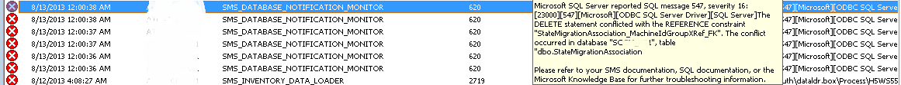
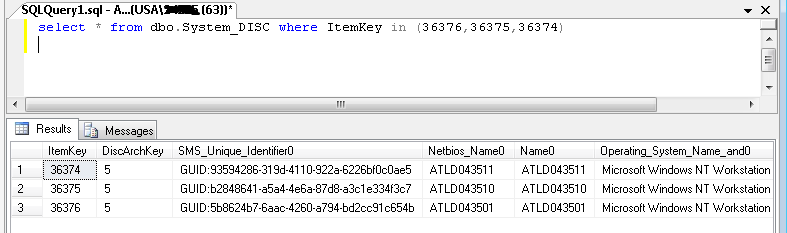
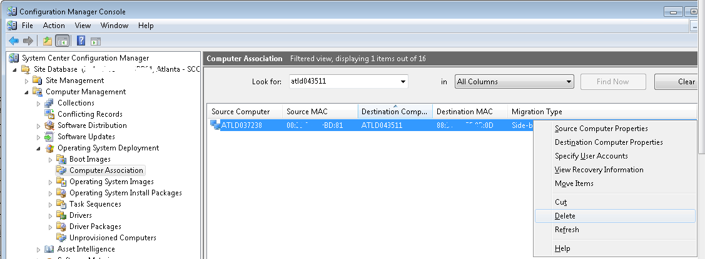

Occasionally you may connect to SCCM and see this lovely sight.



Ah yes, who doesn't love these pretty red icons.  Like little Christmas ornaments.  Anyway, if you're like me, you want an all-green and all-happy SCCM Summary page, and not just because you have a scheduled task or Status Filter to reset counts every thirty minutes.  (If you're doing this, consider yourself admonished!).

So, why does this happen and what does 'The DELETE statement conflicted with the REFERENCE constraint' mean?  We're not DBAs you know!

Well, you will see this sort of message most often if you have the regularly scheduled SCCM Maintenance tasks turned on, specifically the 'Delete Obsolete Client Data' Task.  What is happening is that on the appointed schedule, SCCM attempts to delete all obsolete clients.  However, some Constraint is keeping the operation from completing.

I've seen this commonly when the obsolete computer to be removed is still referenced in a Computer Association.  Uh-oh!  As you will see in the snippet below from the smsdbmon.log file , the StateMigrationAssociation Table is specifically mentioned in the SQL Error message.  It tried to help us, it really did.

```
> Deleting all obsolete clients that have not reported within 3 days.
> 
> \*\*\* delete System\_DISC from System\_DISC where ItemKey = 34879
> 
> \*\*\* \[23000\]\[547\]\[Microsoft\]\[ODBC SQL Server Driver\]\[SQL Server\]The DELETE statement conflicted with the REFERENCE constraint "**StateMigrationAssociation**\_MachineIdGroupXRef\_FK". The conflict occurred in database "SCCM\_TLA", table "dbo.**StateMigrationAssociation**", column 'RestoreClientItemKey'. : System\_DATA\_del
> 
> CDiscoverySource\_SQL::DeleteDiscoveryItem - could not execute sql- delete System\_DISC from System\_DISC where ItemKey = 34879
> 
> \-- SMS\_DATABASE\_NOTIFICATION\_MONITOR 14456 (0x3878)
```


We would see this message every night at first (later every three days when I rescheduled the task because I was sick of seeing the messages.  Shame shame, I know!)  The message would repeat three sets of times, once for each ItemKey, (34879, 35618, 35975).   Well, unfortunately for us, SCCM doesn't natively list the StateMigration ItemKey in the console for our easy deletion.

However, it turns out that if we fire up SQL and then query the dbo.System\_DISC table, we can find the SCCM Resource Name!  (Thanks go out to Vivian Kiarie, she is an amazing SQL DBA and Architect, and very patient as well).

Simply read through your smsdbmon.log for the item keys listed in the error, and add them to the paranthesis at the end.

`select * from dbo.System_DISC where ItemKey in (34879,35618,35975)`



Note the Name0 Column.  This is how the association will appear in the SCCM Console.

Now, open SCCM and go to the Computer Associations area, and delete the offending Computer Associations.  You may find that the Resource in question is either the Source or the Destination for the Computer Association.  No matter, so long as the data has been restored, it is safe to remove the association and get on with life.



The next time that the Delete Obsolete Client Discovery Data Task runs, these records will be removed once and for all.

You're on your way to a happier and healthier SCCM.
