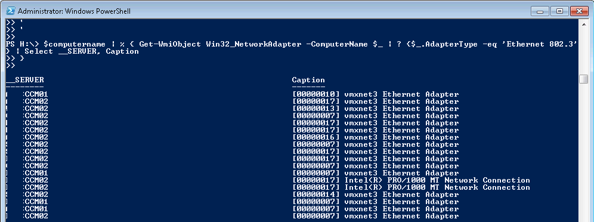

Hi all,

Today I needed to get the remote network adapters for a group of computers, to determine if they all had a common issue.  Rather than RDP into 18 servers, a few characters of Powershell did all the work for me.

In my case, I needed the remote server name, and also the Caption for the NIC.
```
$computername = 1..20 | % {"Server_$($_)" }

$computername | % { 
     Get-WmiObject Win32\_NetworkAdapter -ComputerName $_ | ` 
        ? {$_.AdapterType -eq 'Ethernet 802.3'} 
          | Select __SERVER, Caption }
```

Here is an example of the output.

 


