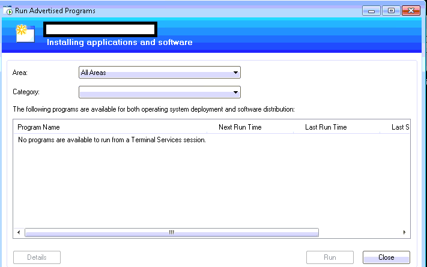
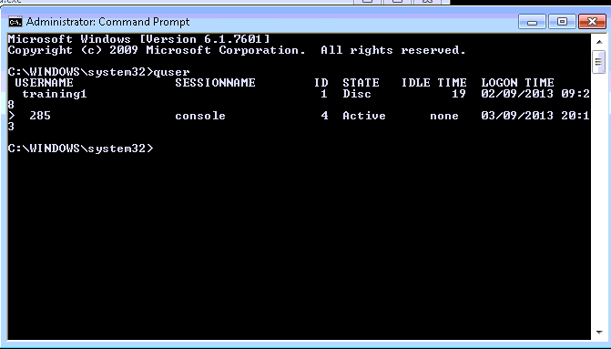
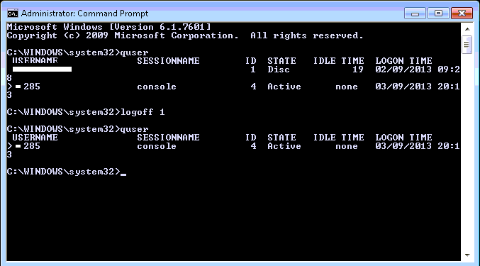
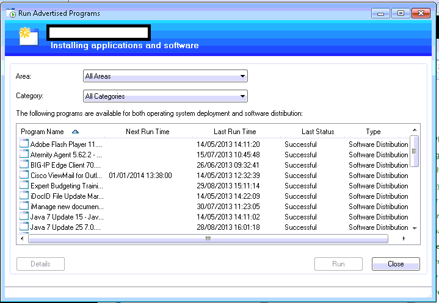

Hey all,

  Another SCCM post here.  You've probably been in this scenario before:  You have a user complaining that an advertisement doesn't work from his/her computer and they are being vague about it.  Typically, we would dive in with SCCM Client Center or read the logs (or status messages from a program, more on that in a bit) to determine what went wrong.  

  During the course of your troubleshooting, you may need to see what is happening on this user's computer, so you Remote in with a tool like LogMeIn ignition or using the Remote Desktop Connection app with the /admin switch ('MSTSC /ADMIN').  

  You attempt to launch the advertisement from Run Advertised Programs, but then you see this:

 "No Programs available to run from a Terminal Services session"

  What?!  This is actually a strange one.  I've been searching around for the real reason behind all this but from what I've gathered thus far, SCCM determines the advertisements displayed to a user under RAP based on the user currently connected to the lowest session number.  If one user logs in to a computer another is already logged onto, RAP will lock the other user from launching software installs with this method.  

 Some people will restart the computer to get around this issue, which is a bit of an overreaction.  If you know your command line basics, you can get RAP up and working again in under 20 seconds!

 Lets use the query user command (QUSER, for short) to see if this is the case.

 Yep, sure enough, someone else was disconnected when we connected using mstsc /admin.  If we note their session ID ('1', in the above screen shot) we can feed this to the logoff command and get rid of their session. 

 Logoff is a bit of a laconic application, and performs its work silently.  Lets try refreshing Run Advertised Programs now and see if it works.

  And now we're back in the running!  Enjoy, hope this helps you out!
