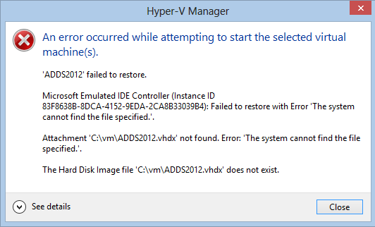
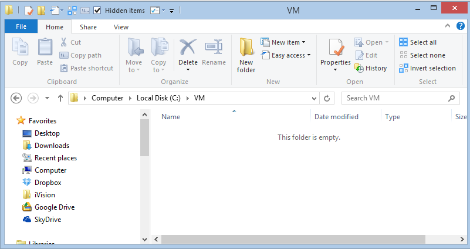
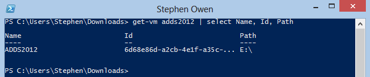
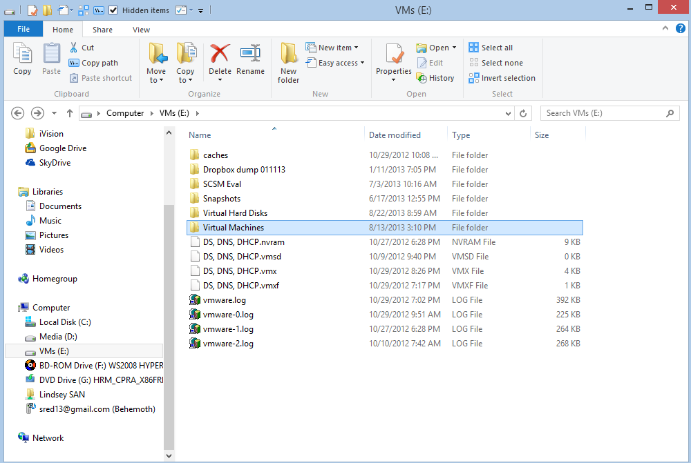
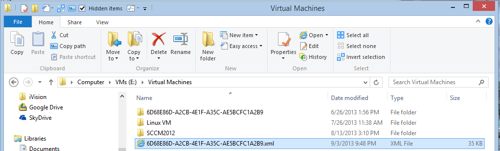
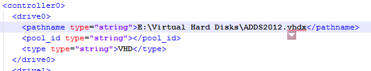
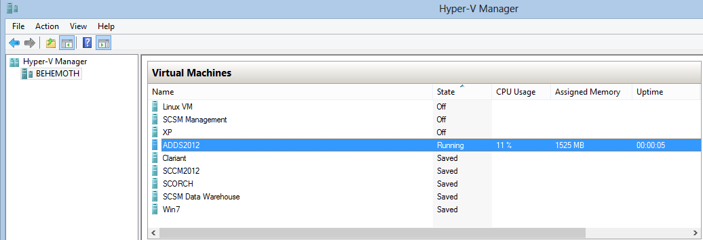

Here is a scenario for you: some lowly admin thinks he will free up space by moving a VHD file, or perhaps you add more storage to your home test lab, and move your VHD files to the new drive.  If you tried this operation while the VM is running, the file copy will fail.

If you try this on saved or shut down VMs, you can definitely move the virtual hard drive (.vhdx file) which will cause the VM associated with it to rather predictably fail when powered on, as seen below.

 

Failed to restore with error The System cannot find the file specified.  
Attachment .vhdx not found. The System cannot find the file specified.  
The hard disk image file does not exist.

Lets verify by going to the path specified.

 

Sure enough, there is no VHD file at the path listed.

Now, lets determine where the VHD file went off to.  Lets use Powershell to track down the VM's ID.

 

Here we are searching for VMs that match the name specified, and then selecting the VM id and the VM Configuration File storage Path (E:\\) in the screenshot above.

Using this [excellent blog post](http://blogs.msdn.com/b/virtual_pc_guy/archive/2010/03/10/understanding-where-your-virtual-machine-files-are-hyper-v.aspx) by Ben Armstrong I determined that the VM configuration files are stored in the Virtual Machines folder on the path specified in the Powershell output (you can also check this using the Hyper-V console)

 Sure enough, we see a Virtual Machines folder in the path specified.

Earlier, we saw that the VM ID was 6D68E..., lets open the configuration file associated with it.

 

Search for the VHD path we gathered from the earlier error message.  You should find this under the <controller#> <drive#> tags in the XML.  Replace the incorrect path with the correct path.  Be sure to omit any single or double quotes.

 

Now save the file, and try to restart the VM again with Hyper-V or Powershell.

 If all went well, you should now see the VM started successfully!

I hope this helps you!
