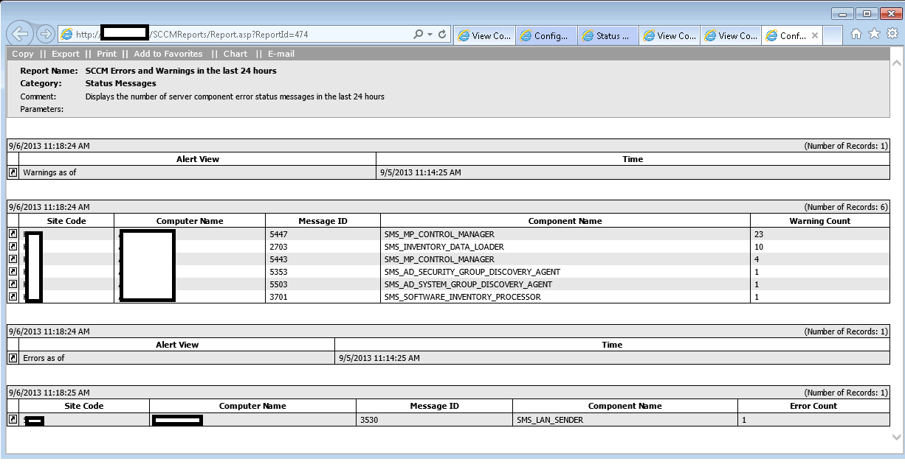
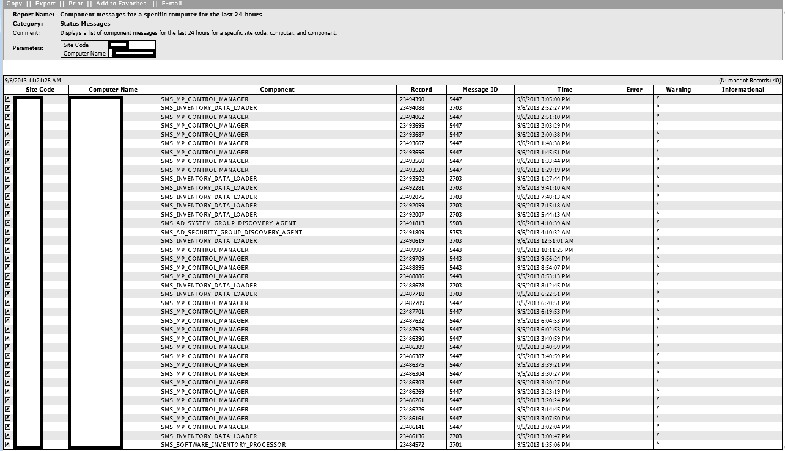
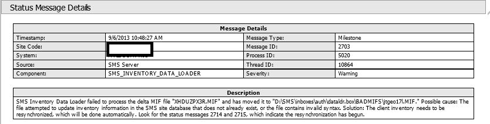

I found myself juggling many different Status Message views in SCCM to try to keep on top of various messages that would arise in one environment.  So I did what anyone would do, and through liberal code-reuse and copy pasting, I reinvented the wheel.

What I've created here is based off of two built-in SCCM reports.  The first, Component Messages for the Last 12 Hours, and Count Errors for the last 12 hours (should be reports 80 and 89).

The output is a three-drill down view as seen here.

 The first page is a collection of a count of messages separates by Warnings and Errors, and then a listing of each grouped by Component ID.

 Clicking the link icon takes you to a listing of the warnings and errors for that site. I tried to transpose the actual message into the fields, but ran into a number of road blocks. Instead, I linked the record ID to the web status message viewer.

 The Standard SQL Web Report Status Message Viewer, fed by the RecordID field from the previous report.

And Viola! It all works!

[Code is available here](../series/snippet-randomSql)