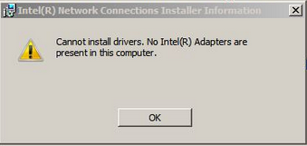
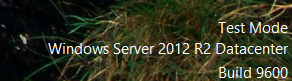
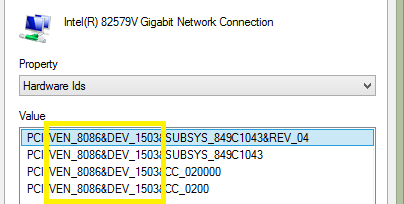
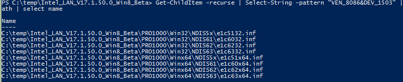
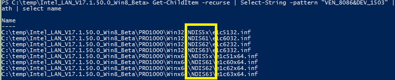
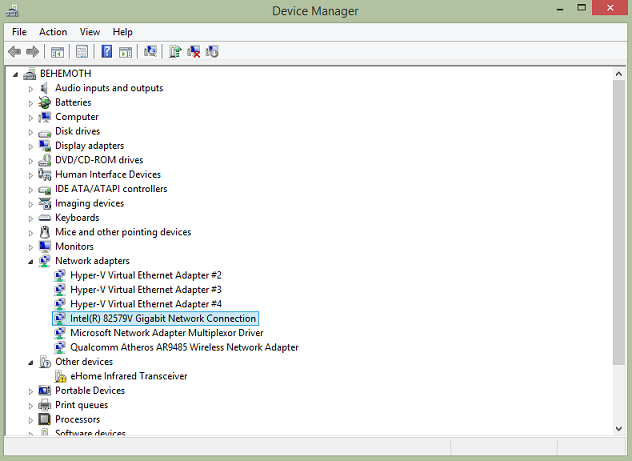

With the release of Server 2012 R2, I decided to rebuild my test lab on the newest of the new.  The 'newy-new' as we call it in the field.

The install of Server 2012 R2 was relatively uneventful.  However, my Ethernet adapter was not detected.  Thinking myself a wise man, I went to the Asus website to find the Ethernet software, however the installation failed with 'OS version not supported'. Such is the life on the bleeding edge.

I then went to the Intel site to download the NIC directly, but this install failed with 'Cannot Install Drivers.  No Intel Adapters are present in this computer'.  Huh?  Well, being resourceful, I began Googling furiously.  I found a number of threads of chatter around related issues for other components (all cited below), and after some experimentation, I got it all working.




*This message was not enough to stop me. I know there is an Intel NIC inside!*

The thing to note here is that the problem is cause when Intel's software attempts to automate the device install, rather than letting Windows handle the installation.  They go so far as to exclude certain device types from automated installation, as you'll see under the \[ControlFlags\] section.  Who knows why this was done, as there seems to be no ill effects from installing this on a Server 2012 R2 system.  It is likely a troubleshooting minimization measure, to keep people from installing drivers for devices that won't work on a particular setup.

We will not be so easily swayed.  : ).  Here is how to alter the .inf files for a device and then put Windows into a test mode which will allow us to force this modified driver into being installed.  You will need:

- The device drivers for your particular device.
    
- Willingness to tamper with and seek a deeper understanding of your computer system.
    
- To take ownership of the fact that things could go wrong in an unexpected manner, and it is not my fault or duty to help you fix it.
    

First, enable test mode and disable driver signing in order to install these hacked drivers.  We'll need to do this because Windows requires signed drivers and will note that our changes to the driver files that we are about to make.

From an Administrative Command prompt:
```
bcdedit -set loadoptions DISABLE\_INTEGRITY\_CHECKS

bcdedit -set TESTSIGNING ON
```
Now, restart the system.  As you see, we are now 'Flying Dirty'


 

This is Microsoft's way of reminding you that you're doing something that you shouldn't be doing.

Open your driver download and extract it somewhere (in my case for an Asus p8z77-v with an Intel 82579V Gigabit NIC).  I've placed my files at `C:\\temp\\Intel\_LAN\_V17.1.50.0\_Win8\_Beta\\PRO1000\\Winx64\\NDIS63`.  You'll want to open the various .inf files until you find the one that contains your Hardware IDs.

If you'd like to automate tracking down the desired driver(wouldn't you!), open up device manager and select the malfunctioning device.  Go to the Details Pane and Select Hardware IDs.


 

Please ignore the fact that the name is detected successfully, I forgot to take a screen shot before I fixed the issue. If you're reading this, your screen will generally look much more jacked up, with frowning device faces everywhere.

We'll use 'VEN\_8086&DEV\_1503'.  This may likely be different on your system.  Armed with our Vendor and device identifier, we will now browse to the directory in PowerShell where we placed the unzipped install files earlier.  Use the following command.
```
Get-ChildItem -recurse | Select-String -pattern "YOURHARDWAREID" | group path | select name
```

 

So nicely sorted. Imagine if we didn't know Powershell and had to manually do all of this \*shudder\*\

This is giving us an output of every .inf file which mentions our device ID by name.  This is very powerful and is saving us a ton of time finding the right file for our situation.  The next few bits just depend on us knowing a thing or two about the system we're using and a bit about Driver Specification history (everyone's favorite topic!)

We're using a 64-bit system, so lets narrow things down to the files made for our architecture, as seen in the third from the left column below.

[](../assets/images/2013/09/images/nichack-1_2.png)

Then the Network Driver Interface Specification (NDIS) that matches our OS, for reference:

<table border="1" cellspacing="0" cellpadding="0"><tbody><tr><td>Version</td><td>Desktop OS</td><td>Server OS</td></tr><tr><td>NDIS 6.0</td><td>Vista</td><td>*</td></tr><tr><td>NDIS 6.1</td><td>Vista SP 1</td><td>Server 2008</td></tr><tr><td>NDIS 6.2</td><td>Windows 7</td><td>Server 2008 R2</td></tr><tr><td>NDIS 6.3</td><td>Windows 8</td><td>Server 2012</td></tr><tr><td>NDIS 6.4</td><td>Windows 8.1</td><td>Server 2012 R2</td></tr></tbody></table>

_Updated on 10/09/2015_

This means we will use the NDIS63 version.



This has narrowed it down to only one file, the e1c63x64.inf file.  If you're a do-it-yourselfer, you can just paste my entry below, taking care to match the section heading.  if you want to know more, check the links below for more detail as to why this works.  The mile-high view is that we're removing the exclusions for our device from Windows Auto Detection, and then copying some bits around.  Or something like that.  Seriously check the links if you have a burning curiosity.
```
<------BEGIN COPY------------>

;\*\*  Unless otherwise agreed by Intel in writing, you may not remove or      \*\*
;\*\*  alter this notice or any other notice embedded in Materials by Intel    \*\*
;\*\*  or Intel’s suppliers or licensors in any way.                           \*\*
;\*\*\*\*\*\*\*\*\*\*\*\*\*\*\*\*\*\*\*\*\*\*\*\*\*\*\*\*\*\*\*\*\*\*\*\*\*\*\*\*\*\*\*\*\*\*\*\*\*\*\*\*\*\*\*\*\*\*\*\*\*\*\*\*\*\*\*\*\*\*\*\*\*\*\*\*\*\*
;
;\*\*\*\*\*\*\*\*\*\*\*\*\*\*\*\*\*\*\*\*\*\*\*\*\*\*\*\*\*\*\*\*\*\*\*\*\*\*\*\*\*\*\*\*\*\*\*\*\*\*\*\*\*\*\*\*\*\*\*\*\*\*\*\*\*\*\*\*\*\*\*\*\*\*\*\*\*\*

; e1c63x64.INF (Intel 64 bit extension Platform Only,
; Windows 8 64 bit extension)

;
; Intel(R) Gigabit Network connections
;\*\*\*\*\*\*\*\*\*\*\*\*\*\*\*\*\*\*\*\*\*\*\*\*\*\*\*\*\*\*\*\*\*\*\*\*\*\*\*\*\*\*\*\*\*\*\*\*\*\*\*\*\*\*\*\*\*\*\*\*\*\*\*\*\*\*\*\*\*\*\*\*\*\*\*\*\*\*
;

\[Version\]
Signature   = "$Windows NT$"
Class       = Net
ClassGUID   = {4d36e972-e325-11ce-bfc1-08002be10318}
Provider    = %Intel%
CatalogFile = e1c63x64.cat
DriverVer   = 03/29/2012,12.1.10.0

\[Manufacturer\]
%Intel%     = Intel, NTamd64.6.2, NTamd64.6.2.1

\[ControlFlags\]
;ExcludeFromSelect = \\
;    PCI\\VEN\_8086&DEV\_1502,\\
;    PCI\\VEN\_8086&DEV\_1503

\[Intel\]

\[Intel.NTamd64.6.2.1\]
; DisplayName                   Section              DeviceID
; -----------                   -------              --------
%E1502NC.DeviceDesc%            = E1502.6.2.1,       PCI\\VEN\_8086&DEV\_1502
%E1502NC.DeviceDesc%            = E1502.6.2.1,       PCI\\VEN\_8086&DEV\_1502&SUBSYS\_00011179
%E1502NC.DeviceDesc%            = E1502.6.2.1,       PCI\\VEN\_8086&DEV\_1502&SUBSYS\_00021179
%E1502NC.DeviceDesc%            = E1502.6.2.1,       PCI\\VEN\_8086&DEV\_1502&SUBSYS\_80001025
%E1503NC.DeviceDesc%            = E1503.6.2.1,       PCI\\VEN\_8086&DEV\_1503
%E1503NC.DeviceDesc%            = E1503.6.2.1,       PCI\\VEN\_8086&DEV\_1503&SUBSYS\_00011179
%E1503NC.DeviceDesc%            = E1503.6.2.1,       PCI\\VEN\_8086&DEV\_1503&SUBSYS\_00021179
%E1503NC.DeviceDesc%            = E1503.6.2.1,       PCI\\VEN\_8086&DEV\_1503&SUBSYS\_80001025
%E1503NC.DeviceDesc%            = E1503.6.2.1,       PCI\\VEN\_8086&DEV\_1503&SUBSYS\_04911025

\[Intel.NTamd64.6.2\]
; DisplayName                   Section        DeviceID
; -----------                   -------        --------
%E1502NC.DeviceDesc%            = E1502,       PCI\\VEN\_8086&DEV\_1502
%E1502NC.DeviceDesc%            = E1502,       PCI\\VEN\_8086&DEV\_1502&SUBSYS\_00011179
%E1502NC.DeviceDesc%            = E1502,       PCI\\VEN\_8086&DEV\_1502&SUBSYS\_00021179
%E1502NC.DeviceDesc%            = E1502,       PCI\\VEN\_8086&DEV\_1502&SUBSYS\_80001025
%E1503NC.DeviceDesc%            = E1503.6.2.1,       PCI\\VEN\_8086&DEV\_1503
%E1503NC.DeviceDesc%            = E1503.6.2.1,       PCI\\VEN\_8086&DEV\_1503&SUBSYS\_00011179
%E1503NC.DeviceDesc%            = E1503.6.2.1,       PCI\\VEN\_8086&DEV\_1503&SUBSYS\_00021179
%E1503NC.DeviceDesc%            = E1503.6.2.1,       PCI\\VEN\_8086&DEV\_1503&SUBSYS\_80001025
%E1503NC.DeviceDesc%            = E1503.6.2.1,       PCI\\VEN\_8086&DEV\_1503&SUBSYS\_04911025

;===============================================================================

;                WINDOWS 8 for 64-bit EXTENDED PLATFORMS

;
;===============================================================================

<-----------Please stop copying---------->
```

If you're the trusting sort, you can just click this link for the Complete inf [https://dl.dropboxusercontent.com/u/6268163/e1c63x64.inf](https://dl.dropboxusercontent.com/u/6268163/e1c63x64.inf)

Now, go back to device manager, select the errant device and Update Driver, pointing it to the directory that contains our modified driver.  If all went well, you should see the device begin to install automatically!

  
 

Yay, Happy Device Manager. 'Whats up with that missing 'e-home transceiver?' Um...this is more of a do as I say, not as I do situation.

Don't forget to disable test mode when you're finished, with this command.
```
bcdedit -set loadoptions ENABLE\_INTEGRITY\_CHECKS
bcdedit -set TESTSIGNING OFF
```
Sources:

[http://homeservershow.com/forums/index.php?/topic/4025-intel-82579v-nic-on-ga-z77x-ud5h-and-other-motherboards-with-server-oss/](http://homeservershow.com/forums/index.php?/topic/4025-intel-82579v-nic-on-ga-z77x-ud5h-and-other-motherboards-with-server-oss/)

[https://communities.intel.com/thread/21118](https://communities.intel.com/thread/21118)

[http://laslow.net/2012/03/14/disable-driver-signature-enforcement-in-windows-8-cp/](http://laslow.net/2012/03/14/disable-driver-signature-enforcement-in-windows-8-cp/)

[sixcolumns.com/t/how-to-disable-and-bypass-driver-signature-enforcement-in-windows-8/151/2](http://sixcolumns.com/t/how-to-disable-and-bypass-driver-signature-enforcement-in-windows-8/151/2)
