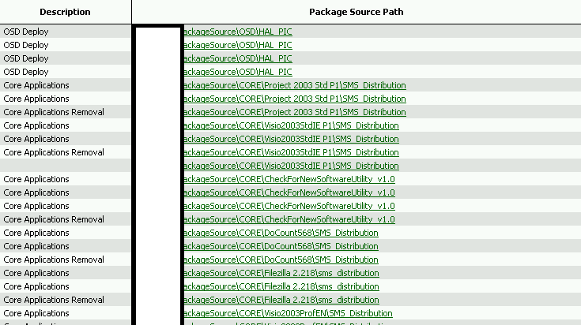

I recently had a requirement at a client to make a list of all SCCM Packages. their Programs,  and then the command lines of each, along with the package source.  I wondered if this was possible, and fortunately the SQL Views were already present to do so.
<!--more-->
This ended up being a very short query: 

```sql
SELECT Program.PackageID, 
      Package.Name 'Package Name', 
      Program.ProgramName 'Program Name', 
      Program.CommandLine, Program.Comment, 
      Program.Description,
      Package.PkgSourcePath 
FROM v_Program as Program 
  LEFT JOIN v_Package as Package 
    on Package.PackageID = Program.PackageID
Order by Program.PackageID

```
 And the output  Some of these command lines were VERY long, so it came out a bit wide.:


