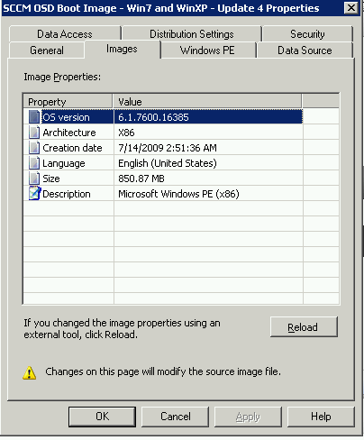

I ran into an issue at a client in which the person who setup their SCCM infrastructure left and I needed to determine which version of WinPE we using for our Task Sequence.

You can see the WinPE OS version under **Computer Management\\Operating System Deployment\\Boot Images\\Boot Image Name**, Properties, but that doesn't really tell you which version of Windows PE you are using, and you might need to know that from time to time.  For instance, if you're using Dell or HP's Driver CAB files, they are distributed based on WinPE version for underlying OS compatibility.
<!--more-->

The primary difference in WinPE versions is the core kernel code that WinPE is built from.  This is important to note, as certain utilities may not work on older versions of WinPE.

In case you haven't memorized all of the system major release version numbers of Windows, I've complied the below chart to assist you, slacker.

<table border="1" cellspacing="0" cellpadding="0"><tbody><tr><td>WinPE Version #</td><td>PE Version</td><td>Derived From</td></tr><tr><td>WinPE 1.5</td><td>5.1.x</td><td>Win XP SP2</td></tr><tr><td>WinPE 2.0</td><td>6.0.x</td><td>Vista</td></tr><tr><td>WinPE 3.0</td><td>6.1.7600.16385</td><td>Windows 7</td></tr><tr><td>WinPE 4.0</td><td>6.2.x</td><td>Windows 8</td></tr><tr><td>WinPE 5.0</td><td>6.3.x</td><td>Windows 8.1?</td></tr></tbody></table>
