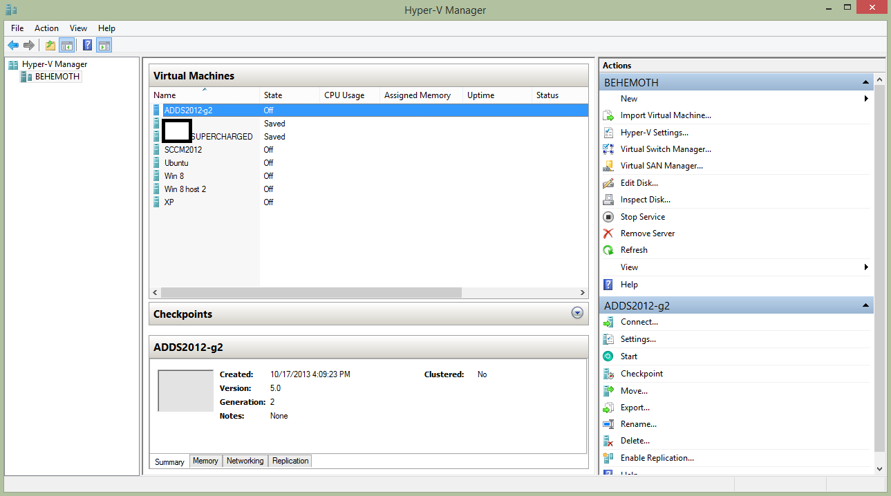
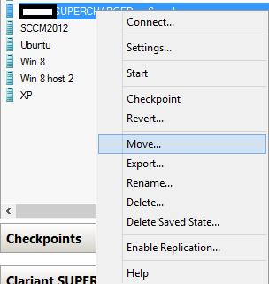
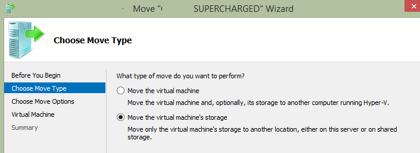
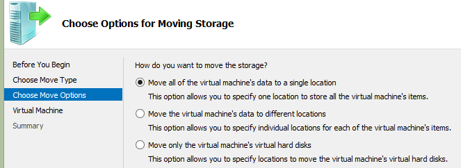
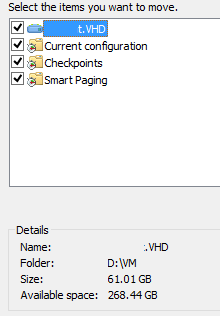

Hi all,

Don't be a dummy, use the fantastic tools built-in to Hyper-V 2012 to make it easy to migrate your VMs onto new storage or over to a new host.  Never mess with copying .vhdx or configuration files again.

I rebuilt my storage in my test lab, making use of Storage Tiering in Storage Spaces to pool two 64 GB SSDs and one 1.5 TB HDD to get the best of both high-speed read and writes and bulk storage without needing to move my files around manually.  The tiering aspect of Storage Spaces will detect which files are most used and then automatically merge them into the faster speed SSD from bulk, how cool is that!
<!--more-->

In any case, I needed to move my VMs over to this new storage, and this is how I did it:

Begin by opening up Hyper-V

 

Select the VM you want to move and, well, choose move.

 Select Move to start the Wizard

 

The top option is used to migrate to another Hyper-V host, use the bottom to move within the same host

 

Use the second option to individually migrate files to alternate locations. Also useful to see where your configurations are stored.

 

In this example, we can see that the VHD is stored on the D:\\ Drive

Now you're just a few quick clicks away from moving all of your VMs to your new storage.  This is pretty much the right way to do this, as opposed to the wrong way I had to recover from, which I covered in a previous post.

# This supports live Storage Migrations too!

So you can do this while the VMs are running.  Very cool.
