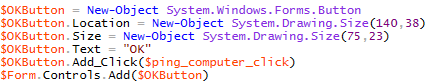
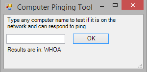
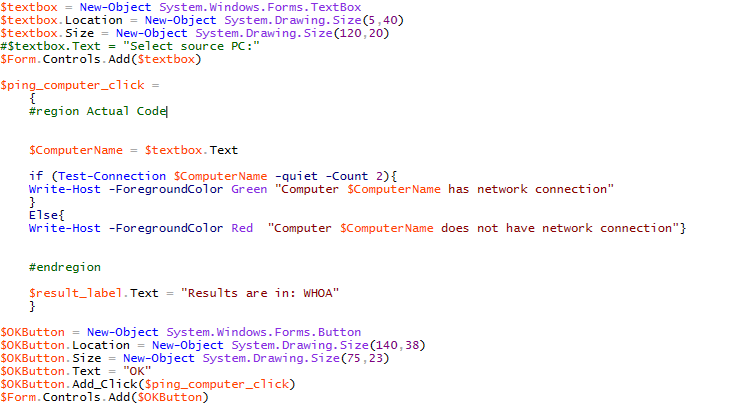
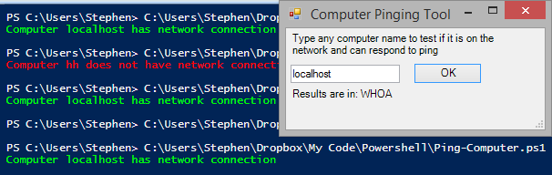
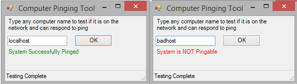

**This post is part of the Learning GUI Toolmaking Series, here on FoxDeploy. Click the banner to return to the series jump page!**

* * *

**Update! this post was previously titled 'Continued: CREATING A GUI NATIVELY FOR YOUR POWERSHELL TOOLS USING .NET METHODS'.  It has been renamed and cleaned up with better descriptions.**

When we left off, we had a nice fancy UI that didn't do anything! This session, we'll link our pinging code from before into our GUI, and then update the contents on the screen as part of the process.

Once we're done with this, we'll experiment with some of the other controls available, and then customize things a bit more.

To begin, one thing I wanted to draw attention too is a strange behavior I've noticed when using this method of making a GUI. Remember this bit, with the `$ping_computer_click` behavior specified?



Currently this is telling PowerShell 'When this button is clicked, execute the contents of the variable named `$Ping_Computer_click`'.  Since this variable is empty, nothing is going to happen.  Let's go ahead and populate the behavior for clicking the Ok button.   Have it change the value of the $result\_label.Text field.   Add the following after the $results\_label section:

```powershell
$ping_computer_click ={ $result_label.Text = “Results are in: WHOA”} 
```

Alright, now save it and give it a try. See, nothing happened when you clicked the button!

Why is this?  I'm sorry I mislead you.  It's because given the current flow of the script, the variable is empty at the time that it is added to the form.  This means that the flow of the variables associated with various actions on your GUI matters.  To have this actually work, move the code for $ping\_computer\_click to just before the $results\_label section, and give it a try.

 

Clicking the OK button changes the value of the text! Sweet!

Okay, cool, it works.  Now to move our earlier code for the pinging function into the space of the `$ping\_computer\_click` variable, and uncomment it, and while we're at it, lets change the value of `$ComputerName` from Read-host "blah blah blah" to `$textbox.Text`​.  You should have something similar to the following:

 

A screen shot of text; this isn't very efficient.

Alright, and now if we test it (let's use 'localhost' to guarantee the test completes) we should see…

 The test completes and we get console output of what happened. Nice!

Now let's add a status bar to the tool, so the user will have feedback when the button is pressed.


```powershell
$statusBar1 = New-Object System.Windows.Forms.StatusBar 
$statusBar1.Name = "statusBar1" 
$statusBar1.Text = "Ready..." 
$form.Controls.Add($statusBar1)
```
Then, under the `$ping_computer_click` section, add this line to the top and the other to bottom:

<table border="1" cellspacing="0" cellpadding="0"><tbody><tr><td>Top</td><td>$statusBar1.Text = "Testing..."</td></tr><tr><td>Bottom</td><td>&nbsp;$statusBar1.Text = "Testing Complete"</td></tr></tbody></table>

We'll also update the logic from the earlier pinging test to have it update the values of the Results label with a message for whether or not the process completed, and also spruce things up with a little color.


```powershell
$ping_computer_click = { #region Actual Code

$statusBar1.Text = “Testing…” $ComputerName = $textbox.Text

if (Test-Connection $ComputerName -quiet -Count 2){ 
    Write-Host -ForegroundColor Green “Computer $ComputerName has network connection” 
    $result_label.ForeColor= “Green” 
    $result_label.Text = “System Successfully Pinged” 
  } 
Else{ 
    Write-Host -ForegroundColor Red “Computer $ComputerName does not have network connection” 
    $result_label.ForeColor= “Red” $result_label.Text = “System is NOT Pingable” 
  }

$statusBar1.Text = “Testing Complete” #endregion }
```
And the final result!



Some final notes: • If you don't want the user to be able to resize your beautiful tool, then simply set $form.MaximumSize and $form.MinimumSize equal to $Form.Size. • In order to have the enter button map to clicking the Okay button, we need to move and alter the following lines to the bottom of the #drawforms region:

```powershell
$Form.Add_KeyDown({
    if ($_.KeyCode -eq "Enter"){
        & $ping_computer_click}}
) 
$Form.Add_KeyDown({if ($_.KeyCode -eq "Escape"){$Form.Close()}})
```
The Ampersand (&) has a special meaning in PowerShell.  It means Invoke, or Execute.  If we didn't use this, PS would attempt to display the content of the variable instead.

I hope you've enjoyed this demonstration/walkthrough. In a future post, I'll demonstrate how to change the icon, add additional controls like auto populating drop-down menus and scroll bars. I'll also show you how to customize and brand your tools, so everyone you work with will know how cool you are.  If you REALLY love making GUIs for your tools, we should accept that this is kind of like coding a full webpage in Notepad or a front end in without the benefit of a modern IDE.  Sure, it is cool that you can do it but there are better ways.  So, if this is the sort of thing you enjoy, I'd highly recommend you take a look at PrimalScript's tools, particularly PrimalGUI.  It makes creating a front-end for your tools a snap.  More building with less guessing of pixel sizes.  Its a win-win!

You can find the completed full script here     [[Completed Script Ping-Tool.ps1](http://foxdeploy.com/code-and-scripts/completed-script-ping-tool-ps1/ "Completed Script Ping-Tool.ps1")]`
