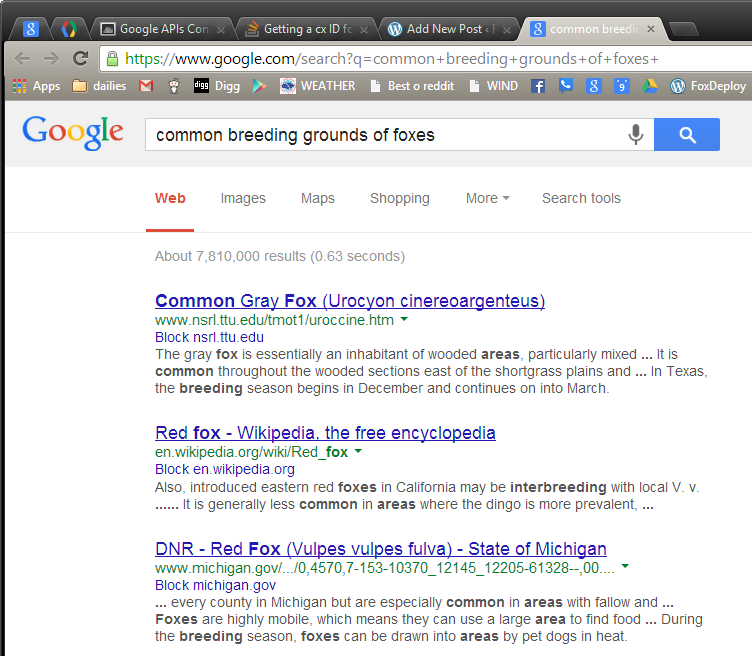

Hi guys,

In this two-part series, I'll demonstrate how I created a quick little function to launch a new Google search from the command line using Powershell.  It started with me being annoyed that looking up the maximum RAM for my motherboard was a multistep process, first using **Get-WmiObject Win32\_BaseBoard | Select Product**  and then Googling it to see the max RAM.  I wanted to start a search right from the Powershell window!

To start off, I wanted to make a function accept infinite number of characters with spaces as an argument.  This became a problem as PowerShell uses spaces to delimit parameters, so I had to get a bit clever.  I didn't want to have to create thirty or more parameters in my function header to accept all of the possible names.  I got around this by using the $args variable, which alongside the $input variable can be used to handle either Pipeline Input or the function being called itself with parameters.  Using $input leads to another problem--For here there be dragons!--the $input automatic variable is NOT an array, but rather a construct known as an enumerator.  That means two things:

1. Unless you call its .Reset() Method, you can only access its value a single time.  One time use!
2. You cannot use it in the Begin phase of your functions, only in the Process.

If you want to really learn about how weird these things are, check out these blogs posts here about them.

- [http://dmitrysotnikov.wordpress.com/2008/11/26/input-gotchas/](http://dmitrysotnikov.wordpress.com/2008/11/26/input-gotchas/)
- [http://social.technet.microsoft.com/Forums/windowsserver/en-US/f3cf450b-6d3b-45d6-8c88-b9a600604e63/powershells-input-automatic-variable?forum=winserverpowershell](http://social.technet.microsoft.com/Forums/windowsserver/en-US/f3cf450b-6d3b-45d6-8c88-b9a600604e63/powershells-input-automatic-variable?forum=winserverpowershell)
- [http://www.powertheshell.com/input\_psv3/](http://www.powertheshell.com/input_psv3/)

With all of that in mind, I instead created a structure in the script to detect if there are arguments present, and if not, set $args equal to the values in $input by means of classing $input as an array (this means throwing an @ sign at the front, and robing it in a nice warm pair of parentheses), and then running the .Split() Method on $args, to give us separate objects (necessary to build a URL).

The code reads the content of $args (which will be similar whether the function receives a parameter or pipeline input) and then for each object in $args, throws it onto a $query variable with a plus sign at the end of it.  In the last step of the code, $query is substringed to remove a dangling plus sign, and then committed to $url, which is then invoked using the Start command, to open in your browser of choice.

Here is the code.

```powershell
`<# .Synopsis Searches the Googes .DESCRIPTION Lets you quickly start a search from within Powershell .EXAMPLE Search-Google Error code 5 --New google search results will open listing top entries for 'error code 5'` `.EXAMPLE search-google (gwmi win32_baseboard).Product maximum ram`

``If you need to get the maximum ram for your motherboard, you can even use this type of syntax #> function Search-Google { 
  Begin { 
      $query='https://www.google.com/search?q=' 
      } 
  Process { 
    if ($args.Count -eq 0) {
      "Args were empty, commiting `$input to `$args" 
      Set-Variable -Name args -Value (@($input) | % {$_}) 
      "Args now equals $args" $args = $args.Split() 
    }
    ELSE { 
      "Args had value, using them instead" 
    }

    Write-Host $args.Count, "Arguments detected" "Parsing out Arguments: $args" for ($i=0;$i -le $args.Count;$i++){ $args | % {"Arg $i `t $_ `t Length `t" + $_.Length, " characters"} }``

    $args | % {$query = $query + "$_+"}`

  } 
  End { 
    $url = $query.Substring(0,$query.Length-1) 
    "Final Search will be $url `nInvoking..." 
    start "$url" 
  } 
}
```

   And here is the result.


And a new browser tab was born...



 

In the end, you can use this to get the maximum RAM, just as I wanted to!

> search-google (gwmi win32_baseboard | select -expand Product) maximum ram

If you want to add this to your default Powershell window (and why wouldn't you?), simply add it to your PowerShell Profile, which is launched every time you open the program.