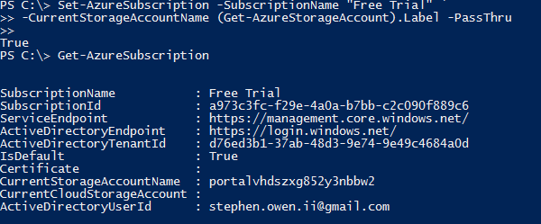
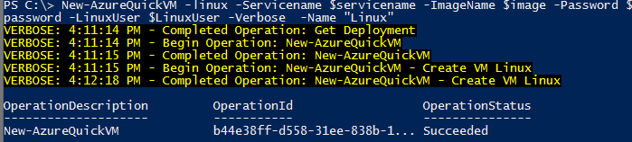
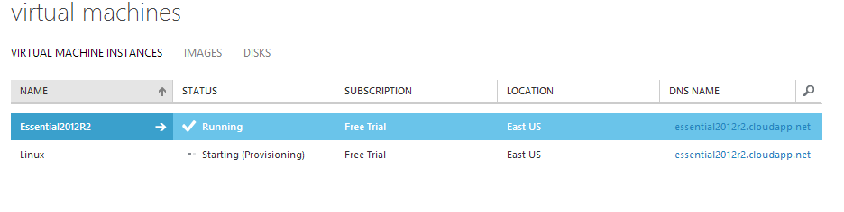

I was trying to make a new Linux VM using the Azure PowerShell commandlet New-AzureQuickVM, which basically makes a VM very quickly for you using one of the images available in the catalog.  However, I kept running into this message:

> New-AzureQuickVM : CurrentStorageAccountName is not accessible. Ensure the current storage account is accessible and in the same location or affinity group as your cloud service.
<!--more-->

Now, when you first create a VM in the Azure Web Console, you'll be prompted to create a Storage Account if you don't already have one.  Assuming you've done so, the first thing you should check is to see if the Storage Account is defined within your Azure Subscription.  From Powershell, run the \[code language="powershell" light="true"\]Get-AzureSubscription\[/code\] Command.

](../assets/images/2013/12/images/nostorageaccount01.png) Note that there is no CurrentStorageAccountSpecified

Ah, that will definitely cause an issue.  We need to get the StorageAccountName and register it to our current subscription.  You can query the names of all of your Azure Storage Accounts with Get-AzureStorageAccounts.

 We need the label of this storage account.

We need the name under 'Label'.  We now need to set this value on our Azure Subscription using the Set-AzureSubscription commandlette.  For cool points, we're going to specify the name on the parameter by calling a lazy property of a nested command.  Sounds fancy, right?

```
Set-AzureSubscription -SubscriptionName "Free Trial" `
   -CurrentStorageAccountName (Get-AzureStorageAccount).Label -PassThru
```

We're using a dash to wrap the command around, and using the PassThru switch to tell the command to provide us some output that something actually happened. (not really true, PassThru actually is a switch available on many commandlettes that prompts the function to create a PowerShell object and pipe it on the next element in the Pipeline.  If it is the last one in a pipeline, though, this output will dump be default into Out-Host)  If all goes well, you should be able to check that value was saved by running Get-AzureSubscription again.  I've placed both commands on the same screen to keep down the number of screenshots.

 Top: Setting the Label Property of the results from the Get-AzureStorageAccount command as the value for the -CurrentStorageAccountName.  
Bottom: Checking that our changes stuck.

And now, lets try to make that VM. The New-AzureQuickVM command has a few mandatory parameters, namely $ServiceName, $ImageName, Password and LinuxUser.  Service name is the name of the Cloud Service you've made in Azure, while ImageName is the name of the image you want to use for this VM (you can see the full list of images by using the Get-AzureVMImage commandlette), Password is your Azure Password and LinuxUser is the name of a user account to be given root permissions, and finally Name is the name of the VM.  To make this easier on yourself, specify all of these values in variables first.  Go ahead and throw on a -Verbose switch to get some detailed information about the tasks at hand.

 

If you don't go verbose, it is hard to tell if anything happened.

Now, go to your Azure management console and wait just a few moments.  You'll see the VM appear in real time.  Very, very cool.

images 

The VM will appear in real time!

By default this will create and start a 'Small' sized VM, which will cost you $46 a month on a base level subscription.  Keep this in mind as you begin scripting the creation of VMs unless you can pay for it.
