Sure, it's fun to go into Azure and see all of the cool supported operating system images you can have running in mere minutes.  But it is even cooler to take your own internal server or data image and upload that to Azure to use in your VMs.  It is even cooler to do it all with PowerShell!  If the demo gets a bit technical, be sure to skip to the end for my concluding notes.
<!--more-->

If you don't have your Azure account accessible from the command line, first of all you should install the Windows Azure PowerShell pack available [http://www.windowsazure.com/en-us/downloads/](http://www.windowsazure.com/en-us/downloads/).  Launch an Azure PowerShell prompt and then run Add-AzureAccount and login

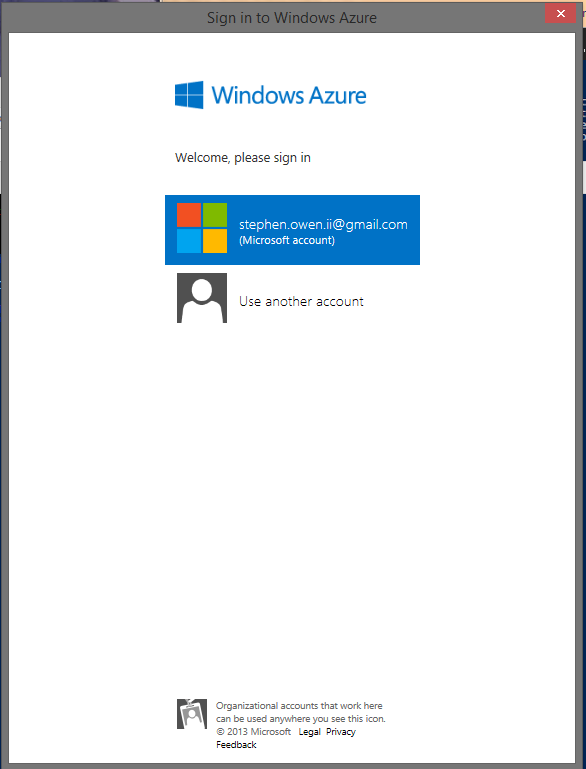 What a nifty interface, I'd love to steal--er--aggressively borrow this UI element for my own PowerShell tools!

 

## The Demonstration

For this example, let's pretend we have a VHD with important customer data we'll need to access in our worker VMs from within Azure.  Go to Disk management and get our VHD made.  For the sake of data transit, we'll make a small VHD and load it up with important customer data!

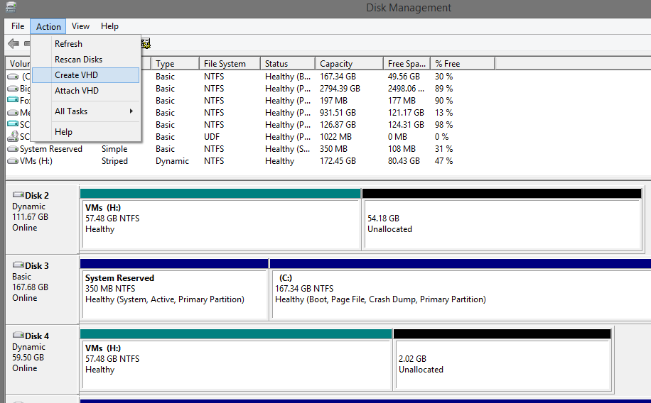 Hopefully you knew you could make a VHD like this

Now, attach the VHD to one of our systems and format it, and you can load it up with whatever data your VMs will need to do meaningful work.  Let's take a second and think through this scenario.

This could be a copy of your customer order database, or an important SQL backup you might need for auditing reasons, or maybe it's your standard server image for a VM in your internal server cluster/private cloud and you want to use it in Azure too.  Ours in the picture below is loaded with the important files we need to do work here at FoxDeploy.

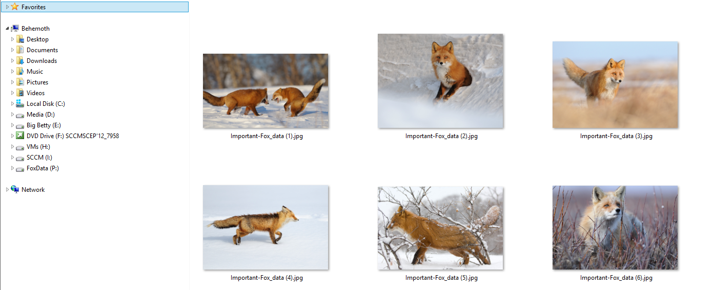

Very important customer data!

 Now, to push this image off over the wire and out to the blue skies of Azure.  We'll need to get the URL of our Storage account, so the commands will know where to put the file.  Run Get-AzureStorageAccount, making note of the URLs provided under Endpoints:

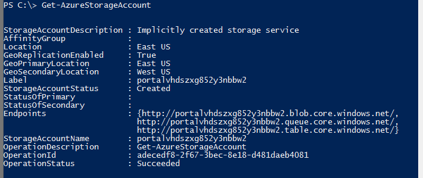

Or, go to your Storage control panel under the Azure Console.

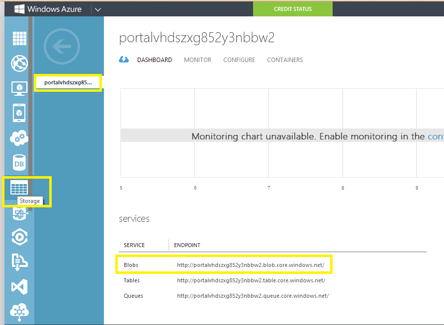

The URL that contains the word 'blob' will be the URL we'll need to note for later on.  But wait--you ask-- what is a blob?  Well, a blob is an unstructured type of data storage.  It relies on containers but it is not a hierarchical storage system.  Confused?  Me too.  Check out [this link](http://www.windowsazure.com/EN-US/develop/net/how-to-guides/blob-storage/#what-is "What is a blob?") from Microsoft on the topic.

Next, we'll need to import a Publishing certificate into our PowerShell session.  We'll do this by using the Get-AzurePublishSettingsFile Commandlette, which will launch a window in our browser of choice and allow you to download a .cer file to use for uploading data to Azure.

 This opens when you run 'Get-AzurePublishSettingsFile'.  Maybe I'm easily impressed, but I love that these commandlettes will spawn a .net window or a browser session and never seem to lose track of sessions or cookies.

We then use the Import-AzurePublishSettingsFile commandlette, making sure to specify the path to our just-downloaded file.  Use the following syntax:

`Import-AzurePublishSettingsFile -PublishSettingsFile $Path_to_publish_settings_file.`

Now, let's use the Add-AzureVHD Commandlette.  I've captured my values in variables, but for reference:

](../assets/images/2013/12/images/uploadvhd_06.png) A new method I came up with to display the contents of a command. Is this helpful?

](../assets/images/2013/12/images/uploadvhd_07.png) And our image if off to Azure!

Now we have our data in Azure, so we can safely pull it down again if we'd like to.  If you want to, you could even upload a second copy and place it in a different geographical location.  Did I mention that Microsoft keeps three copies of every VHD you upload to Azure?  Say hello to your Cloud-Based Geo-Redundant backup solution!  And I'm using all of this tech to store fox pictures…

Having the VHD in Azure is cool, but if we want to use this on one of our VMs, we'll need to move the VHD over from the upload's container to the VHD's container.

We'll use the Start-CopyAzureStorageBlob commandlette to move it on over.

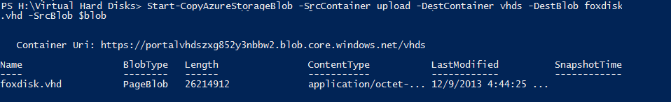

Finally, lets add this to our disk repository by using Add-AzureDisk with the -Medialocation parameter specified as the URL of our .vhd in the VHDs folder, and -DiskName as the name we'd like our Disk to have in the Azure console.  This will give our beloved VHD a special place in the hallowed halls of the Azure Image Catalog for our account.

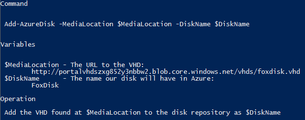 A breakdown of what is about to be run in the next screenshot

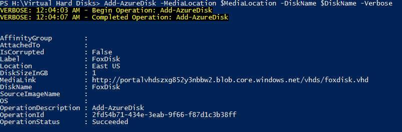 It worked! Our VHD is ready for the big leagues.

If all of this worked correctly, you'll be able to attach the disk using either Powershell or the Azure console.  Upon connecting to our VM, our important data is now available.

[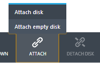

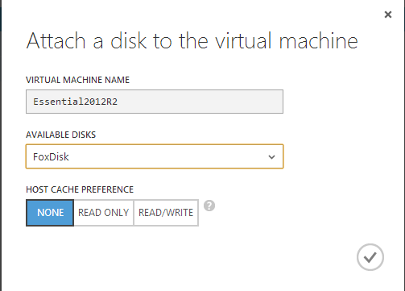 You can also connect your VHD to a VM using Add-AzureVMDisk

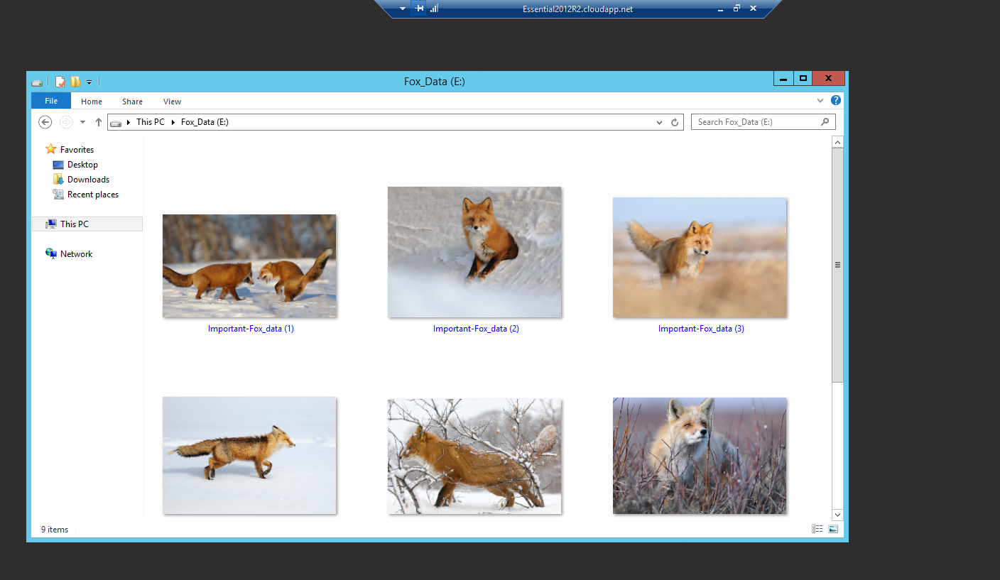 Our data will live on in the Cloud

## In Conclusion

In a production scenario, we could use this along with a sysprepped worker VM image and even a sysprepped SQL install to have VMs to allow our infrastructure to build out as needed to support customer demand(likely using a combination of Operations Manager, Orchestrator and Virtual Machine Manager).

Imagine if we ran a business that depended on customers being able to place orders on our website.  We predict a very strong black Friday and Cyber Monday turnout but don't want to invest in the infrastructure to support all of those customers and their connections for a short time frame.  We use these steps to upload a disk that contains an OS image sysprepped to launch IIS and our shopping app upon first boot, and then connect to another data disk or backend SQL instance for our customer orders or shopping cart contents.  Now, as the shopping season approaches, we configure Operations Manager to monitor our average customer wait times or page refresh latency.  We could accomplish this in SCOM using a number of methods.  Now, we set a threshold for maximum acceptable thresholds and then in Orchestrator, build a runbook to monitor these thresholds.

As customers begin to pile in (our advertisements worked!) we have our runbook configured to monitor their experience, and then as needed, add additional instances of our shopping app VMs and register them in our load balancers.  If we also add some logic to our runbook which would note when a new instance is no longer needed and gracefully shut down and delete the VM, we're really working smart.  This is a cool story and a great scenario to help you imagine how this level of automation and orchestration can help support the business, and allow us to work with some powerful and fascinating tools.

We're now using Just-In-Time Virtual Machine generation to allow our customers a great shopping experience.  Awesome!
