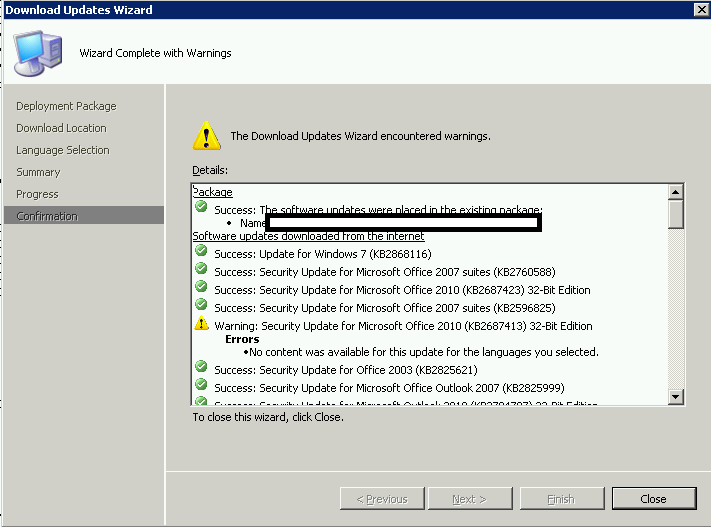
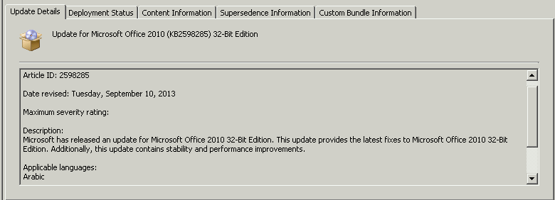

You may experience the following when trying to add a few of this month's updates to your deployments.

\[caption id="attachment\_183" align="alignnone" width="585"\] No content was available for this update for the languages you selected.\[/caption\]

The symptom is that all of your other updates will download without a problem, only a few will have this warning.  Furthermore, these updates with issues do not show any special error messages when viewed in the patchdownloader.log.

The reason for this is that if you deploy your updates in English only, you will find that there are no content files available in English.  You can verify the available languages by clicking the updates themselves in the updates list.

'Applicable Languages : Arabic' DOH!

 This means that the update source is not available in the language you specified while Deploying Updates (perhaps in your templates?).

> **But how to we deal with this?** 

Well, if the update refers to a specific foreign language IME (like the one for Chinese character input below) and your organization doesn't deploy in Chinese, then you can safely ignore it.  For the other updates, it is more a case of knowing your organization.  If you might deploy, or don't know if you are deploying in the Middle East, you may be safer just downloading and deploying the content.

If anyone is curious, these were the problem updates for this month, and the associated language:

<table border="1" cellspacing="0" cellpadding="0"><tbody><tr><td>Update for Microsoft Office 2010 (KB 2598285)</td><td>Arabic</td></tr><tr><td>Update for Microsoft Powerpoint viewer 2010 (KB 2553351)</td><td>Arabic</td></tr><tr><td>Security update for Microsoft Office 2010 (KB 2687413)</td><td>Taiwan Chinese</td></tr></tbody></table>

Kudos to Wayne Hughes and Jeff Renfroe for helping me to understand this.
