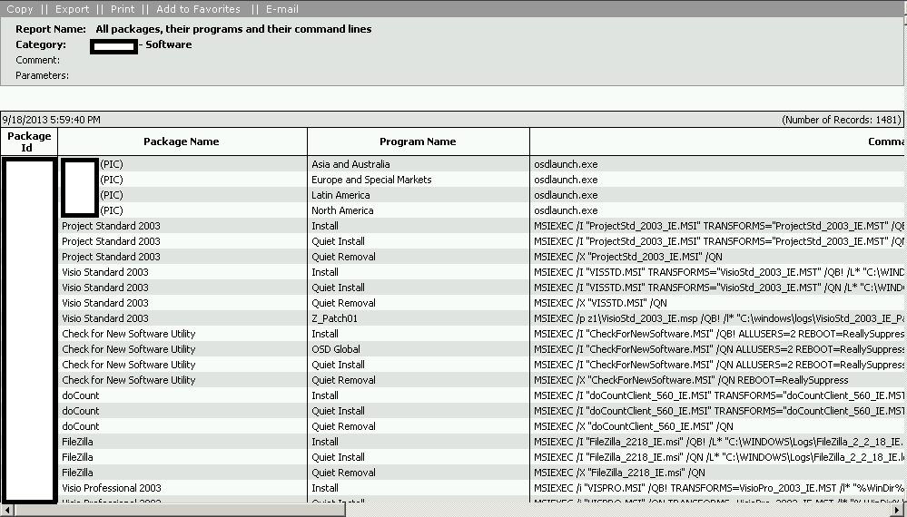
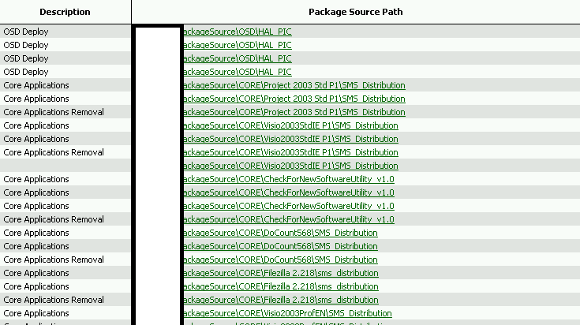

Hi all,

I recently had a requirement at a client to make a list of all SCCM Packages. their Programs,  and then the command lines of each, along with the package source.  I wondered if this was possible, and fortunately the SQL Views were already present to do so.

This ended up being a very short query: \[code language="sql"\]SELECT Program.PackageID, Package.Name 'Package Name', Program.ProgramName 'Program Name', Program.CommandLine, Program.Comment, Program.Description, Package.PkgSourcePath FROM \[v\_Program\] as Program LEFT JOIN v\_Package as Package on Package.PackageID = Program.PackageID
 Order by Program.PackageID \[/code\] And the output  Some of these command lines were VERY long, so it came out a bit wide.:

 
