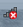
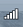

Ever wonder where this little guy gets its information from, be it happy or sad?

<table border="1" cellspacing="0" cellpadding="0"><tbody><tr><td>&nbsp;</td><td>Sad LAN Connection</td></tr><tr><td>&nbsp;</td><td>Happy LAN Connection</td></tr><tr><td>&nbsp;</td><td>Sad Wi-Fi Connection</td></tr><tr><td>&nbsp;</td><td>Happy Wi-Fi Connection</td></tr></tbody></table>

Essentially, a task runs whenever a network configuration change event takes place.  This calls a service which first tries to NSLookup [www.msftncsi.com](http://www.msftncsi.com), the Microsoft Network Connection Status Indicator site.  If this is successful, it then performs an HTTP GET on a simple text file stored on this site.

If these two steps work, it proves that DNS, Routing, and HTTP traffic are all allowed and working.

Now, if you're on a system that can access certain sites explicitly, like Updates.Microsoft.com then you may still a see a status icon of disconnected, even if your system can get out to the general web.  This might be because msftncsi.com remains blocked.

So, the icon is a great indicator of whether or not you have web access for most cases, but not necessarily in high security environments.

Source : [http://blogs.technet.com/b/networking/archive/2012/12/20/the-network-connection-status-icon.aspx](http://blogs.technet.com/b/networking/archive/2012/12/20/the-network-connection-status-icon.aspx)
