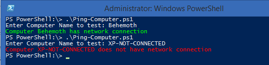
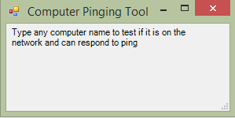
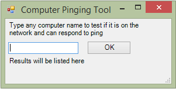

**This post is part of the Learning GUI Toolmaking Series, here on FoxDeploy. Click the banner to return to the series jump page!**

* * *

**Update: this post was previously titled 'Creating a GUI Natively for you PowerShell Tools using .Net Methods', it has been renamed to make more sense.**

I know, scary title, Right!?  Trust me, it isn't so bad!

My standard methodology around the office is to find a common problem that I can solve using a repeatable method,  I then turn this into a tool I give to my help desk or clients and move on to the next interesting problem.

While you or I might be comfortable in a console or digging deep into systems settings and can turn a PC with an issue in practically no time, others on our team or that we support might want the process to be more approachable, and have more automation.  This also means, to an extent, that it should be made into a tool.

So, lets say in your environment you've located an issue (for the sake of this example, computers not responding to ping indicating some problem) and need a mechanism to test whether a machine is connected to the network using a Ping operation, we could do this with just an easy command line entry, but lets build a full graphical tool around this that anybody could use, in order to teach the procedure.

Alright, here we go: a simple ping testing tool.

\[code language="powershell"\]$ComputerName = read-host "Enter Computer Name to test:" if (Test-Connection $ComputerName -quiet -Count 2){ Write-Host -ForegroundColor Green "Computer $ComputerName has network connection" } Else{ Write-Host -ForegroundColor Red "Computer $ComputerName does not have network connection"} \[/code\]

And to test it:

\[caption id="attachment\_256" align="alignnone" width="531"\] Cool, it works!\[/caption\]

So we know our base code is working.  Now to create the outline of the GUI we want.

First and foremost, in order to have access to the Systems.Windows.Forms .NET elements we need to draw our GUI, we have to load the assemblies.  This is done with the following two lines, added to the top of our script.

\[code language="powershell" light="true"\] \[void\] \[System.Reflection.Assembly\]::LoadWithPartialName("System.Windows.Forms") \[void\] \[System.Reflection.Assembly\]::LoadWithPartialName("System.Drawing") \[/code\]

Void is a casting (converts whatever output came before it) that tells the method here to do the operation but be quiet about it.

Next, we will define the basic form onto which our application will be built, calling it $form, and then setting properties for its title (via the .Text property), size and position on screen.

\[code language="powershell" light="true"\]#begin to draw forms $Form = New-Object System.Windows.Forms.Form $Form.Text = "Computer Pinging Tool" $Form.Size = New-Object System.Drawing.Size(300,150) $Form.StartPosition = "CenterScreen"\[/code\]

One of the cool things you can do with the System.Windows.Forms object is to modify it's KeyPreview property to True and then add listeners for certain key presses to have your form respond to them. Basically if you enable KeyPreview, your form itself will intecept a key press and can do things with it before the control that is selected gets the press. So instead of the user having to click the X button or click enter, yowe can tell the form to do something when the user hits Escape or Enter instead.

With that in mind, lets add a hook into both the Enter and Escape keys to make them function.

\[code language="powershell" light="true"\]$Form.KeyPreview = $True $Form.Add\_KeyDown({if ($\_.KeyCode -eq "Enter") {$x=$ListBox.SelectedItem;$Form.Close()}}) $Form.Add\_KeyDown({if ($\_.KeyCode -eq "Escape") {$Form.Close()}})\[/code\]

And now, lets comment block out the Ping section of the script (we'll also use #region and #endregion to allow us to collapse away that block for the time being) and add the following lines to the bottom to display our form.

\[code language="powershell" light="true"\]#Show form $Form.Topmost = $True $Form.Add\_Shown({$Form.Activate()}) \[void\] $Form.ShowDialog()\[/code\]

If you've been following along from home, you should have something similar to this.

And now lets give it a try!

\[caption id="attachment\_258" align="alignnone" width="585"\] Mmmm, tasty progress.\[/caption\]

Ah, the sweet taste of progress.  We now have a form and some code which works. Lets add a box where a user can specify the computer name to test, and then a button to start the test.

We'll be using the Systems.Windows.Forms.Label (Abbreviated as simply Forms.whatever from now on), Forms. TextBox and Forms.Button controls to add the rest of our app for now.  While I'm here, if you'd like a listing of all of the available other .net controls you can make use of, check out this link: [http://msdn.microsoft.com/en-us/library/system.windows.forms.aspx](http://msdn.microsoft.com/en-us/library/system.windows.forms.aspx)

First, lets add a label (a field of uneditable text), in which we will describe what this tool will do.  To start, instantiate a new System.Windows.Forms object of type .label, and then we'll set the location, size and text properties.  Finally, we'll add the control to our form using the .Add() method, as you'll see below.  Add the following text above the commented out Actual Code region.

\[code language="powershell" light="true"\]$label = New-Object System.Windows.Forms.Label $label.Location = New-Object System.Drawing.Size(5,5) $label.Size = New-Object System.Drawing.Size(240,30) $label.Text = "Type any computer name to test if it is on the network and can respond to ping" $Form.Controls.Add($label) \[/code\]

Some notes about this.  Location here is given in (x,y) with distances being pixels away from the upper left hand corner of the form.  Using this method of building a GUI from scratch, it is not uncommon to spend some time fiddling with the sizing by tweaking values and executing, back and forth.

\[caption id="attachment\_271" align="alignnone" width="585"\] Note the #regions used to make editing our code a bit cleaner\[/caption\]

Lets save our script and see what happens!

\[caption id="attachment\_272" align="alignnone" width="299"\] We are making a GUI interface using Visual Basi--er, PowerShell!\[/caption\]

Alright, next, to throw a textbox on there and add a button to begin the ping test, add the following lines in the '#region begin to draw forms'.

\[code language="powershell" light="true"\]$textbox = New-Object System.Windows.Forms.TextBox $textbox.Location = New-Object System.Drawing.Size(5,40) $textbox.Size = New-Object System.Drawing.Size(120,20) #$textbox.Text = "Select source PC:" $Form.Controls.Add($textbox)

$OKButton = New-Object System.Windows.Forms.Button $OKButton.Location = New-Object System.Drawing.Size(140,38) $OKButton.Size = New-Object System.Drawing.Size(75,23) $OKButton.Text = "OK" $OKButton.Add\_Click($ping\_computer\_click) $Form.Controls.Add($OKButton)

$result\_label = New-Object System.Windows.Forms.label $result\_label.Location = New-Object System.Drawing.Size(5,65) $result\_label.Size = New-Object System.Drawing.Size(240,30) $result\_label.Text = "Results will be listed here" $Form.Controls.Add($result\_label)\[/code\]

At this point you may be noticing a whole lot of forms form forms.  I know, there is a lot of retyping the same things.  In fact, this whole procedure is begging to be made into a simple New-Control function, but I haven't had time to hash it out yet, maybe in a future post!  Also, one thing I want to draw attention to is the $OKButton.Add\_Click; specifying this property will associate the contents of the $ping\_computer\_click variable (currently empty) as a function to execute when the button is clicked.  We'll go over that in a future post!

Before heading out, lets see what we have thus far.

\[caption id="attachment\_273" align="alignnone" width="301"\] Seeing the UI come together is such a satisfying feeling\[/caption\]

Alright, next time we reconvene, we'll link our pinging function from earlier into this tool, and see if it works!
