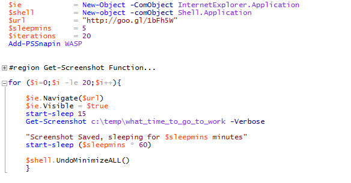

When I moved a while back, I wondered what the best route to take to work would be, and also when I should leave for work, but I didn't know the area well enough to be certain.  I could go to Google Maps and put in my home address and work address and see what the current traffic time was, but this wouldn't help me determine if I needed to leave at 7:45 or if I could eat another bagel and walk out the door at 8:00 and still make it to work on time (bagel carbohydrates notwithstanding).

So I did what I always do and turned to PowerShell to build a tool to do this.  I'd already used some PowerShell driven Internet Explorer automation to save me loading 100 URLs to see what the title was of each (to track down what the patch was doing for a particular KB Update Number), so I knew I could start there and work out a solution.

My methodology was to take a Google Maps link with drive time, and automate IE opening, browsing to this page, and then screen-shotting it for my later review.  It would have been cooler to scrape the page and then have PowerShell objects available to look at, as this entrepid poster did here http://masterrex.com/?p=64), but I'm just not that cool yet.

I started by borrowing the excellent Get-ScreenShot function written by Joe Glessner (http://joeit.wordpress.com/), to handle taking my screen shots for me.  The next step was to go to Google Maps, search for directions from my home town to work, and then get the URL, [](http://goo.gl/1bFh5W) is one I used for this example.

Next, my script itself.

`$ie = New-Object -ComObject InternetExplorer.Application  
$shell = New-object -comObject Shell.Application  
$url = "http://goo.gl/1bFh5W"  
$sleepmins = 5  
$iterations = 20  
Add-PSSnapin WASP`

`#region Get-Screenshot Function`

```  
##-------------------------------------------------------------------------- 
## FUNCTION.......: Get-Screenshot  
## PURPOSE........: Takes a screenshot and saves it to a file.  
## REQUIREMENTS...: PowerShell 2.0  
## NOTES..........:  
##-------------------------------------------------------------------------- 
Function Get-Screenshot {  
<#  
.SYNOPSIS  
Takes a screenshot and writes it to a file.  
.DESCRIPTION  
The Get-Screenshot Function uses the System.Drawing .NET assembly to  
take a screenshot, and then writes it to a file.  
.PARAMETER The path where the file will be stored. If a trailing backslash is used  
the operation will fail. See the examples for syntax.  
.PARAMETER This optional switch will save the resulting screenshot as a PNG file.  
This is the default setting.  
.PARAMETER  
This optional switch will save the resulting screenshot as a JPEG file.  
.PARAMETER  
This optional switch will save the resulting screenshot as a BMP file.  
.PARAMETER  
This optional switch will save the resulting screenshot as a GIF file.  
session.  
[..]``NOTES  
NAME......: Get-Screenshot  
AUTHOR....: Joe Glessner  
LAST EDIT.: 12MAY11  
CREATED...: 11APR11  
.LINK  
http://joeit.wordpress.com/  
#>  
[CmdletBinding()]  
Param (  
[Parameter(Mandatory=$True,  
Position=0,  
ValueFromPipeline=$false,  
ValueFromPipelineByPropertyName=$false)]  
[String]$Path,  
[Switch]$jpeg,  
[Switch]$bmp,  
[Switch]$gif  
)#End Param  
$asm0 = [System.Reflection.Assembly]::LoadWithPartialName(`  
"System.Drawing")  
Write-Verbose "Assembly loaded: $asm0"  
$asm1 = [System.Reflection.Assembly]::LoadWithPartialName(`  
"System.Windows.Forms")  
Write-Verbose "Assembly Loaded: $asm1"  
$screen = [System.Windows.Forms.Screen]::PrimaryScreen.Bounds  
$Bitmap = new-object System.Drawing.Bitmap $screen.width,$screen.height  
$Size = New-object System.Drawing.Size $screen.width,$screen.height  
$FromImage = [System.Drawing.Graphics]::FromImage($Bitmap)  
$FromImage.copyfromscreen(0,0,0,0, $Size,  
([System.Drawing.CopyPixelOperation]::SourceCopy))  
$Timestamp = get-date -uformat "%Y_%m_%d_@_%H%M_%S"  
If ([IO.Directory]::Exists($Path)) {  
Write-Verbose "Directory $Path already exists."  
}#END: If ([IO.Directory]::Exists($Path))  
Else {  
[IO.Directory]::CreateDirectory($Path) | Out-Null  
Write-Verbose "Folder $Path does not exist, creating..."  
}#END: Else  
If ($jpeg) {  
$FileName = "\$($Timestamp)_screenshot.jpeg"  
$Target = $Path + $FileName  
$Bitmap.Save("$Target",  
([system.drawing.imaging.imageformat]::Jpeg));  
}#END: If ($jpeg)  
ElseIf ($bmp) {  
$FileName = "\$($Timestamp)_screenshot.bmp"  
$Target = $Path + $FileName  
$Bitmap.Save("$Target",  
([system.drawing.imaging.imageformat]::Bmp));  
}#END: If ($bmp)  
ElseIf ($gif) {  
$FileName = "\$($Timestamp)_screenshot.gif"  
$Target = $Path + $FileName  
$Bitmap.Save("$Target",  
([system.drawing.imaging.imageformat]::Gif));  
}  
Else {  
$FileName = "\$($Timestamp)_screenshot.png"  
$Target = $Path + $FileName  
$Bitmap.Save("$Target",  
([system.drawing.imaging.imageformat]::Png));  
}#END: Else  
Write-Verbose "File saved to: $target"  
}#END: Function Get-Screenshot  
`` ```

`` `#endregion` ``

`  
for ($i=0;$i -le $iterations;$i++){  
$ie.Navigate($url)  
$ie.Visible = $true  
start-sleep 15  
Get-Screenshot c:\temp\what_time_to_go_to_work -Verbose  
"Screenshot Saved, sleeping for $sleepmins minutes"  
start-sleep ($sleepmins * 60)  
$shell.UndoMinimizeALL()  
}`

Because I know you all love pictures...

\[caption id="attachment\_303" align="alignnone" width="584"\][](http://foxdeploy.files.wordpress.com/2013/11/whentogotowork_1.png) It is pretty succinct when you omit other people's code...\[/caption\]

And after leaving it running for a while, you'll have a folder full of screenshots of Google Maps showing you the travel time, once every X minute you specify, for X iterations.  You just take a look and see when would be the fastest time to get to work!  Easy!

My next rev of this will attempt to scrape the information from an Internet.Webkit object.  I'll update this post when I get to that point.
