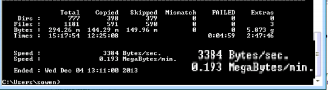

\[caption id="attachment\_350" align="alignnone" width="540"\] I was wrong earlier.\[/caption\]

Yep, this is now the slowest ever transfer. I was uploading the contents of a Server2012\\Install\\Sources\\SXS folder to another server in Switzerland. Such Speed!

Just to be clear, this was the fourth attempt to complete this transfer, at a scorching speed of 3 KBPS!!
