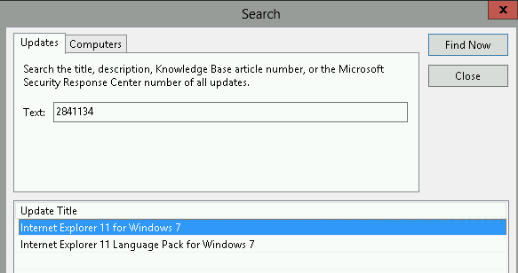

Today while attempting to deploy certain Windows Updates (namely IE 9 and IE 11) in a new 2012 R2 environment, I noticed that the two updates would not appear while doing a search for them within SCCM. After checking my product classifications to ensure the update should be there, I then c  hecked WSUS on the server for the update, saw them.

 Why are you hiding from me?

I then investigated the log files.  Within wsyncmgr.log, I saw numerous entries like the following: 

`Error ' Wsyncmgr.log' entry Update [GUID] not synced due to pending EULA Download. [..] EULA sync failures summary: Update [GUID] not synced due to pending EULA Download. Sync partially completed due to pending EULAs.  No admin intervention required, will retry in 60 minutes.` 

This can occasionally happen if your proxy settings do not support HTTP 1.1 redirection, and so I double checked the proxy.  The settings checked out (but if not, some recommend changing these values under Administration \\ Site Configuration \\ Servers and Site System Roles\\Site Name\\Software Update Point)

 Try double-checking these values if you run into the same situation

One measure you can take in troubleshooting a WSUS system is to use the WSUSUtil and its parameters to try to locate the issue.  In this case, I used the reset switch, which forces WSUS to recheck all content and redownload any missing or corrupt update files.  You'll find the tool at %drive%\\Program Files\\Update Services\\Tools. Give the tool a few minutes to run, you'll see no command output, nor records in the Application Event Viewer Log.  Afterwards, I reran the sync and watched the wsyncmgr.log again.  This time I saw messages like `'Synchronizing update [GUID] - Internet Explorer 11 for Windows 7'.`

 Ahhh, the smell of progress.

And within the console

 Whenever I see IE 11 written out, I hear that 'Too close' song by Alex Clair in my head.

I hope this helps you out.
