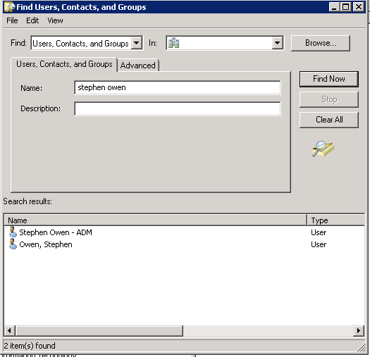
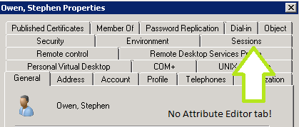
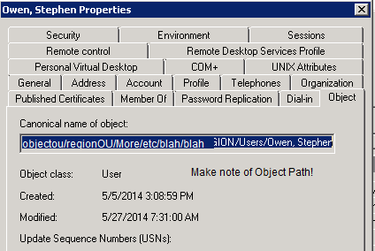
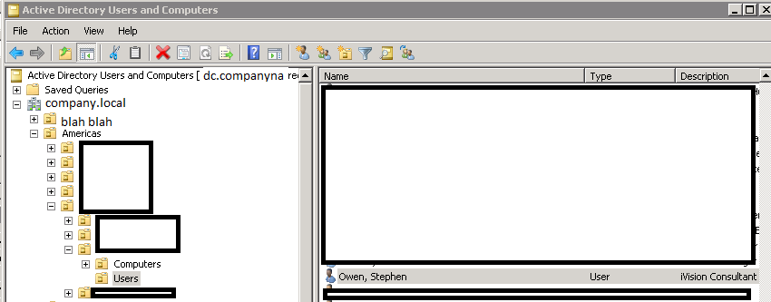
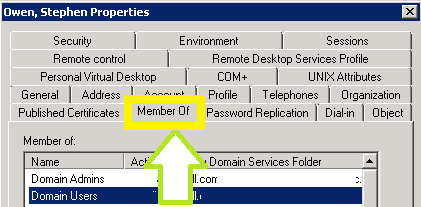
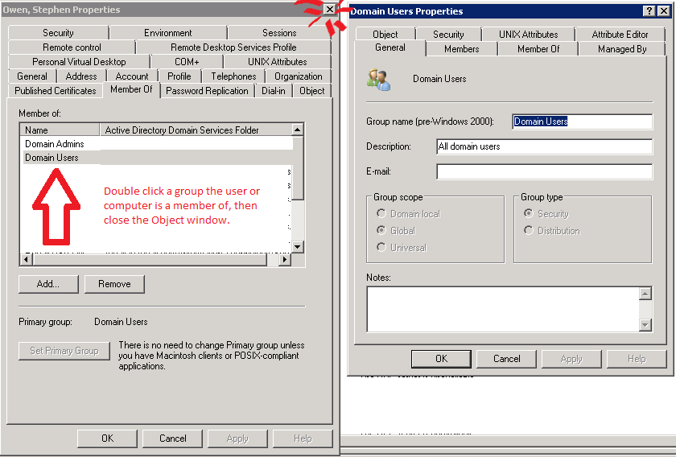
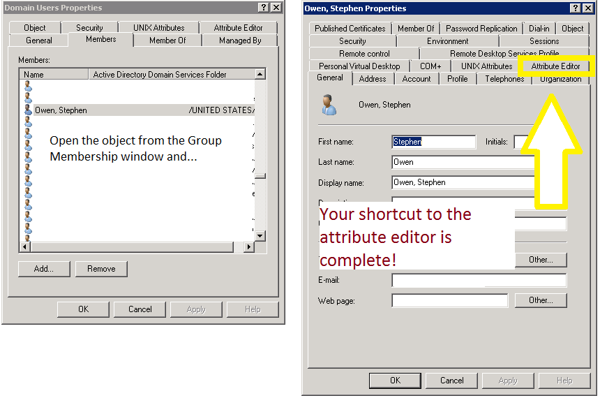

##  The problem

One of the bizarre pain-points of administering Active Directory Users and Computers is that you cannot edit Object attributes directly from Search.  What do I mean about this?  Here is an example.  I'm searching for myself here.

I can see my object, but when I open it, I only see a subset of the available properties for the object.  Notable missing is the 'Attribute Editor' tab.

Normally the next step is to look at the object path and browse out to it in AD, which wastes a lot of time.  However, we'll never waste that time again, once you're armed with this tip!

[] I normally shudder more and more as I see how deep I have to search to find this object I need to edit.

[] Slogging all the way down into a deep or complex tree is one of those minor things that can make you hate your life.

 

## The Fix

 

We'll not do it the old way again.  So, from the Search window, find your user or computer you'd like to alter, then click Member Of.  Open one of the groups the object is in and then close the original object window.

[] Click 'Member Of' for the object you'd like to edit, then pick a group that contains them.

[] Be sure to Close the original Object once the group has loaded. This will prompt ADUC to redraw the object from the groups window, forcing more properties to appear

Now, go to the Members tab for this group and find the object you'd like to edit.  Double-click it and…

[] You'll never do it the old way again!

Enjoy this workaround!  I've got no idea why you can't just edit Attributes directly from Search without these extra steps, but it so much faster than manually browsing to objects that I'd wager you'll never go back to the old way again.

All credit for finding this work around goes to my colleague and friend Mark Wuerslin for his detective work in discovering this workaround.
