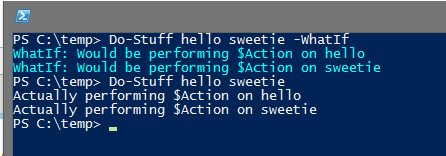

If you are a prudent sysadmin or consultant, you probably rely on using the -WhatIf command before ever running any serious PowerShell cmdlets in your environment. Since we love it so much, shouldn't we build this very same courtesy into our tools that others will use?

Before I learned how easy it is to add -WhatIf support to my Functions and Scripts, I'd often write something ugly like this:

```powershell

Function Do-Stuff{

param([switch]$WhatIf)

ForEach($item in $args){ 
  if ($WhatIf){ 
    Write-host "WhatIf: Would be performing \`$Action on $item" -ForegroundColor Cyan 
    }
    ELSE {
      "Actually performing \`$Action on $item" 
      } 
    }
} 
```

Aside: This is amended from an actual script in production that I've created. It was made a LONG time ago.

Yep, it's not very nice and I'm deeply, deeply ashamed.

I mean, it worked:

[](../assets/images/2014/09/images/dontdowhatif_thisway_1.png)

It's almost an example of what not to do! This little snippet has been simplified to be as easy to read as it gets, the thing would get VERY nasty when working with a complex script, as I'd pretty much have to write all of my code twice. Once to actually do the thing, and another to describe what I was doing in this pseudo-WhatIf message.

It wasn't uncommon to see this sort of thing over and over and over. Every single decision tree in my scripts would be made an extra six or seven lines longer because of this forking.  In fact, people often called me something that sounded just like 'That Forking PowerShell guy'.   **:(**

**BUT NO MORE!**

Changing this little sucker to work the right way is easy, and only requires a few edits.

First off, we're going to delete the [switch], and we're going to add in a proper array/parameter to capture our input. We'll also change line 5 from $args to $Objects, to match.

```powershell
Function Do-Stuff{ 
  param([string[]]$Objects) 
  ForEach($item in $Objects){ 
    if ($WhatIf){ 
      Write-host "WhatIf: Would be performing \`$Action on $item" -ForegroundColor Cyan } 
    ELSE { 
      "Actually performing \`$Action on $item" 
      } 
    }
} 
```

We have to dump the  use of `$args` because we'll be telling PowerShell to treat our code as a proper cmdlet, which means we can't use catchalls like $args anymore.

Next, we'll add in the magic sauce:

```powershell
[CmdletBinding(SupportsShouldProcess=$true)]
```

. Add this little guy right after the Function Declaration like so:

```powershell
Function Do-Stuff{ [CmdletBinding(SupportsShouldProcess=$true)] param([string[]]$Objects) 
```

Finally, we'll gut the existing decision structure, and replace it with this:

```powershell
 ForEach($item in $Objects){
    if ($pscmdlet.ShouldProcess("$item", "DoStuff")){ 
      "Actually performing \`$Action on $item" 
      } 
 }
```

In line 2 above, we're specifying the syntax to be displayed to the user. In this case, if the user were to run

```powershell 
Do-Stuff -Objects "hello","sweetie" -WhatIf 
```

it would say:
```
What if: Performing the operation "DoStuff" on target "hello". What if: Performing the operation "DoStuff" on target "sweetie".
```
You also use this same structure to provide messages to the user which are displayed with Warning and ConfirmImpact, but I'll get into those examples in a later date.

> "But Stephen/FoxDeploy/PowerShell guy", you ask, voice raising up a plaintive octave" what IS all of this $pscmdlet stuff anyway? You never defined $pscmdlet anywhere in that code!"

I'm happy you asked. `$pscmdlet` is the guts of what is letting us do a -WhatIf so easily. Well, this and `[cmdletbinding]`.

In simple terms, what we're doing here is replacing our janky $WhatIf switch for proper -WhatIf support, which is provided to us via the $pscmdlet, a special PowerShell variable created at runtime, and that object's method .ShouldProcess(). We don’t need to define or mess with $pscmdlet at all, it is provided to our function to use during execution because we told PowerShell to treat this like real compiled code (think the built-in cmdlets).

See, adding that [CmdletBinding] declaration to our function told PowerShell that we wanted to treat this code as a default cmdlet, which exposes a lot of additional functionality. For instance, adding CmdletBinding lets us specify all sorts of additional tools our script can use, from ConfirmImpact to Paging, to WhatIf support. You can read more about CmdletBinding in the built in help system.

```powershell 
Get-help about_Functions_CmdletBindingAttribute 
```
Some of this stuff is hard to approach, which is why a deep-dive into what Cmdlet Binding is and what it offers is coming in a future post.

As for $PSCmdlet itself, we're essentially peering under the covers into the PowerShell runspace here with this variable. It's a bit confusing, but for now, know that you can't use $pscmdlet.ShouldProcess() without adding [CmdletBinding] to your code.

Here is the completed sample of how to use -WhatIf

```powershell

Function Do-Stuff{ 
  [CmdletBinding(SupportsShouldProcess=$true)] param([string[]]$Objects)

ForEach($item in $Objects){ 
  if ($pscmdlet.ShouldProcess("$item", "DoStuff")){ 
    "Actually performing `$Action on $item" 
  }
} 
} 
```

And the final result:


I hope you liked this shallow dive into how-to -WhatIf and how not to do it!