I've seen a lot of people ask about how to do this, so I thought I'd provide some information on the matter. Previously I had a project in which I had to pull a ton of data from an extended SCCM database and massage it before importing into MDT to setup location settings and things like that for an automated zero-touch install with very granular configuration settings determined based on workstation location.

I had to learn this the hard way, but it saved me weeks worth of painstakingly combing through records, and was also pretty fun once I dug into the guts, and was able to get old customized SQL records to jive with the Microsoft Deployment Toolkit Database!  It's fun to teach machines to talk to each other!

Because many PowerShell enthusiasts may not be familiar with SQL, in this post I'll walk through the steps to install SQL, setup a database and then create a table, before digging into how to directly influence SQL from the PowerShell prompt.

## Setting up our SQL Database Engine

First things first, we'll create our SQL Test DB. I'll start with Sql Server express 2008 with tools, since it is so common and easy.  Get the bits here http://www.microsoft.com/en-us/download/details.aspx?id=22973.  Once it finished downloading, run the install, selecting Installation and then 'New SQL Server Stand-alone installation or add features to an existing installation"

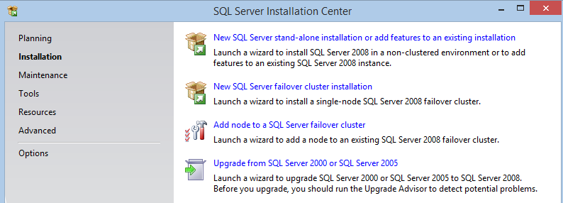 You want the top option

The SQL install wizard will check system state before getting you too deeply into the install.

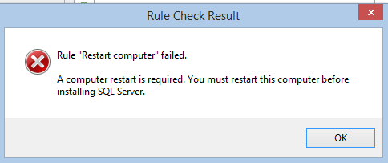

If you run into this 'Need to Restart' rule, you can bypass the restart by deleting the items under the following key.

```
HKLM:\\SYSTEM\\CurrentControlSet\\Control\\Session Manager 
```

and delete all items under PendingFileRenameOperations (Taken from http://www.sqlcoffee.com/Troubleshooting051.htm).  You can then rerun the Rule Check by clicking re-run.

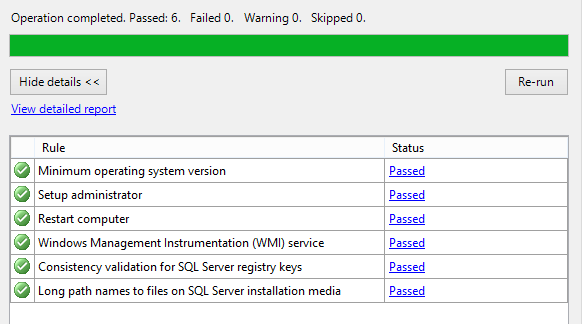 All systems are go!

 

Install Setup Support Files, if needed, then correct any dire errors under Setup Support Rules, if encountered.  Select Free edition, then at the Feature selection screen pick at a minimum Database Engine Services and Management Tools - Basic

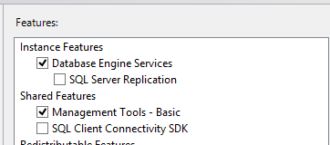

On the next screen, pick where you want your DB to go, and specify an instance name (I'm leaving this default).  Click Next.

For Accounts, select NT Authority System and local service, as this is just our test.  If you're setting up production SQL, you should know that many applications which run on SQL won't install if you leave the barn-doors open from a security standpoint.

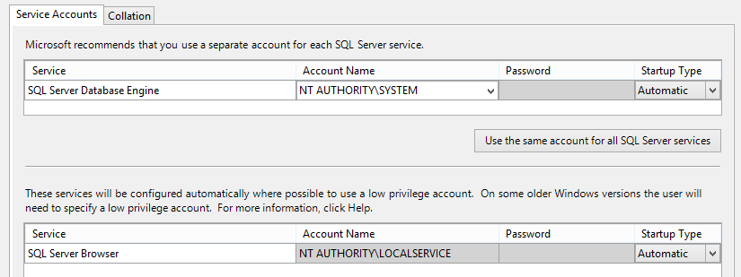 Good enough for a test environment, but not recommended when going production

Click Next

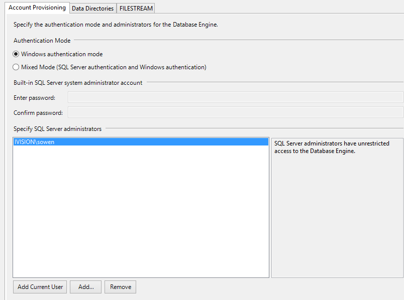 Ensure you specify Add Current User to SQL Server Administrators

next next next next next next next, and then when this loading bar shows up, go ahead and grab a sandwich.

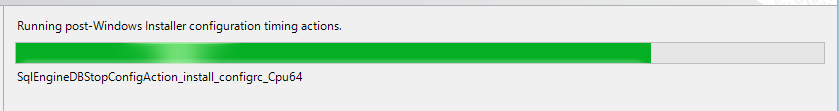 It will pause at this screen until roughly the heat-death of the universe.

Once the wizard finally completes, you should have SQL Installed!

## Creating a Table

Alright, now that the fun of the installation wizard is behind us, it is time to open up management studio and create our first SQL database and table, then we'll do some PowerShell!  First things first, fire up Management Studio.  and for your engine, select localhost, and leave the authentication as 'Windows Authentication' if you followed my steps earlier.

[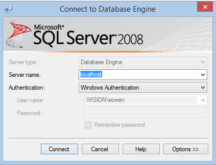](../assets/images/2014/09/images/sql08.png)

Now, click localhost in Object explorer on the side, then click databases, right-click and make a new database.

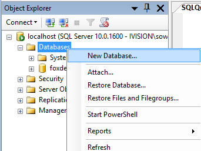

Pick whatever you'd like for a name. I choose FoxDeploy.  You can safely leave everything else as the default for our purposes, then pick next. Select your Database and browse to tables and pick new table

Pick a name for the table on the far right side, and then add some columns to your sheet. In my screen shot, I've selected the datatype of nchar(10), but I would recommend picking a type such as MAXVARCHAR or something similar in your own test. The nchar(10) datatype will limit the number of characters you can input, and can give you some puzzling errors.

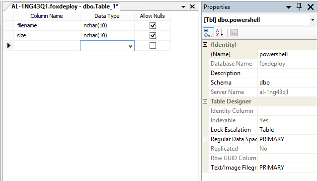 On the right side, select the name of the table, I choose Powershell,

 

Finally, click this button to generate a change script you'll execute which will spin up the table we need to insert data.

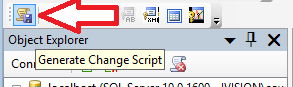

A box should appear, offering you the option to create a Save Change Script.  This is incredibly strongly recommended if ever touching production SQL.

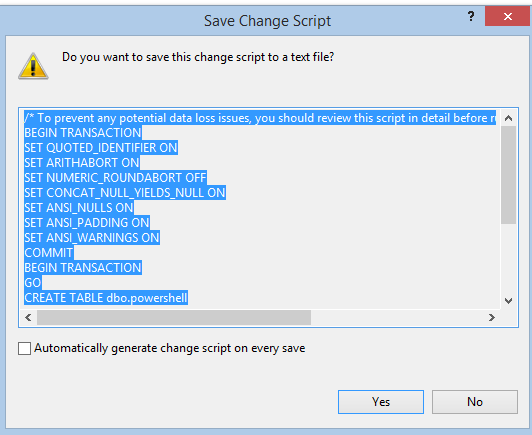 You can copy the query out of this window and run it directly, which saves a step of running the transaction log file created

 

Click New Query, paste the script in, and hit f5! And hold on to your butts!

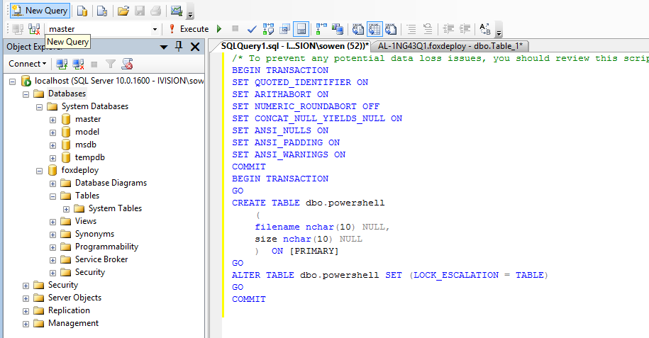

If everything worked correctly, you should receive confirmation in the messages window below.

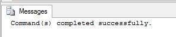 Most of the time in SQL you won't see this message….

 

Now hit F5 at the base level of the DB view and you should see your new table

Now we have a database engine running locally, with a database named foxdeploy, and a table titled powershell. The table should have two columns, filename and size.  This is another good time to grab a drink, as we're finally about to begin coding!

## SQL And PowerShell - Better Together?

Before I get into how to do the PowerShell bit, I want to tell a story which came up when I thought of this section heading.

Years ago I worked at a bank in telemarketing position. One day, we had a huge meeting where they had us hundred employees go into a room, and gave us mouse pads, shirts, and mugs, then go to our seats.  You can always tell how cheesie or impactful a reorg will be based on the amount of swag they give out. They even had candy in our seats when we got there.  My cheese-alert was off the radar.

They splurged for thousands and thousands of custom re-packaged Reeses' cups with the company logo on it, with the saying 'like chocolate and peanut butter, customer service and sales are better together!' on the wrapping.

Turns out they were essentially laying off the custom service folks and making us do their jobs. Yay!  Who doesn't want to call in to activate their credit card and get a hard-sale for a home-equity line, or call about an over limit fee and be sold useless credit insurance.

At least we got free candy.

[](../assets/images/2014/09/images/reeses.jpg)

 

Well, as it turns out, PowerShell and SQL do work pretty well together.  Better than a Reese's cup...nah, maybe not quite that well.

Most of the magic of pulling info from and putting stuff into SQL revolves around using the Invoke-SQLCmd cmdlette to perform native language queries on the SQL databases and tables. This useful tool is installed as part of SQL Management Studios.  What we'll be doing is gathering information with PowerShell and sending it down the pipeline to

To do our work, we're concerned with the following syntax of the Invoke-SQLCmd cmdlette:

```powershell 
PS SQLSERVER:\\> "database","serverinstance","query" | % {get-help Invoke-Sqlcmd -Parameter $\_}

\-Database A character string specifying the name of a database. Invoke-Sqlcmd connects to this database in the instance that is specified in -ServerInstance. If -Database is not specified, the database that is used depends on whether the current path specifies both the SQLSERVER:\\SQL folder and a database name. If the path specifies both the SQL folder and a database name, Invoke-Sqlcmd connects to the database that is specified in the path. If the path is not based on the SQL folder, or the path does not contain a database name, Invoke-Sqlcmd connects to the default database for the current login ID. If you specify the -IgnoreProviderContext switch, Invoke-Sqlcmd does not consider any database specified in the current path, and connects to the database defined as the default for the current login ID.

Required? false Position? named Default value Accept pipeline input? false Accept wildcard characters? false

\-ServerInstance A character string or SMO server object specifying the name of an instance of the Database Engine. For default instances, only specify the computer name: "MyComputer". For named instances, use the format "ComputerName\\InstanceName".

Required? false Position? named Default value Accept pipeline input? true (ByValue) Accept wildcard characters? false

\-Query Specifies one or more queries to be run. The queries can be Transact-SQL or XQuery statements, or sqlcmd commands. Multiple queries separated by a semicolon can be specified. Do not specify the sqlcmd GO separator. Escape any double quotation marks included in the string. Consider using bracketed identifiers such as \[MyTable\] instead of quoted identifiers such as "MyTable".

Required? false Position? 1 Default value Accept pipeline input? false Accept wildcard characters? false 
```

We’ll be specifying a ServerInstance, Database and a query to run. Now, the -Query parameter is expecting native SQL language, here is an example of the SQL Transaction Query we'll be running:

```sql
insert into Tablename (ColumnName1, ColumnName2)
 VALUES ('Value1', 'Value2') 
```

Not too bad to work with. You specify the ColumnName first, and then the Values to go into each row within that column.  This won't be too hard to do, but let's define our $database, $server and then do a test-run to give it a try, remembering that our column names are filename and size.

```powershell

$database = 'foxdeploy' $server = '.' $table = 'dbo.powershell\_test'

Invoke-Sqlcmd -Database $database -ServerInstance $server \` -Query "insert into $table (filename, size) VALUES ('test','45')" 
```

When you execute this code, you won't get any update at all from the console.  It is necessary to test and see that the change occurred:

```powershell Invoke-Sqlcmd -Database $database -ServerInstance $server -Query "select \* from $table" 
```

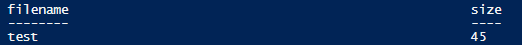

Sweet!  Like Candy!

## The Practical-ish Example

Now, let's use a practical example. In this situation, let's list out the ten biggest files in a folder and select the filename and size, and then import those properties into our SQL Database. Keep in mind, the sky is the limit here, you could be polling for biggest mailboxes and then doing something with those users, dump records from AD into an analysis services instance for some in-depth reporting, do some datamining or whatever you can put your mind to.  This is purely proof-of-concept.

For a preview, these are the files in the directory I'm listing out:

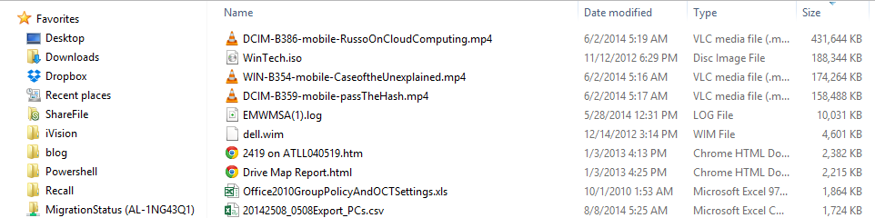 If all goes well, these should appear as entries in our DB

What we'll do is setup variables to simplify our command structure (and let us re-use this code in the future).  We'll then get  and sort a list of the files, and then pull values from each record, which we'll store in a variable.  We'll then use Invoke-SQLCmd to act on this data, and insert one row for each item:

```powershell

$database = 'foxdeploy' $server = '.' $table = 'dbo.powershell\_test'

Get-ChildItem c:\temp | sort Length -desc | select -First 10 | % { $Name = $\_.Name $FileSize = $\_.Length $query = "insert into $table (filename, size) VALUES (\`'$Name\`', \`'$FileSize\`')" 

Write-Host "About to Execute:\`t $query" Invoke-Sqlcmd -database $database -ServerInstance $server -query "insert into $table (filename, size) VALUES (\`'$Name\`', \`'$FileSize\`')" }


```

And now, let's run one more query to see if our changes took…

```powershell

Invoke-Sqlcmd -Database $database -ServerInstance $server -Query "select \* from $table" 
```

 

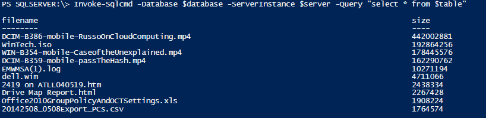 Blam! We're pulling this data that we just added into SQL back from our database!

It worked!  To round things out, here is a screen shot from SQL management studio which shows that the entries now exist within the table from that side too.

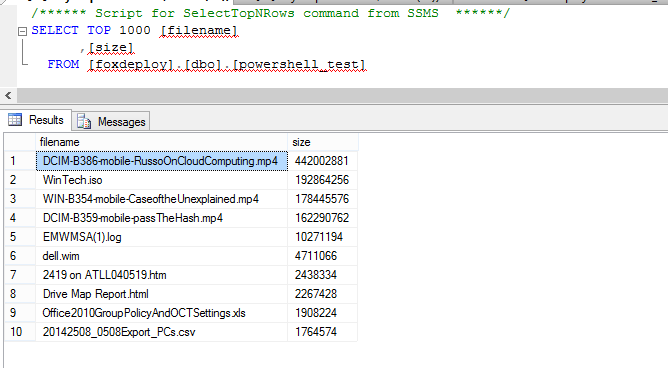

### Winding Down

While it is very unlikely that you'll need to import a list of files into your SQL DB anytime soon, but just think of the possibilities.

You can take these principles and do anything you put your mind to with them.  This is one of the best features of PowerShell, this infinitely rewarding aspect of it.  A little bit of tinkering in your spare time one day can lead become the start of a powerful new tool to you'll come back to over and over again in the future.  Just ten minutes of reading up on best practices can lead to a lifetime of positive ripples.

Be sure to check back later, when I'll flesh this out with some code samples of deleting rows, updating rows, and creating/dropping tables. I hope this was helpful!