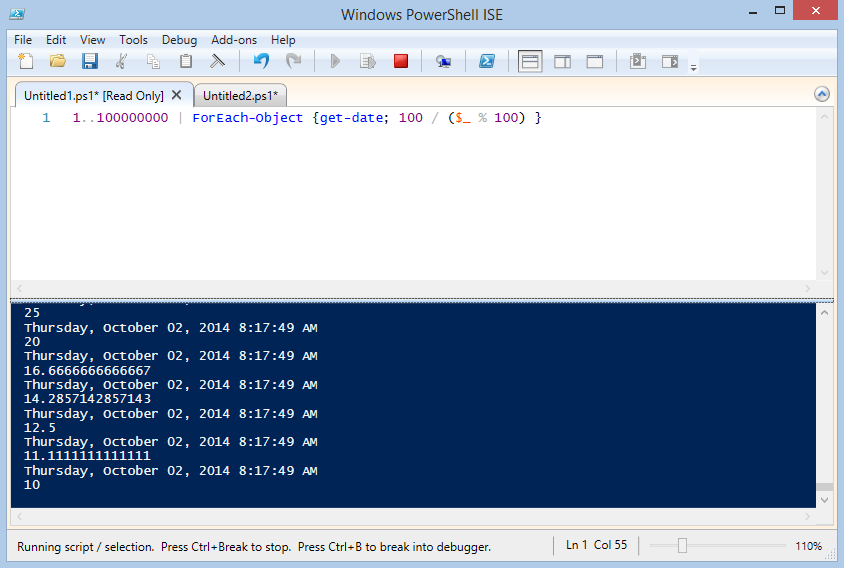
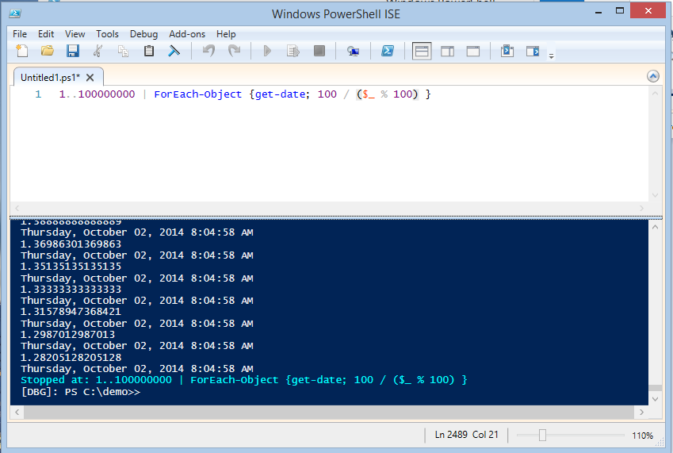
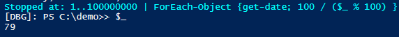
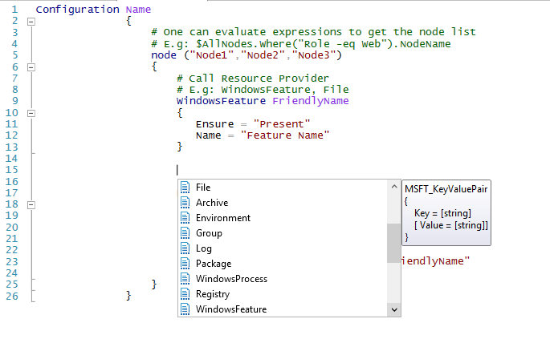
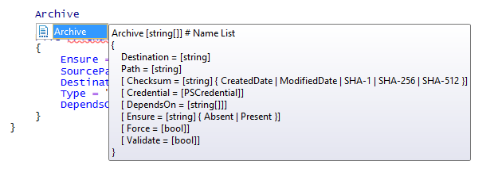

This will be a quick post, but I want to highlight some of the great new features in the ISE for Windows 10 / WMF 5 and PowerShell 5.0. Currently you can use these features on Windows 8.1 and up if you install the WMF 5.0 September preview ([found here](http://blogs.msdn.com/b/powershell/archive/2014/09/04/windows-management-framework-5-0-preview-september-2014-is-now-available.aspx)) or find them natively installed on Windows 10 if you've had a chance to try the Tech preview.

### Jump into Debugger from ISE

I LOVE this feature.  Previously to hop into Debugger you had to either apply \[CmdletBinding\] to your script or Function and litter your code with Write-Debug statements, or manually set $DebugPreference = $true to skirt \[CmdletBinding\].  With PowerShell v 5 this is no more!

Take the following code:

```powershell 
1..100000 | ForEach-Object {get-date; $\_ } 
```

Simple enough, iterate from 1 to 100000 and ForEach-Object, Get-Date and then write the current value.

Now, imagine if the math were a little different, something like this

```powershell 
1..100000 | ForEach-Object {get-date; 100 / ($\_ % 100) } 
```

Because we're taking the remainder of 100 divided by our current number, when our number is perfectly divisble by 100 we'll end up with a DIV/0 error state. If we wanted to debug or troubleshoot this code or other code from within the loop, we'd previously have needed to go through all sorts of hoops to add Debug statements.

New to PowerShell ISE v5 is the ability to hit Ctrl+B (yes, B, not C!) to jump into debug mode at any time.

It's easy to miss in the ISE. When you launch any code, the status bar on the bottom of the window of the ISE will change from 'Stopped' or 'Ready' to the below

 Running script / selection. Press Ctrl+Break to Stop. Press Ctrl+B to break into debugger.

Hitting **Ctrl+B** while our code is running changes our prompt too. We get a standard Write-Debug style display of which line the code was processing when we interuppted, and our prompt shifts into '\[DBG\]>>' mode, signaling that we are paused within execution of a script, and can access the variables available within script execution.

[](../assets/images/2014/10/images/v5isechanges02.png)

It now becomes very easy to access the current variable, making it very easy to troubleshoot why code fails in a particular situation.

 
Officially no excuse not to debug our code now!

This is a killer feature, in my opinion, and one I'll highlight in my PowerShell teaching from now on.

### AutoCompletion of DSC Resources

DSC support for the ISE started off a little rockily.  The ISE kind of knew what DSC was, but we Desired State Configuration fans didn't get much love, and practically no autocomplete either!

I always found it hard to remember what the names or properties were of various resources (especially early on when things were not exactly 100% consistent between providers), and would have to reference my own blog post on the topic from time to time!

Now, there's no forgetting.  When within a Configuration Scriptblock in the ISE, simply hit **Ctrl+Space** to display AutoComplete hints for the various resources available.

[](../assets/images/2014/10/images/v5isechanges04.png)

You can even select one and hit **Ctrl+Space** again to see a reminder of which properties are available for that Configuration Resource.



These great new features to the ISE contribute to make it an even better place to code.