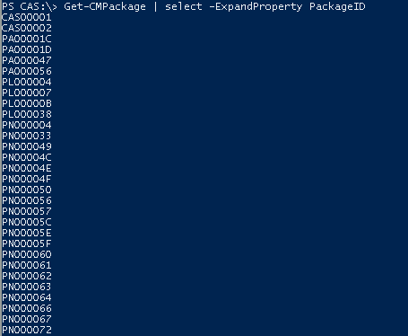
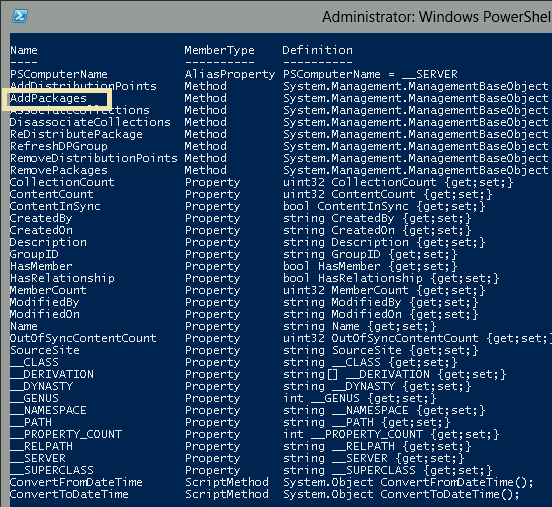
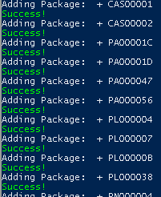

Another quickie here: I needed a way to add all packages to all distribution points, and do so with as few / zero clicks as possible.  Using a few PowerShell commands, I was able to do just that!  While there is no native command (yet!) to push content to a distribution point, you can easily do so with a WMI call, and automate the whole process with a single pipeline.

For the first step, we'll use the Configuration Manager Module's Get-CMPackage Command, and pipe it into a filter.  We'll need the PackageID field, and would prefer not to have the value include the column header, so we'll use the -ExpandProperty parameter to omit this.

\[code language="powershell" light="true"\]Get-CMPackage | Select - ExpandProperty PackageID\[/code\] 

Now, we need to connect to the local SCCM instance.  We'll use Get-WMIObject to do so.

\[code language="powershell" light="true"\]Get-WMIObject -NameSpace "Root\\SMS\\Site\_YOUR\_PRIMARY\_OR\_CAS\_SITE\_CODE" -Class SMS\_DistributionPointGroup\[/code\]

If you pipe this command into Get-Member, you'll see the output below.  This tells us of all of the properties and methods we'll have available using the WMI Object.  I've highlighted the method we need, AddPackages().

Now, to put it all together.  We'll first enumerate all of the PackageIDs, and send this value on down our command line using a pipeline.  This value will be assigned to $package in the run phase of the ForEach-Object command, in which the WMI Object's AddPackage() method will be called once for each object in the variable, using the $\_ current pipeline object character.  Some rudimentary error catching is here, looking to see if a non-zero value is returned.  Here is the command.

\[code language="powershell"\]Get-CMPackage | Select -ExpandProperty PackageID | ForEach-Object { $package = $\_ Write-host "Adding Package: $package" if (((Get-WMIObject -NameSpace "Root\\SMS\\Site\_YOUR-THREE-DIGIT-SITE-CODE" -Class SMS\_DistributionPointGroup).AddPackages($package)).ReturnValue -ne 0) { Write-host -ForegroundColor DarkRed "Possible error processing $package" } ELSE{ Write-Host -ForegroundColor GREEN "Success!" } } \[/code\] And here it is in action.

](http://foxdeploy.files.wordpress.com/2014/01/04_add_all_packages_to_distribution_point_group.png) Happy Green makes me feel alright!\[/caption\]

I hope this helped you out.  You could also distribute drivers, operating system images, updates or any other content that uses a PackageID using this same syntax.
