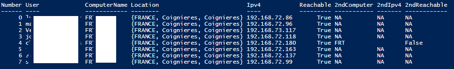
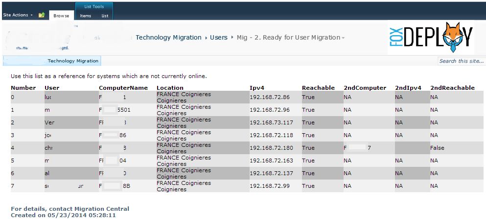

Many times we in Dev/Ops or a sysadmin role will create tools for our own use to get nicely formatted output in the console.  Normally projects like this have three phases. In the beginning, people are doing something very manually, or have a huge task to accomplish. In the first phase, it's good enough to make it work, and get people using it ASAP. From there, it's a great phase of quickly iterating adding more features and refining the scope of the tool or project, and everyone is happy. Well, everyone but you. The final phase has you putting the finishing touches on everything and really polishing it up. I love on the field engineering, because many times I'm saving someone from a terrible load of work, or making what was arduous a simple task. Drawing put the true potential of powershell and converting others is one of my greatest professional joys.

Now, in this scenario we have a list of computers that need to be migrated from Domain A to Domain B using the Quest migration tools.  At the start of the project, we mass imported a list from SCCM of User to Computer correlations into SharePoint, so we use that to track computers and users for migration scheduling.  The need here was for a tool that could pull down a list of computers for a particular day, display needed information like the user's name and also provide a one-stop portal for us to be notified when a computer comes online.

With a nice head-start provided by one of my colleagues, John O'harra, we had a valid pipeline full of objects, which was being used to write out files needed for our import.

Using a few calculated properties, we were set.

\[code language="powershell"\] Enumerate-SharePoint | Where-Object WorkstationMigrationComplete-ne 'true' | Select-Object \` @{Name="Number";Expression={$global:i;$global:i++}},\` @{Name='User';Expression={$\_.AccountName}},\` @{Name='ComputerName';Expression={if (($\_.PrimaryWorkstationName).Length-gt 0){$\_.PrimaryWorkstationName}ELSE{"NA"}}},\` @{Name='Location';Expression={$\_.Country,$\_.State,$\_.City}},\` @{Name='Ipv4';Expression={Test-Connection-computername $\_.PrimaryWorkstationName -count 1 | select -ExpandProperty IPV4Address | select -expand IPAddressToString }},\` @{Name='Reachable';Expression={Test-Connection -computername $\_.PrimaryWorkstationName -count 1 -quiet}},\` @{Name='2ndComputer';Expression={if (($\_.SecondaryWorkstationName).Length -gt 0){$\_.SecondaryWorkstationName}ELSE{"NA"}}},\` @{Name='2ndIpv4';Expression={if (($\_.SecondaryWorkstationName).Length -gt 0){Test-Connection -computername $\_.SecondaryWorkstationName -count 1 | select -ExpandProperty IPV4Address | select -expand IPAddressToString }ELSE{"NA"}}},\` @{Name='2ndReachable';Expression={if (($\_.SecondaryWorkstationName).Length -gt 0){Test-Connection -computername $\_.SecondaryWorkstationName -count 1 -quiet}ELSE{"NA"}}} | Format-Table -auto\[/code\]

###  Phase 1; Console Only

\[caption id="attachment\_550" align="alignnone" width="1105"\] It works and has a nice utilitarian vibe going on, but it isn't really something you'd want to put up on the big screen...\[/caption\]

It could be so much better! This is a solid phase one tool. It does its job but really no one will be impressed too much. I had to do more!

So I dug into my vast and terrible HTML knowledge and decided to make use of the Tee-Object command to send my pipelined objects out to a Variable instead.  Tee is definitely a useful command.  Sometimes I'll use it within a function to output my pipeline to a variable that will persist through a particular phase of a function.

Imaging you had a function that performed a few tasks, Get-Information, Process-Information, and then ActOn-Information.  During the Debugging process, you might want to run through the function a few times and then after running, tweak some of your objects to see which properties you have available.  Commiting the pipeline objects from each phase to a $global:GetInfoObject, $global:ProcessInfoObject and $global:ActOnInfoObject is a great way to run your tools and then conduct post-mortem on them.  In an upcoming blog post, I'll go more in-depth into this example.

Anyway, once I used Tee-Object, I envisioned running a ConvertTo-HTML command and then allowing the Control Techs to access this file from a share on my PC.

### Phase 2; Introduce some sophistication

The first attempt was pretty…meh.

This is what I would define as a phase two offering. It shows a lot of potential and many would say it is good enough to put into production. It is definitely good enough to run on a monitor somewhere, but I knew we could do better.  I pulled out a little bit of CSS I love to use, with some alternating table and column rows.  I then added a header image (courtesy of a screen print from SharePoint :) and immediately the whole process was elevated to something much more professional looking.

### Phase 3; Polish!

Of course, the links are just for appearances, but with a bit of work, it could all be functional. This is where I would call this a phase three deliverable and begin looking for my next project. It can serve well in the field, looking good and getting the job done, and won't embarrass me later.

The beauty about this whole thing is that all of the heavy lifting is done by the ConvertTo-HTML commandlet and using its parameters.

\[code language="powershell"\] $HTMLoutput | ConvertTo-Html -title “Migrations for $MigrationGroup“ \` -Head $head -pre “
Use this list as a reference for systems which are not currently online.
” -post “<h3>For details, contact Migration Central Created on $date by Stephen Owen</h3>” | Out-File c:\\public\\Migration\_$MigrationGroup.html\[/code\] The other bit of the lifting is used in the $header variable, as seen here.  Feel free to adapt this to your own purposes and I hope that it helps you get work done quickly using PowerShell.

\[code language="html"\] $head = @" <!DOCTYPE HTML PUBLIC “-//W3C//DTD HTML 4.01 Frameset//EN” “http://www.w3.org/TR/html4/frameset.dtd”&gt; <html><head><title>Unmigrated Systems Report</title><meta http-equiv=”refresh” content=”120″ />  </head> \[/code\]
