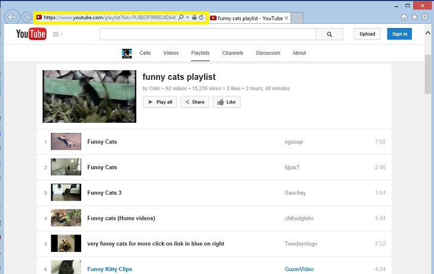
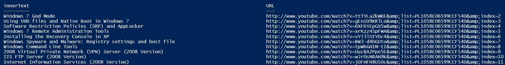
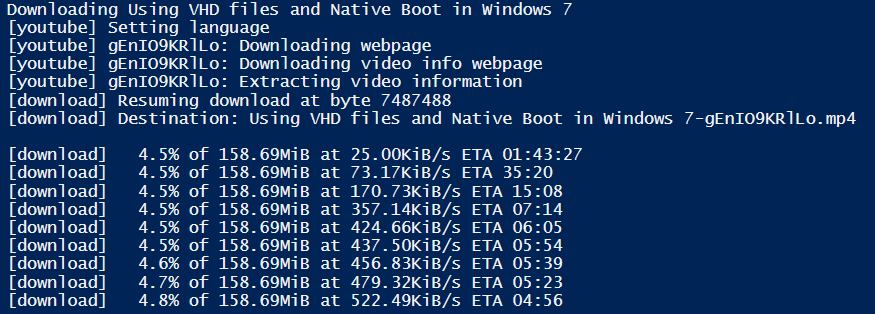

Recently, a colleague approached me requesting pointers on the quickest possible way to download a YouTube playlist.  I'd used KeepVid.com previously, to download videos one at a time, but never found a good tool to use to download a full playlist.  So I decided to make one!

### Prerequisites

This tool depends on you already having the wonderfully useful youtube-dl.exe downloaded on your system.  I placed it in my %PATH% directory, but you can also run this code directly from wherever you placed the binary.  Get the tool here if you don't already have it:  [http://rg3.github.io/youtube-dl/](http://rg3.github.io/youtube-dl/)

You should make sure your link loads in Playlist form.  It should look like this:

[https://www.youtube.com/playlist?list=PL8B03F998924DA45B](https://www.youtube.com/playlist?list=PL8B03F998924DA45B)

](https://foxdeploy.files.wordpress.com/2014/07/youtube_dl_00.png) You can get your playlist by selecting the URL from a page that will generally look like this.\[/caption\]

If it doesn't contain a playlist, this method won't work for you.  Once you have your URL, provide it in the $PlayListURL in the top line of the code:

 

\[code language="powershell"\]$Playlisturl = "http://www.youtube.com/playlist?list=PL1058E06599CCF54D&amp;" \[/code\]

Next, the real magic happens in this ungainly one-liner

\[code language="powershell"\]$VideoUrls= (invoke-WebRequest -uri $Playlisturl).Links | ? {$\_.HREF -like "/watch\*"} | \` ? innerText -notmatch ".\[0-9\]:\[0-9\]." | ? {$\_.innerText.Length -gt 3} | Select innerText, \` @{Name="URL";Expression={'http://www.youtube.com' + $\_.href}} | ? innerText -notlike "\*Play all\*"

\[/code\]

We'll break it down element by element:

We begin by Invoking a WebRequest for our URL and selecting all of the links. Next, we select only the playlist items that contain a direct video reference (contains "/watch"), then further filter to remove those without a playtime in the innerText field, which indicates direct links to times within videos.

Next, we remove items with a title with less than three characters, to remove duplicate entries, then we move on down the pipeline to set up a calculated property to perform some adjustment to the URL property.  We finally remove all items that survived to this point, which have 'Play All' in their name (which is typically reserved for the first entry in a playlist.

](https://foxdeploy.files.wordpress.com/2014/07/youtube_dl_01.png) Sample output of a playlist\[/caption\]

This gets saved and then fed to the binary one by one!

\[code language="powershell"\] ForEach ($video in $VideoUrls){ Write-Host "Downloading $($video.innerText)" .\\youtube-dl.exe $video.URL } \[/code\]

[] This process supports WGET, so your downloads can even resume!\[/caption\]

### Completed Code

\[code language="powershell"\]$Playlisturl = "http://www.youtube.com/playlist?list=PL1058E06599CCF54D" $VideoUrls= (invoke-WebRequest -uri $Playlisturl).Links | ? {$\_.HREF -like "/watch\*"} | \` ? innerText -notmatch ".\[0-9\]:\[0-9\]." | ? {$\_.innerText.Length -gt 3} | Select innerText, \` @{Name="URL";Expression={'http://www.youtube.com' + $\_.href}} | ? innerText -notlike "\*Play all\*"

$VideoUrls

ForEach ($video in $VideoUrls){ Write-Host ("Downloading " + $video.innerText) .\\youtube-dl.exe $video.URL } \[/code\]
