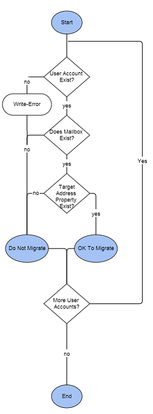

This is another Quest Migration Manager for Exchange, Active Directory (QMM post).

Sorry for the big influx of these, as you can tell I've been doing a lot of Exchange and AD Migration work recently :)

So, during a Quest driven migration project, you generally have two goals.

1. Migrate a User's AD and E-mail accounts from the existing domain (Source) to the new domain (Target)
2. Migrate a User's Computer to the target

In order to do this, you have a few dependencies:

1. Before a user's PC can be moved, you need to sync user's AD Objects and Mailboxes to ensure the user account is placed in the right OU for Group Policy, and to make sure that the user has all of their mail available when the switch e-mail servers
2. When the above is synced, you then have to use the QMM Resource Update Manager to re-ACL all of the files, services and registry items on the user's workstation, before the system can be migrated to the new domain.

So, a big prerequisite to this whole process that can keep you from moving a user's PC is to know whether or not the user's mailbox is Switched to the new Exchange Environment.

Here's the general flowchart of when it is OK to migrate a user account.

](https://foxdeploy.files.wordpress.com/2014/08/get_switchedstatus-2.png) Get-SwitchedStatus FlowChart\[/caption\]

You'll have Exchange server pairs setup for each of your core Exchange DAG's and these will handle syncing mailboxes from Source to Target. Once a mailbox is synced, it can then be Switched, a process which handles mail routing and ensures that new mail is delivered to the mailbox the user is using. Essentially, Switching the mailbox will direct all new mail to the user's new mailbox in the target, at which point you can safely unprovision and disable their mailbox from the source.

The easiest way to determine a user's Switched status is to pull up their AD Account in the Source Domain and look for a 'targetAddress' attribute. Unfortunately, these attributes are not selectable as a column for Active Directory Users & Computers Search, nor can you view these Attributes from the user object when opened from source (if you attempt that, only a select few tabs of user object properties are shown).

To that end, I have created the Get-SwitchedStatus.ps1 PowerShell Script. You can use this, specifying -Server for Root AD Server to query for attributes. It accepts parameter input and also has some decent help to get you started.

My next incarnation of this will be a standalone C# version of the same functionality!

\[code language="powershell"\] #################################################################### # ----Name : Quest Switch Status # ---Author: Stephen Owen, 7.24.2014 # Function : Use this tool to determine if a user account has switched or not, based on the account's Source targetAddress property # ---Usage : Get-SwitchedStatus &lt;$username&gt;

Function Get-SwitchedStatus { &lt;# .Synopsis Use this tool to determine if a user account has switched or not, based on the account's Source targetAddress property .DESCRIPTION This tool connects to the Source (legacy) AD Domain and looks up the specified user object, returning the .targetAddress property connects to the target domain to move the user account to the correct OU .PARAMETER UserName &lt;Mandatory&gt; Specify the username to inquire, will bind to aliases like UserName, LogonName or SAMAccountName. Accepts Pipeline input. .PARAMETER Service &lt;Optional&gt; Specify the Active Directory Service to Query .PARAMETER SourceCredential &lt;Optional&gt; Specify the Credentials to use to query the Source AD Infrastructure. If omitted, this tool will also look for a Global:$Credential object, and attempt to use that. .SWITCH WriteWarning Provide detailed Warning information if a user is encountered without needed properties. .EXAMPLE Get-SwitchedStatus -UserName Stephen.Owen &gt; This tool will connect to the source, and grab the targetAddress property of the object &lt;Stephen.Owen&gt;. If this contains \*@source.qmm, the account is most likely unSwitched. If this value contains \*@target.qmm, then the account is most likely Switched and the workstation can be migrated. If this account does not have a mailbox, the workstation can be migrated. .EXAMPLE "Stephen.Owen","Mark.Wuerslin" | Get-SwitchedStatus &gt; Perform Get-SwitchedStatus on both Stephen.Owen, then Mark.Wuerslin #&gt; \[CmdletBinding()\] param(\[Alias("UserName","LogonName","SAMAccountName")\] \[parameter(Mandatory=$True,ValueFromPipeline=$True,position=0)\]\[string\[\]\]$UserNames, \[string\]$service="amatldc01", \[string\]$SourceCredential, \[switch\]$WriteWarning)

$obj=@() $Host.UI.RawUI.WindowTitle="---Get UserSwitchedStatus Tool" Write-Progress -Activity ("Checking for Quest Active Roles PSSnapIn...") -PercentComplete 25 -Status "Searching.." if (-not ((Get-PSSnapin).Name -contains "Quest.ActiveRoles.ADManagement")){

try {Add-PSSnapin Quest.ActiveRoles.ADManagement -ErrorAction Stop} catch{ #Write-host "\[ERROR\]" -ForegroundColor Red Write-Warning "This tool depends on the Quest Active Roles tools to operate" $DL = Read-Host "Download? Y/N" IF ($DL -eq "Y"){ Start 'http://www.quest.com/quest\_download\_assets/individual\_components/Quest\_ActiveRolesManagementShellforActiveDirectoryx86\_151.msi' "Exiting..." } ELSE{"Exiting...";break}

BREAK } finally{Write-Progress -Activity ("Checking for Quest Active Roles PSSnapIn...") -PercentComplete 100 -Status "Detected" Start-Sleep -Milliseconds 150 } } ELSE{Write-Progress -Activity ("Checking for Quest Active Roles PSSnapIn...") -PercentComplete 100 -Status "Detected" start-sleep -Milliseconds 150 } if (-not($SourceCredential)){ if (-not($credential)){ $credential= Get-Credential -Message "Enter credentials which can browse AD in Source and Target"} ELSE{Write-Progress -Activity ("Connecting to source...") -PercentComplete 25 -Status "Cached credential detected, continuing..." } } ELSE{ $credential = $SourceCredential } Write-host ("Detected: " + $UserNames.Count + " objects")

#Connect to source start-sleep -Milliseconds 150

Write-Progress -Activity ("Connecting to source...") -PercentComplete 50 -Status "Connecting..." try {Connect-QADService $service -Credential $credential -ErrorAction Stop | Out-Null} Catch{ Write-warning "Error ocurred connecting to AMATLDC01 to pull source OU paths, check credentials..." BREAK }

finally{Write-Progress -Activity ("Connecting to source...") -PercentComplete 100 -Status "Connected!" Start-Sleep -Milliseconds 150 }

forEach ($CurrentObject in $UserNames){ Try {start-sleep -Milliseconds 100 Write-Progress -Activity ("Looking up $CurrentObject on $service") -PercentComplete 75 -Status "Gathering Info..." $user = get-qaduser $CurrentObject -DontUseDefaultIncludedProperties \` -IncludedProperties targetAddress \` -Service $service \` -ConnectionAccount $credential.UserName \` -ConnectionPassword $credential.Password \` -ErrorAction Stop Write-Debug "Troubleshoot \`$user"}

catch {Write-Warning ("Unable to perform Get-QADUser for object $CurrentObject from service: $service \`n check \`$CurrentObject") } Write-Debug "Troubleshoot \`$user"

if ($user){ if (-not($user.targetAddress)){ if ($WriteWarning){ Write-Warning ("Unable to find targetAddress: $CurrentObject has NOT Switched") }

} }

if ($user.targetAddress -like "\*@target.qmm"){ $obj += \[pscustomobject\]@{UserName=$user;Status="Switched"} Write-Progress -Activity ("Looking up $CurrentObject on $service") -PercentComplete 100 -Status "Gathered!" Start-Sleep -Milliseconds 150

CONTINUE } if ($user.Email){ $obj += \[pscustomobject\]@{UserName=$user;Status="Not Switched"} Write-Progress -Activity ("Looking up $CurrentObject on $service") -PercentComplete 100 -Status "Gathered!" Start-Sleep -Milliseconds 150 } ELSE{ $obj += \[pscustomobject\]@{UserName=$user;Status="No E-mail"} Write-Progress -Activity ("Looking up $CurrentObject on $service") -PercentComplete 100 -Status "Gathered!" Start-Sleep -Milliseconds 150 }

}

$obj | ft }

\[/code\]
