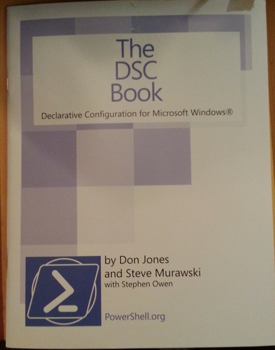

When I heard that Don Jones brought a few thousand copies of The DSC Book, which I contributed to, as give-aways for this year's PowerShell summit,  I was ecstatic to be printed!  And I really wanted to have a copy of the book.  Unfortunately, they ran out very quickly, and Don informed me that we had no more available.

I put out some calls for help on Twitter and Facebook, and was ecstatic to get a reply from Teresa Wilson (aka The Scripting Wife).  Today, this beauty arrived at my door!

 

 

It's surreal!

Thank you Don, Steve, and Teresa!
