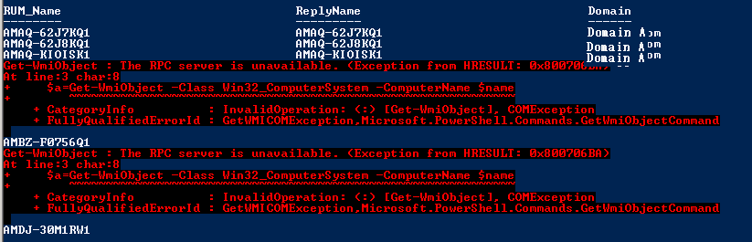

Recently at a client, we have a situation arise in which we needed to verify which Domain a number of PCs were joined to.

One issue we encountered was that because of certain underlying settings conflicts between WINS, DHCP and DNS, occasionally the wrong computer name would reply to certain commands. To alleviate this, I wrote the following short code snippet to grab a computer from a CSV, run a Get-WMIObject command, and then return the domain name.

\[code language="powershell"\] Write-Host "Ok output" import-csv .\\Desktop\\Ampcs.csv | select -expand Name | ForEach-Object { $name = $\_ Get-WmiObject -Class Win32\_ComputerSystem -ComputerName $name | select @{Name="RUMName";Expression={$name} },@{Name="ReplyName";Expression={$\_.Name} },@{Name="Domain";Expression={$\_.Domain} } }

\[/code\]

The problem with this approach is that if the computer is offline or doesn't allow remote procedure calls (a tell-tale for being in the wrong domain, as WinRM should be enabled if the PC is in the right place via Group Policy) emerges in the form of nasty error messages.

To 'get the job done' I told people just to ignore this message…but the dev inside of me couldn't handle the ugliness of this whole process. With just a few small edits, I was able to get this much better output.

\[code language="powershell"\]

Write-Host "Better output" import-csv .\\Desktop\\Ampcs.csv | select -expand Name | ForEach-Object { $name = $\_ try {$a=Get-WmiObject -Class Win32\_ComputerSystem -ErrorAction Stop -ComputerName $name} catch{$a= \[pscustomobject\]@{Name=$name;Domain="Access Denied"}} \[pscustomobject\]@{RUM\_Name=$name;ReplyName=$a.Name;Domain=$a.Domain} } \[/code\]

The core difference here Is that I'm setting an object $a equal to either the results of a Get-WMIObject Command, or as a PSCustomObject with a hashtable that contains a description of my problem and some other attributes. It never occurred to me before to try this route, using the -ErrorAction Stop to trigger an alternate output of my command.

I really like this method of communicating data, as it allows me to handle edge case scenarios gracefully. If I wanted to take it one step further, I could use multiple Catch Error blocks to provide logic for all different sorts of Error Messages, which would really elevate this code.

Hope you enjoy it!
