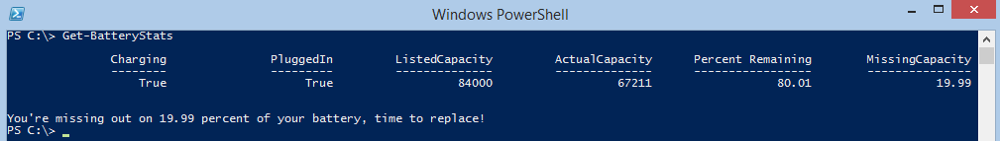

This 'One Inch of Power' is a new piece I want to start doing, cramming a lot of functionality into an inch or less of PowerShell code.

Most of these will be ten lines or less, and do something useful. So, here we go!

Ever feel like your battery is letting you down? Thanks to modern Battery WMI compatibility, we can get a battery to report to us its supposed capacity, and then dig through various WMI classes to find out if the battery is really performing as well as it should be.

Remember that most laptop batteries are only going to perform at full power for a year worth of charging cycles, after which you'll get reduced performance. My battery on my laptop was starting to slouch, so I decided to write this up.

You should run this code once while charging, and then rerun this function to see what the actual output is of your battery.

\[code language="powershell"\] Function Get-BatteryStats{ $batteryStatus = gwmi batterystatus -name root\\wmi $batterystats = gwmi win32\_portablebattery $missing = \[Math\]::Round(((1-($batteryStatus.RemainingCapacity\[0\]/$batterystats.DesignCapacity))\*100), 2)

$batteryReport = \[pscustomobject\]@{'Charging'=$batteryStatus.Charging\[0\];'PluggedIn'=$batteryStatus.PowerOnline\[0\];'ListedCapacity'=$batterystats.DesignCapacity;'ActualCapacity'=$batteryStatus.RemainingCapacity\[0\];'Percent Remaining'=\[Math\]::Round((($batteryStatus.RemainingCapacity\[0\]/$batterystats.DesignCapacity)\*100),2);MissingCapacity=if (\[math\]::Sign($missing) -eq '-1'){"ReRunOnBattery"}ELSE{$missing}} $batteryReport | ft

if ($batteryReport.ActualCapacity -gt $batteryReport.ListedCapacity){Write-Warning "Battery Reports greater than possible capacity, try rerunning this code when unit is not plugged in to AC power"} if ($batteryReport.MissingCapacity -eq 'ReRunOnBattery'){Write-Warning "Can't obtain missing power, rerun while unit is not plugged in to AC power"}ELSE{"You're missing out on $missing percent of your battery, time to replace!"} } \[/code\]

\[caption id="attachment\_718" align="alignnone" width="705"\] Time to buy a new battery!\[/caption\]
