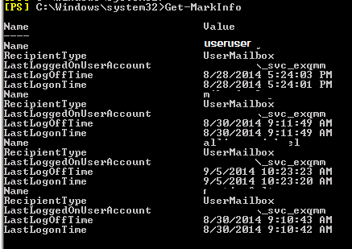
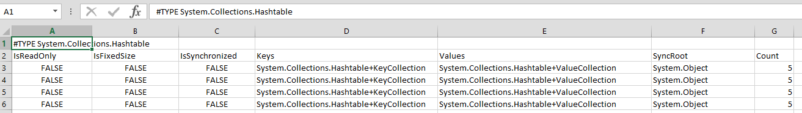
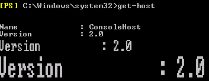

Today at a client I had to export some Exchange Information from a one of their Exchange boxes. A simple task, but I kept experiencing some strange issues when I would run my script in PowerShell on the Exchange servers.

The only data I needed was RecipientType, LastLoggedOn and some other similar info, which is also easy to get. It needed to be extracted from Exchange and made ready for assimilation into a larger spreadsheet, so exporting as a Custom Object of some form would be the way to go.

I quickly came up which this script, which should have been more than up to the task. However, the output was very bizarre.

\[code language="powershell"\] $Array = New-Object -TypeName System.Collections.ArrayList

Function Get-MarkInfo { ForEach ($user in $users){ $mbx = Get-Mailbox $user $mbxstat = Get-MailboxStatistics $user \[PSCustomObject\]$obj=@{Name=$user;RecipientType=$mbx.RecipientType;LastLoggedOnUserAccount=$mbxstat.LastLoggedOnUserAccount;LastLogOffTime=$mbxstat.LastLogOffTime;LastLogonTime=$mbxstat.LastLogonTime} $Array.Add($obj) | Out-Null } $Array | export-csv C:\\temp\\EmailExport.Csv } \[/code\]

This shouldn't export these sorts of things

[] Oh no...why is my glorious \[PSCustomObject\] master race appearing as a hash table? No one asked for key:value pairs!\[/caption\] 

A hashtable? I never ordered a hashtable!  The CSV output was even worse

[] No properties? This is what happens when you export a hashtable and don't enumerate\[/caption\]

This was very puzzling. I tried everything under the sun to try and determine why my beautiful little PSCustomObject was coming out as an ugly hashtable. Surely there is an explanation somewhere!  I tried adding Format-Table commands everywhere you could think of, and sorts of craziness with using accelerators to try and force my PSCustomObject to be treated with the respect it deserves.

I ended up digging through old blogposts about 'Whats New In PowerShell v2' and v3, when finally I stumbled on these posts: http://stackoverflow.com/questions/14967920/powershell-3-pscustomobject-displays-in-stupid-mode-via-a-variable http://www.jonathanmedd.net/2011/09/powershell-v3-creating-objects-with-pscustomobject-its-fast.html

> \[PSCustomObject\] casting is a new feature in PowerShell version 3.0!

A quick check…

[] There It was, right in front of me\[/caption\]

I'd been workign on a 2.0 version server all along! :(

I did some googling to try to refresh myself on the old way to do it, and even posted on PowerShell.org.

http://blogs.technet.com/b/heyscriptingguy/archive/2011/05/19/create-custom-objects-in-your-powershell-script.aspx

MikeFRobbins( http://mikefrobbins.com/, https://twitter.com/mikefrobbins) chimed in with a text-book perfect solution to my issue. So, I present to any of you who ever run into this same issue, the PowerShell 2.0 approach to creating and exporting a custom object.

\[code language="powershell"\] $Array = New-Object -TypeName System.Collections.ArrayList

Function Get-MarkInfo { ForEach ($user in $users){ $mbx = Get-Mailbox $user $mbxstat = Get-MailboxStatistics $user

$ObjectProperties = @{ Name = $user RecipientType=$mbx.RecipientType LastLoggedOnUserAccount=$mbxstat.LastLoggedOnUserAccount LastLogOffTime=$mbxstat.LastLogOffTime LastLogonTime=$mbxstat.LastLogonTime }

$obj = New-Object PSObject -Property $ObjectProperties $obj | ft $Array.Add($obj) | Out-Null } $Array | ft } \[/code\]
