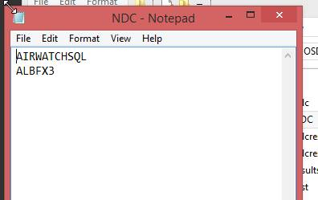
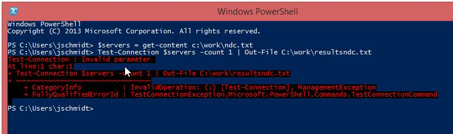
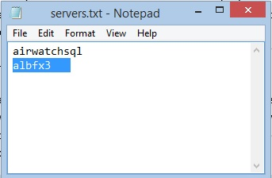

### Accepting Scripts for Review!

I _love_ it when people send me scripts that don't run, or ask for help when they encounter issues.  For me, part of my own learning solidification process is trying to explain things to others.  If I can't explain it to them, then I really don't know the topic as well as I think I do.  If you, dead readers, ever have a script or function that **just won't run**, never hesitate to send it to me.  I'll do my best to answer your problem in an understandable and friendly way, and hopefully we'll both be the wiser.  If you're okay with it, I'll post it here for others to enjoy too!

### \-Parameter Binding OMFG

I got an e-mail from a colleague today.  He said that this simple script kept failing:

\[code language="powershell"\] $servers = get-content c:\\temp\\servers.txt Test-connection $servers -count 1 | export-csv C:\\temp\\Server.csv \[/code\]

He sent me a copy of the file, which looked like this:

Running the command would give him (And me too!) the same output!

\[caption id="attachment\_772" align="alignnone" width="775"\] Invalid parameter, TestConnectionException.Microsoft.PowerShell.Commands\[/caption\]

 

I jumped into the machine, and then saw it for myself, typing out $servers would give me the contents of the file.I could separately ping each of the computers too.  But then when I attempted to run the full command, I'd get the same error!  Finally, I decided to take a look into the contents of $server, because something was going wrong here…

\[code language="powershell"\] $servers.Count

\>2 \[/code\]

Hmm…two items

\[code language="powershell"\]

$servers\[1\]                              

\>ALBFX3 \[/code\]

And the text looks good…what about the length, is something off?

\[code language="powershell"\] $servers\[1\].Length          

\>10 \[/code\]

Wait…ALBFX3 is only five letters. So I jumped into the text file itself and…

\[caption id="attachment\_775" align="alignnone" width="343"\] With Spaces, no one can hear you scream\[/caption\]

 

In the text file, ALBFX3 actually had some spaces in it!  PowerShell was getting the second item as 'ALBFX3    '.

PowerShell interprets spaces as the delimiter between arguments and inputs.It thought the spaces were preceding input, and then not finding any, throwing up an 'Invalid Parameter' error for that reason.  If you run into a bizarro invalid parameter error in the future, remember to double check for trailing spaces.
