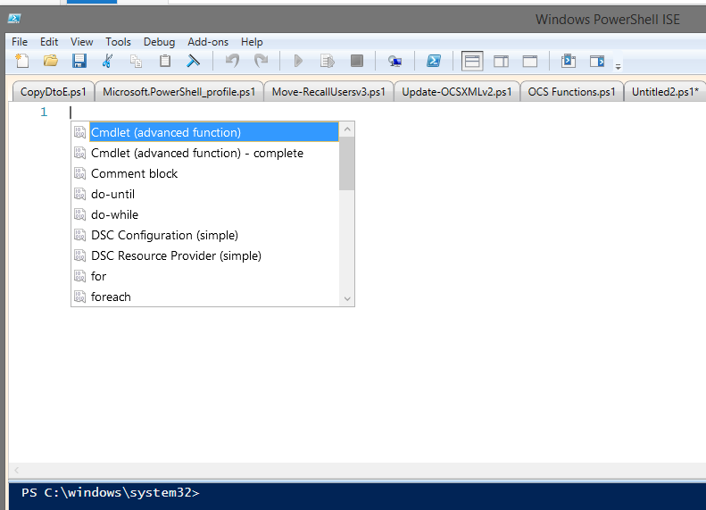

Hi guys,

One of the best features of the PowerShell ISE is the presence of Snippets, a great engine to fill in code-snippets for common tasks.  I pretty much use this every single day!

](https://foxdeploy.files.wordpress.com/2014/10/snippets0negative1.png) Hit Control+J to display the snippet menu. You can hover over for more info and detailed syntax.\[/caption\]

 

Making a new Snippet is kind of difficult though.  I found this wonderful little snippet that allows you to easily create more snippets.  I know.  Snippets in Snippets?  Not sure if it is more Ludacris or Inception though...

Rob the PowerShell DBA had this awesome snippet on his blog.

\[code language="powershell"\] $snippet1 = @{     Title = "New-Snippet";     Description = "Create a New Snippet";     Text = @" \`$snippet = @{     Title = \`"Put Title Here\`";     Description = \`"Description Here\`";     Text = @\`"     Code in Here \`"@ } New-IseSnippet @snippet "@ } New-IseSnippet @snippet1 –Force

\[/code\]

From <[http://sqldbawithabeard.com/2014/09/09/powershell-snippets-a-great-learning-tool/](http://sqldbawithabeard.com/2014/09/09/powershell-snippets-a-great-learning-tool/)\>

What does it do? Well, after running this in the ISE, you can hit Control+J and bam, an easy to fill in form to create a nice new Snippet.

[] You'll use this on a weekly basis!\[/caption\]

Fill in the values and hit F5 to create the snippet.

I love this so much, here are a bunch of snippets I use everywhere.

#### Custom Objects using Try/Catch

I made a whole blog post about doing this. It's now my go-to standard when making information gathering tools.

\[code language="powershell"\] $snippet = @{     Title = "Try/Catch/Custom Objects";     Description = "A great way to get good streamlined output while Try/Catching";     Text = @"     try {\`$a=Get-WmiObject -Class Win32\_ComputerSystem -ErrorAction Stop -ComputerName $name} catch{\`$a= \[pscustomobject\]@{Name=\`$name;Domain="Access Denied"}} \[pscustomobject\]@{RUM\_Name=\`$name;ReplyName=\`$a.Name;Domain=\`$a.Domain} "@ } New-IseSnippet @snippet \[/code\]

#### Quick PS Custom Object

Sometimes you just need to grab a bunch of info about a thing and make it a single object. Here's how:

\[code language="powershell"\] $snippet = @{     Title = "Custom Object";     Description = "I always forget how to do this!";     Text = @" #Add more columns to the object by adding extra key/values     \[pscustomobject\]@{Name=$name;Domain="Access Denied"} "@ }

New-IseSnippet @snippet \[/code\]

#### Progress Bar within ForEach Loop

This looks easy but I would forget how to do it constantly.

\[code language="powershell"\] $snippet = @{     Title = "Write Progress Sample";     Description = "Progress and how to do it";     Text = @"     #sample range of numbers \`$users = (1..13000)

#setting up base number \`$i=0 ForEach (\`$user in \`$users){ #increment \`$i++

#Round the numbers up for a nice output and then Write-Progress Write-Progress -Activity "Processing \`$user" -PercentComplete ((\`$i/\`$users.Count) \* 100) -Status ("\`$i out of " + \`$users.Count +" completed "+\[math\]::Round(((\`$i/\`$users.Count) \* 100),2) +" %") } "@ } New-IseSnippet @snippet \[/code\]

#### PowerShell V1 Custom Object Format

Sometimes you have to work on ancient systems and forget how to make old-school custom objects. Never again! This example is based on capturing the output of Get-MailboxStatistics within $mbx.

\[code language="powershell"\] $snippet = @{     Title = "PS 2.0 Custom Objects";     Description = "Old Fashioned Custom Objects";     Text = @"     \`$ObjectProperties = @{ Name = \`$user RecipientType=\`$mbx.RecipientType LastLoggedOnUserAccount=\`$mbxstat.LastLoggedOnUserAccount LastLogOffTime=\`$mbxstat.LastLogOffTime LastLogonTime=\`$mbxstat.LastLogonTime } \`$obj = New-Object PSObject -Property \`$ObjectProperties

"@ } New-IseSnippet @snippet \[/code\]

#### Old-School Custom Objects using Try/Catch

A repeat of my first Custom Object loop, this time with Pre-V2 objects

\[code language="powershell"\] $snippet = @{     Title = "Old School try/catch custom object ";     Description = "Using try/catch to create custom objects is a great way to capture information succinctly. However, the \[PSCustomObject\] Accelerator/casting only work on PS 3 and up. This example uses old school Items to get around that";     Text = @" \`$users | ForEach-Object { \`$name = \`$\_ try {\`$a=Get-mailbox \`$name -erroraction Stop} catch{ \`$ObjectProperties = @{ Name = \`$name HiddenFromAddressListsEnabled="MBX Not Found" } \`$a = New-Object PSObject -Property \`$ObjectProperties}

\`$ObjectProperties = @{ Name = \`$name HiddenFromAddressListsEnabled=\`$a.HiddenFromAddressListsEnabled } New-Object PSObject -Property \`$ObjectProperties } "@ } New-IseSnippet @snippet \[/code\]

#### Display a Popup Prompt

This is a shorty, but a useful one!

\[code language="powershell"\] $snippet = @{     Title = "Popup Message";     Description = "Add a simple pop-up message";     Text = @"     \`$msg = New-Object -ComObject WScript.Shell \`$msg.Popup("Hi Chris", 5, "DeadMau5", 48)

"@ } New-IseSnippet @snippet

\[/code\]
