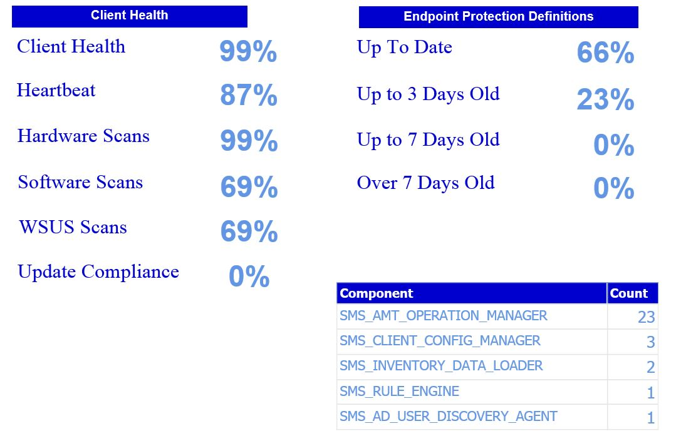

Saw this today on the SCCM Mailing list. Very, very nice looking dashboard report which pulls data from SCCM to display an at-a-glance dashboard view of the health of System Center Configuration Manager.

\[caption id="attachment\_900" align="alignnone" width="705"\] Very cool!\[/caption\]

http://thatsystemcenterguy.wordpress.com/2014/10/29/sccm-dashboards/
