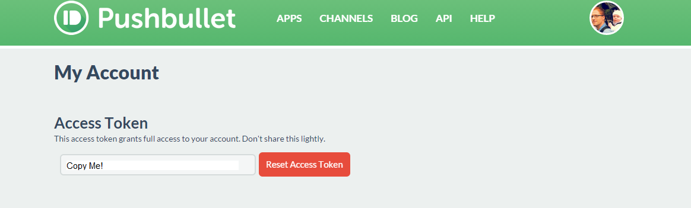
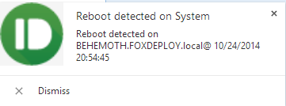
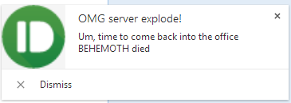
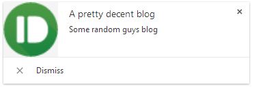

A friend and colleague of mine, [Chris Townsend](https://twitter.com/ChrisTownsend4) were talking over lunch recently, when he lamented that during a very long scripted process, he would have to manually check back in for status checks to see how this process was going, and might waste a whole weekend in front of the keyboard.  We began trying to think of ways to get notifications if he needed to intervene and manually do something.

We talked about e-mails, but I think it wouldn't work because of no open SMTP relay.  Then we wondered about sending a text, and I was reminded of PushBullet.  If you've never heard of it before, it is a very cool service you can install on your desktop, tablets, phones and even web browsers to recieve and send push notifications.  Your friends can sign up under one single Push list and send each other notifications or cool links.  You can also use it in your scripts, provided you'd like to dig into the SDK and setup your own framework with the API.

#### Introducing PowerBullet v 1.0

I present to you the (mostly) finished version of my implementation of PushBullet, which I call **PowerBullet**.  It currently contains only one function, Send-PushMessage, which will send pushes to all of your devices.  In v 2.0, you'll be able to specify which device a message goes to.  Currently, you can send the following types of messages:

- Send a Message/ Note (contains a title, and body text) - **works**
- Send an address (Will open in the default maps application) - **works**
- Send a file which pre-exists on the web - **works**
- Send a link (will open as a URL) - **works**
- Send a checklist\*
- Upload and send a file\*

_There are currently issues with sending a Checklist and Uploading a file.  Due to the more complex nature of these tasks, I plan to fully implement them in v2.0.  For now, the code exists and the function will mostly work, but error out.  If you spot the hole in my logic, let me know!_

[**Download PowerBullet here!**](http://foxdeploy.com/functions/powerbullet-pushbullet-for-powershell/ "PowerBullet : PushBullet for PowerShell")

To start off, I need to give credit where credit is due:

- The [API Documentation](https://docs.pushbullet.com/http/) was pretty good!
- This [post on StackOverflow](http://stackoverflow.com/questions/22491129/how-to-send-multipart-form-data-with-powershell-invoke-restmethod) helped me to understand Multipart forms in JSON
- Finally, I really began to understand how to present credentials using PowerShell because [of this post](http://elderec.org/2014/05/powershell-send-pushbullet-notifications-from-prtg/) on ElderRec by Jonathan Gray.  I tried to track him down to give him credit, but couldn't find his real identity.

#### Getting set up with PowerBullet

1. First things first, you'll need to **go to PushBullet.com and register**.  Sign up for the free service, then check your e-mail to confirm your account.
2. Go ahead and **register some devices too**, you could get the client on your phone or install the extension on [FireFox](https://addons.mozilla.org/en-US/firefox/addon/pushbullet/) or [Chrome](https://chrome.google.com/webstore/detail/pushbullet/chlffgpmiacpedhhbkiomidkjlcfhogd?hl=en).  There is also a desktop client too.
3. **Now, you'll need to make note of your API key** Log into PushBullet.  Click your avatar in the upper-right corner, then click Account Settings 
4. **Copy the API key listed.**   This serves as your login to the web service, and all of your registered devices, channels and subscriptions will be accessed using the key.  You'll also be tracked by PushBullet using this, so if you start pushing 10,000 messages an hour, you can probably expect to receive an e-mail or phone call about your usage.  Don't give the API key out to people. 
5. **Paste the key** into the `$APIKey` line within the `Send-Pushbullet` function and get Pushing!

#### Some examples

Sending a PushBullet Message if a particular error comes up in the Event Log

\[code language="powershell" light="true"\]get-winevent -LogName System | Select -first 1500 | ? Id -eq '1074' | % {Send-PushMessage -Title "Reboot detected on System" -msg ("Reboot detected on " + $\_.MachineName + "@ " + $\_.TimeCreated) -Type Message}\[/code\]

 In this case, look for event 1074, which is a reboot.  This is the Chrome desktop client for PushBullet.\[/caption\]

Sending a message containing PowerShell objects

\[code language="powershell" light="true"\] Send-PushMessage -Type Message -Title "OMG server explode!" -msg "Um, time to come back into the office $Env:COMPUTERNAME died"\[/code\]

 The $env:ComputerName variable will be automatically swapped for its value. Again in the desktop client.\[/caption\]

Send a file which already exists on the web.

\[code language="powershell" light="true"\]Send-PushMessage -FileName "FoxDeploy Logo" -FileType "image/png" -Type File -title "A nice picture" -msg "The FoxDeploy Logo, made by my good friend, Nick Milevsky" -url $url -Verbose VERBOSE: Sending a file VERBOSE: POST https://api.pushbullet.com/v2/pushes with -1-byte payload VERBOSE: received -1-byte response of content type application/json; charset=utf-8 VERBOSE: OK \[/code\]

 Here's an example from the Android Client.\[/caption\]

Sending a link

\[code language="powershell" light="true"\]PS C:\\temp&gt; Send-PushMessage -Type Link -title "A pretty decent blog" -msg "Some random guys blog" -url http://www.foxdeploy.com -Verbose VERBOSE: Sending a link VERBOSE: POST https://api.pushbullet.com/v2/pushes with -1-byte payload VERBOSE: received -1-byte response of content type application/json; charset=utf-8 VERBOSE: OK\[/code\]

 Showing the results in the Chrome client. Clicking the button takes you to...\[/caption\]

 Some random guy's website\[/caption\]

Finally, here is an example of embedding PowerBullet within another function. In this case, we'll make a quick function with a number-indexed hashtable, and invoke Get-Random to get a number. We'll call this 'Simulate-DataCenterFault.  If all goes well, this should come up with a random number, then pull the address from the appropriate key-value pair, and then send a PushBullet message with a working address link.

\[code language="powershell" light="true"\]Function Simulate-DataCenterFault {

$random = get-random 4 -Minimum 1

$DataCenterLocations = @{ 1 = "Capitol Lake Park, Olympia, WA 98501"; 2 = "900 Court St NE, Salem, OR 97301"; 3 = "547 L St, Sacramento, CA 95814"; 4 = "1280 Peachtree St NE, Atlanta, GA 30309"}

"Trouble reported at Datacenter $random" ("Address: "+ $DataCenterLocations\[$random\])

Send-PushMessage -Type Address -PlaceName "Datacenter $random" -PlaceAddress $DataCenterLocations\[$random\] -msg "Trouble reported at Datacenter $random" }

Simulate-DataCenterFault \[/code\]

 

 

