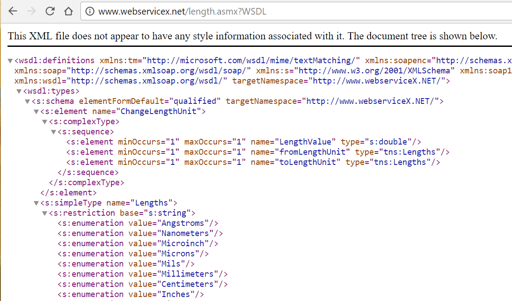
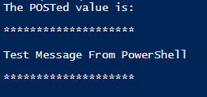

In order to truly ascend to the next level, every scripter eventually needs to integrate an outside service into the organization, be it Air-Watch, ServiceNow, LogicMonitor, Azure AD or any other popular service.

Some of these services include ready made PowerShell modules which you can easily integrate into the environment, but others instead present something different, an API, or Application Programming Interface.

These _sound_ scary and 'developery' but they really aren't so bad.  And the great thing is that they all adhere to the same standard, er, or set of standards.

Fortunately, most of the services we'll find will adhere to one of these common standards: SOAP, REST, or PHP.

The goal of this post is to give you an example of how to use each of these standards to interact with the various systems you may run across.

#### Not only for the web

You may have noticed on the past few posts here that I'm really getting into APIs. "What's so great about APIs?" you may ask.

APIs allow you to very easily leverage work that someone else has done to quickly create your own functions and get seriously useful output from just a little bit of work. If you're planning to Orchestrate workflows in your environment, or create runbooks for your data center too, or if you want to make your own tools, learning how to interact with SOAP, REST and WebServices will definitely be in your favor.

The difference between your average 'Scripting' guy and an Automation Engineer or Consultant is the ability to create your own tools, from scratch, using the APIs provided.  That's where you start to make the big bucks.

#### How do I know which standard to use?

Sometimes, we'll be super lucky and the developers for our desired Service will list which type of API they're offering.  Of course, sometimes we're not so lucky and have to look elsewhere.

Fortunately, we can use the URL for the service to help determine which PowerShell cmdlets to use!  The following chart shows the relationships between URL specification and cmdlet.

<table style="direction:ltr;border-collapse:collapse;border:1pt solid #A3A3A3;" border="1" cellspacing="0" cellpadding="0"><tbody><tr><td style="vertical-align:top;width:2.0895in;padding:4pt;border:1pt solid #A3A3A3;">
URL
</td><td style="vertical-align:top;width:1in;padding:4pt;border:1pt solid #A3A3A3;">
Service Type
</td><td style="vertical-align:top;width:1.6472in;padding:4pt;border:1pt solid #A3A3A3;">
Cmdlet
</td></tr><tr><td style="vertical-align:top;width:2.0895in;padding:4pt;border:1pt solid #A3A3A3;">
Ends in .asmx or ?WSDL
</td><td style="vertical-align:top;width:1in;padding:4pt;border:1pt solid #A3A3A3;">
SOAP
</td><td style="vertical-align:top;width:1.6472in;padding:4pt;border:1pt solid #A3A3A3;">
New-WebServiceProxy
</td></tr><tr><td style="vertical-align:top;width:2.0895in;padding:4pt;border:1pt solid #A3A3A3;">
Contains API, especially api/v2
</td><td style="vertical-align:top;width:1in;padding:4pt;border:1pt solid #A3A3A3;">
REST
</td><td style="vertical-align:top;width:1.6472in;padding:4pt;border:1pt solid #A3A3A3;">
Invoke-RESTMethod
</td></tr><tr><td style="vertical-align:top;width:2.0895in;padding:4pt;border:1pt solid #A3A3A3;">
Ends in .php
</td><td style="vertical-align:top;width:1in;padding:4pt;border:1pt solid #A3A3A3;">
PHP/Form
</td><td style="vertical-align:top;width:1.6472in;padding:4pt;border:1pt solid #A3A3A3;">
Invoke-WebRequest
</td></tr></tbody></table>

#### REST v. Soap, whats the difference?

This is a great question that came up during our user's group last night. Both REST and SOAP are simply methods of accessing information presented via web services. It will suffice to say that REST is now in vogue, and is generally believed to be easier to use and manage than SOAP, which tends to be a bit heavier on XML.

The best answer I've seen came from Dr. M. Ekelstein, who put it the following way: "A nice analogy for REST vs. SOAP is mailing a letter: with SOAP, you're using an envelope; with REST, it's a postcard. "

In his blog he gives an example, comparing the response you can expect from SOAP vs. the response from REST. In both examples, we're querying for the results of a user '12345'. Note the tremendous verbosity of one reply over the other.

<table><tbody><tr><td>SOAP</td><td>REST</td></tr><tr><td>&lt;?xml version="1.0"?&gt;&lt;soap:Envelope xmlns:soap="http://www.w3.org/2001/12/soap-envelope" soap:encodingStyle="http://www.w3.org/2001/12/soap-encoding"&gt; &lt;soap:body pb="http://www.acme.com/phonebook"&gt; &lt;pb:GetUserDetails&gt; &lt;pb:UserID&gt;12345&lt;/pb:UserID&gt; &lt;/pb:GetUserDetails&gt; &lt;/soap:Body&gt; &lt;/soap:Envelope&gt;</td><td><a href="http://www.acme.com/phonebook/UserDetails/12345">http://www.acme.com/phonebook/UserDetails/12345</a></td></tr></tbody></table>

You can imagine how much work would go into parsing out the real juicy bits from the result on the left, versus the result on the right.

Simply put, if you have the option, use REST, it's much easier to deal with the return objects!

#### Working with SOAP Protocol

So, we've determined that we're working with a SOAP API, either because the service API catalog says so, or we used the handy URL trick to determine that the URL of this service ends in .asmx?WSDL, which is short for Web Services Description Language.

The overall flow of accessing resources from a SOAP source are to access the source using New-WebServiceProxy, storing the results in a variable. You'll then run Get-Member to look at the methods your WebService offers, and then go from there with accessing it.

You can generally view a WSDL in your browser by, uh, browsing to it. It will be human readable  XML code.  For this example, we'll be using the handy Length endpoint from [WebServiceX.net](http://WebServiceX.net), which allows us to convert one unit of Length into another.  When we open it in a browser, we see the following Service Description.

Fortunately for us, rather than scrolling through pages and pages of XML, PowerShell knows how to interpret this description and let us access it in a PowerShell-y way, using the New-WebServiceProxy cmdlet.

For example:

\[code language="powershell" light="true"\] $url = "http://www.webservicex.net/length.asmx?WSDL" $proxy = New-WebServiceProxy $url $proxy | gm -memberType Method\[/code\]

TypeName: .AutogeneratedTypes.WebServiceProxy 
 
Name            MemberType Definition
---- --------- ----------
ChangeLengthUnitCompleted Event 
BeginChangeLengthUnit Method System.IAsyncResult 
ChangeLengthUnit      Method double ChangeLengthUnit
ChangeLengthUnitAsync Method void ChangeLengthUnitAsync
EndChangeLengthUnit   Method double EndChangeLengthUnit
ToString Method string ToString()

So, this helpful output lets us see some interesting Methods() available, all centered around Changing Length Units. Let's take a peek at the .ChangeLengthUnit() method.

Those definition types are super long! It basically abbreviates down to ("NumberOfUnits","StartingLengthUnit","EndingLengthUnit")

We can give it a try with the following, to convert 15 Meters into a similar number of International Confusing Headache Increments (INCHEs, for short)

\[code language="powershell" light="true"\] $serviceProxy.ChangeLengthUnit(15,"Meters","Inches") \[/code\]

    >590.551181102362

Pretty nifty!

#### Working with REST

REST APIs are the bomb, and totally fly AF.  They're written when the developers of a service truly have extensibility in mind.

For this example, we'll refer back to my Get-Weather function I released about a month ago. When I originally wrote that, I was using Invoke-WebRequest (Which is effectively just loading the web page and scraping it's contents! I've since had a come to Jesus meeting and fixed my code there )

Here are the most pertinent bits of that function:

\[code language="powershell" light="true"\] $API\_key = "$secret" $url = "https://api.forecast.io/forecast/$API\_key/$coords" #Store the results in $weather $weather = Invoke-RestMethod $url -Method Get

#Display the contents of $weather $weather \[/code\]

    latitude :      33.9533 longitude :  -84.5406 timezone :    America/New\_York offset :          -5 currently :  @{time=1416415006; summary=Clear; icon=clear-day; nearestStormDistance=235; nearestStormBearing=321; precipIntensity=0; precipProbability=0; temperature=38.67; apparentTemperature=36.25; dewPoint=20.8; humidity=0.48; windSpeed=3.54; windBearing=249; visibility=10; cloudCover=0.09; pressure=1029.21; ozone=321.84} minutely :     @{summary=Clear for the hour.; icon=clear-day; data=System.Object\[\]} hourly :         @{summary=Partly cloudy starting this afternoon, continuing until this evening.; icon=partly-cloudy-day; data=System.Object\[\]} daily :            @{summary=Light rain on Saturday through Tuesday, with temperatures rising to 67░F on Monday.; icon=rain; data=System.Object\[\]} flags :           @{sources=System.Object\[\]; isd-stations=System.Object\[\]; darksky-stations=System.Object\[\]; madis-stations=System.Object\[\]; lamp-stations=System.Object\[\]; units=us}

So,now that we've seen how easy it is to work with these object oriented services, let's take a deeper peak under the covers with some PHP/Forms manipulation using PowerShell's built-in FaceBook example.

#### Working with PHP/Web Forms Objects

Now, that we've seen how comparatively easy these were, let's see how we'd attack a .php/forms login.

One of the things to note about using Invoke-WebRequest is that you'll be getting cozy with the HTTP Verbs of Get, Post, Delete, and others. For this example, we'll use Get and Post.

We'll run our test using the easiest .php that I know of, the Form Post Tester service on Hashemian.com's blog. The usage of this service is that you can post any data you'd like to the php system, in the -Body param of your submission. You can pull the data back down later if you append a '/' and a key to your submission, which is handy for testing your HTTP Get.

Here's an example.

\[code language="powershell" light="true"\] $FormtesterUrl = http://www.hashemian.com/tools/form-post-tester.php $accessCode = "/FoxDeploy" $URI = $FormtesterUrl + $accesscode Invoke-WebRequest -Uri $uri -Method Post -Body "Test Message From PowerShell" \[/code\]

If you want to test that it worked, you can open up the full URL in a browser, and see something like this.

Now to pull the data back down from there, we'll do an use the 'Get' method instead.

\[code language="powershell" light="true"\]Invoke-WebRequest -Uri http://www.hashemian.com/tools/form-post-tester.php/FoxDeploy -Method Get | Select -expand Content\[/code\]

In more complex scenarios, you could read the HTML of a page and provide values for all of the fields on a page to log in. If you check the Get-Help example, you'll find a very ambitious example that allows you to log into Facebook with PowerShell!

#### Where to go from here

I hope you liked this quick tour through working with various APIs.  For your next steps, you might be interested in how to work with complex authentication, covered here in [Using PowerShell and oAuth](http://foxdeploy.com/2015/11/02/using-powershell-and-oauth/).

Have a specific question?  I've written modules for dozens of APIs, from [AirWatch](https://github.com/1RedOne/PSAirWatch), to [ServiceNow](https://github.com/1RedOne/PSServiceNow) and even [Imgur](https://github.com/1RedOne/PSImgur) and can help you get your API needs sorted.   Leave a message below, or on reddit.com/r/FoxDeploy and we'll see what we can do!
