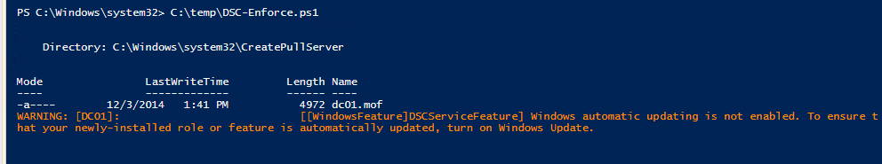
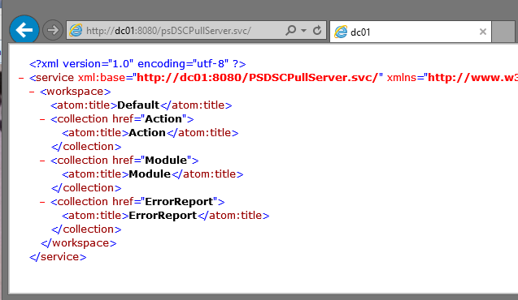
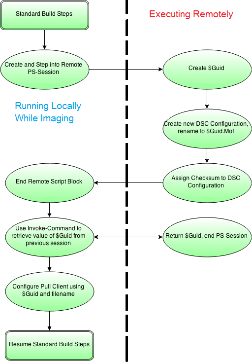
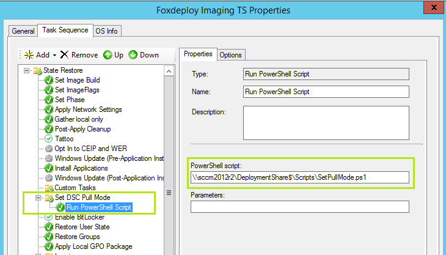
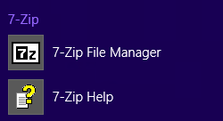

## My 100th Post, Thank you!

Hi guys, it's here, my 100th post anniversary special! I want to thank all of my loyal readers, commenters, and the folks who've liked my blog over the last 18 months for their input, critique and exciting ideas.

I'd also like to thank my extremely talented friend **Joie Brown** for designing this wonderful and festive banner for my site to celebrate the occasion! She is a wonderfully skilled artist, illustrator and designer, and you can find out more about her freelance art here at [www.joieart.net](http://www.joieart.net/). She's done work for My Little Pony, popular web comics and more, including her own printed comic book! This banner turned out great and I owe her a lot of gratitude for it.

Honestly, the feedback I've gotten from Reddit, Twitter and on my site itself is inspiring, and drives me to make better and better content. Thanks for sticking with me, and please, as always, feel free to e-mail me your questions, topic suggestions, or any critique! Stephen.Owen.ii@Gmail.com

## DSC's Chicken and Egg Problem

_Part of my series on replacing and reproducing Group Policy using PowerShell Desired State Configuration._

Anyone who's followed my blog or industry news knows that there is a lot of excitement in the Windows World about the growth of PowerShell and the introduction of Desired State Configuration. DSC will surely grow to replace at least Group Policy, and likely also begin chipping away at Configuration Manager (SCCM or ConfigMan, as it is popularly known) for ConfigMgr's DCM and software distribution. Just my prediction :)

As I've covered before on my blog, Desired State Configuration settings currently come to machines in one of two ways: Push or Pull. Here's the run-down:

- DSC Push ○ A system is built and a devop/admin/sysop pushes a config to the machine by logging on locally and pushing the config down to the system **OR** ○ A system is built and then an outside construct pushes the DSC config down to the system remotely, this could be a runbook or some other flavor of Service Management Automation (SMA)
- DSC Pull ○ A system is built and then instructed by some mechanism to reach out to an SMB Share or IIS server which is configured as a DSC Pull Server, and the system downloads a configuration from there.

The differences between them highlights one of the current challenges you'll run into with DSC: while you could write and push a DSC configuration out for every system created, it would really be better to instruct your VMs or physical infrastructure to automatically look for configuration settings as they're being built.

### The Challenges from here

Here's the problems we need to solve:

> In order for a machine to successfully register a DSC Pull server, at the time you make the registration, a DSC Configuration Guid_must already exist for that server_. Knowing that, how do we ensure a configuration exists for a brand new machine? How do we tell our systems about Pull servers while we're building them?

Active Directory Group Policy side-steps these issue entirely by delivering config settings down as part of standard Group Policy when a new system joins the domain. Since most builds of Windows machines will have them joining a domain, it really is a very nice configuration package.

So the DSC Chicken and Egg problem, as I've coined it, is this:

> **in order to register a DSC Pull Server Successfully, you must pass a GUID with your Pull settings. However, if you're trying to assign a Pull server for a brand new machine, how do you ensure that a Configuration with the appropriate Guid exists? And if you can create a config, how do you return it back to the local machine?**

In this article, I'll outline how to configure a machine for to DSC pull while imaging, which can be used in MDT or SCCM Task Sequences. The goal will be to give an example of implanting DSC Pull server settings on our systems while they're being built.

### Following Along

If you'd like to follow along, I recommend following [Jason Helmick's blog post](http://searchservervirtualization.techtarget.com/tip/How-to-push-out-a-Desired-State-Configuration-Pull-Server) here on building your own DSC Pull Server. We'll use his method and setup an SMB based pull-server.

You will need:

Virtual or physical test infrastructure, at least two machines- (If you'd like to test the baked-in approached using MDT or SCCM, you'll need)
    - One single site SCCM 2012 R2 Server **OR**
    - One MDT Server

Assuming you have a newly imaged Server 2012 R2 server, you'll need to install:

- The [most up-to-date WMF pack](http://www.microsoft.com/en-us/download/confirmation.aspx?id=44987)
- The [DSC resources here](https://gallery.technet.microsoft.com/scriptcenter/DSC-Resource-Kit-All-c449312d). Copy the DSC Resources to C:ProgramFilesWindowsPowerShellModules.
- Finally, run the script [you'll find on Jason Helmick's post](http://searchservervirtualization.techtarget.com/tip/How-to-push-out-a-Desired-State-Configuration-Pull-Server).

Blam, you've got a DSC Server.

\[caption id="attachment\_1005" align="alignnone" width="992"\] No way, that was too easy! Message Text: Warning \[DC01\] : WindowsFeaturesDSCServiceFeature Windows Automatic Updating is not enabled. To ensure your newly-installed role or feature is automatically updated, turn on Windows Updates.\[/caption\]

It was deceptively easy, right? What happened under the covers was that an instance of IIS was spun up and configured to be running a webapp of the Desired State Configuration Pull Service, with a source directory for configs set up as PROGRAMFILES\\WindowsPowerShell\\DscService\\Configuration, and also an instance of the DSC Compliance server (which we'll get into in a later post...once I can understand it!). This script from Jason's blog post configured IIS to listen on port 8080, so we'll need to keep that in mind by directing any requests to our DSC server to that port, using this syntax http://ServerName:PortName. You can change the bindings in IIS, if you'd like, or change it in the script before you launch it.

Alright, and to verify that the service is working… go to http://PullServerName:8080/psDSCPullServer.svc/ 

This isn't very human-readable, but if you're following along from home, you should see something like this.  Henceforth, when we're going to provide a pull service URL in our DSC Configs, we'll provide this full path as the URL.  Our DSC Pull Server exists, satisfying one part of our goals; next, let's look at how you instruct a client to pull configs down from a DSC Pull Server.

## Into the Local Configuration Manager

Beginning with PowerShell v4, there is a new engine running under the covers, the Local Configuration Manager. You can interact with it by using PowerShell commands like Get-DscLocalConfigurationManager. This is where the comparative magic of DSC takes place, where your system evaluates what it should look like, and also where it takes action or reports if it is out-of-compliance. This is an incredibly powerful engine, and I fully believe that the next decade we will spend countless hours coming up with ways to leverage it to our professional and personal success.

Here's a screenshot of the default state of a DSC endpoint.

AllowModuleOverWrite : False CertificateID : ConfigurationDownloadManagers : {} ConfigurationID : ConfigurationMode : ApplyAndMonitor ConfigurationModeFrequencyMins : 15 Credential : DebugMode : False DownloadManagerCustomData : DownloadManagerName : LCMCompatibleVersions : {1.0, 2.0} LCMState : Ready LCMVersion : 2.0 MaxPendingConfigRetryCount : StatusRetentionTimeInDays : 7 PartialConfigurations : {} RebootNodeIfNeeded : False RefreshFrequencyMins : 30 RefreshMode : PUSH ReportManagers : {} ResourceModuleManagers : {} PSComputerName :

We will need to modify a few of these values to reflect the settings for our Pull Server. We'll do that using a DSC configuration resource titled LocalConfigurationManager, which we'll set also using DSC. You can set your system to pull down a config from a pull server using the following syntax:

\[code language="powershell" light="true"\] Configuration SetPullMode { param(\[string\]$guid,$machineName) Node $machineName { LocalConfigurationManager { ConfigurationMode = ‘ApplyOnly’ ConfigurationID = $guid RefreshMode = ‘Pull’ DownloadManagerName = ‘WebDownloadManager’ DownloadManagerCustomData = @{ ServerUrl = ‘http://serverName:8080/PSDSCPullServer.svc'; AllowUnsecureConnection = ‘true’ } } } } SetPullMode –guid $Guid Set-DSCLocalConfigurationManager –Computer servername -Path ./SetPullMode –Verbose \[/code\]

Make sure you include 'AllowUnsecureConnection', otherwise DSC will attempt to query for a settings page on port 443 (https instead of http), and you'll have a nasty hour or two worth of errors to solve.

Thanks to Pete Zerger and Steven Murawski for their excellent blog posts on DSC Pull which helped me to understand the settings needed here. Thanks also to Jacob Benson's post on DSC Troubleshooting which helped me realize that you do need 'AllowUnsecureConnection'.

**So far we've seen how to build a DSC Pull Server** (EASY!) and also how to instruct a single endpoint to look to the DSC Pull Server for a configuration. That's great and all, but we still haven't created a DSC Configuration for this machine we're building, nor have we dealt with some of the problems above, like making sure that a DSC Configuration exists, giving it a GUID, signing it with a checksum, and then registering this GUID in the DSC client at build time.

## The Flow: Created a DSC Resource on-demand, before you need it

The overall next steps here are as follows, to be conducted while our machine is building:

- Ensure a DSC configuration (a .mof file) exists for our newly built machine
- Generate a GUID for our newly built machine, rename our .mof from $nodename to Guid.mof
- Assign a checksum to our config and ensure the extension is .mof.checksum (using the New-DSCCheckcmdlet)
- Tell our newly built machine to pull down a configuration from a pull server using the Guid and relevant Pull Server settings

**But how would I automate this in production?** Great question! We're solving this hairy problem using PowerShell Sessions and Remoting. During the imaging process, we'll include a step to run a PowerShell script which will step out to another server and create a unique GUID, generate a new DSC configuration for our machine, renaming the config to the GUID we created. Finally, we'll use Invoke-Command to pull back the GUID and use that to configure DSC Pull Locally on the new machine. 

Assuming we're using SCCM, what will happen here is that we'll add one step to our Task Sequence, and we add 'Run PowerShell Script'. 

And here is the [code for the script](http://foxdeploy.com/code-and-scripts/dsc-create-configuration-on-demand/ "DSC Create Configuration on demand").

Now, what will happen here is that your system will build and then run the remote PowerShell commands to create the .mof for it. Then, it will use DSC to configure itself as a Pull Client, and proceed with the Task Sequence. When the TS finished, within about 30 minutes, the Local Configuration Manager will attempt it's first Pull, and grab the .mof file then enact the configuration. What we're doing in our demo is simply copying down the source files for an .MSI, and then when it gets here ensure the MSI is installed. Assuming you've got a MSI for 7Zip sitting on a share and you run this script, you should see this!

\[caption id="attachment\_1008" align="alignnone" width="250"\] Our old stand-by, installing 7Zip\[/caption\]

### Wrapping up

If you can run a PowerShell Script while imaging your machine, you can use this approach to bootstrap machines with DSC Pull Settings.  I recognize that not everybody will want to use SCCM to do this procedure, so here are some other ways you could use the same script to attack this problem:

- With SCCM's little brother, Microsoft Deployment Toolkit  and its Lite Touch Install
- Use Windows System Image Manager to configure an unattended.xml file with system first boot actionlook for a pull server (setup DNS alias for a pull server)
- Use Group Policy to run a log-on script to run this PowerShell
- If you make use of another system building tool, use your Orchestration framework to Invoke this script and impart the DSC pull setting back down.

This was a challenging post for me.  Frankly, DSC is still a very new technology and not that much has been written about it.  What I've produced here is an answer to a question that has bothered me since I first became aware of DSC with Jeffrey Snover's WMF 4.0 talk at TechEd last year.  I may have made some mistakes, and it is possible that I'm over-working the whole problem.  Regardless, this solution has worked in my testing, and I would feel confident deploying this to clients or in my own environment.  If you spot an error, please let me know!  I'd love to make this the perfect solution to the 'Configuration must be there before you can embed it' problem.

Thanks!

## Sources

Steve Murawski's Great blog series on the topic on PowerShell.org [httpowershell.org/wp/2013/11/06/configuring-a-desired-state-configuration-client/](http://powershell.org/wp/2013/11/06/configuring-a-desired-state-configuration-client/)

His site on DSC and Chef configuration methodologies - [http://stevenmurawski.com/](http://stevenmurawski.com/)

Jason Helmick's Series on ConcentratedTech [http://searchservervirtualization.techtarget.com/tip/How-to-push-out-a-Desired-State-Configura-Pull-Server](http://searchservervirtualization.techtarget.com/tip/How-to-push-out-a-Desired-State-Configuration-Pull-Server)

Download link to the configuration script needed to configure a DSC Pull Server [http://cdn.ttgtmecom/rms/editorial/1.CreatePullServer.ps1.txt](http://cdn.ttgtmedia.com/rms/editorial/1.CreatePullServer.ps1.txt)

Pete Zerger's awesome post on start-to-finish deploying of a DSC Pull Server [http://www.systemcentercentral.com/day-1-intro-to-powershell-dsc-and-configuring-your-first-pserver/](http://www.systemcentercentral.com/day-1-intro-to-powershell-dsc-and-configuring-your-first-pull-server/)

Jacob Bensen's great post on DSC Troubleshooting [http://jacobbenson.com/?p=296#sthash.VDDogyU0.](http://jacobbenson.com/?p=296#sthash.VDDogyU0.dpbs)

Mike F Robbins great blog post about dealing with an error that choked me up. I had a Server with WMF 5.0 was pushing the image to a PowerShell v4 PC. [http://mikefrobbins.com/2014/10/30/powershell-desired-state-configuraterror-undefined-property-configurationname/#comment-18749](http://mikefrobbins.com/2014/10/30/powershell-desired-state-configuration-error-undefined-property-configurationname/#comment-18749)

Download link to the newest WMF for PowerShell / DSC [http://www.microsoft.comus/download/confirmation.aspx?id=44987](http://www.microsoft.com/en-us/download/confirmation.aspx?id=44987)

Download link to the newest DSC resources link [https://galltechnet.microsoft.com/scriptcenter/DSC-Resource-Kit-All-c449312d](https://gallery.technet.microsoft.com/scriptcenter/DSC-Resource-Kit-All-c449312d)
