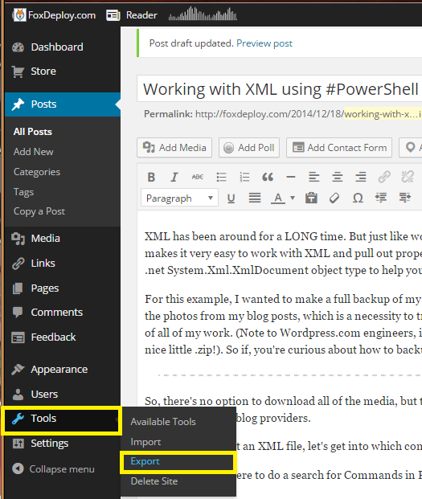
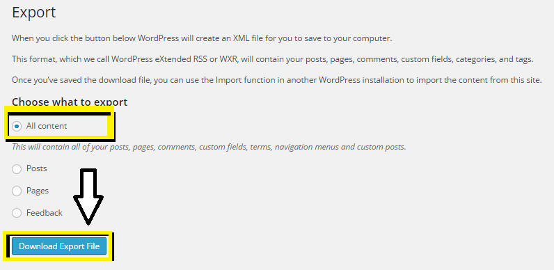
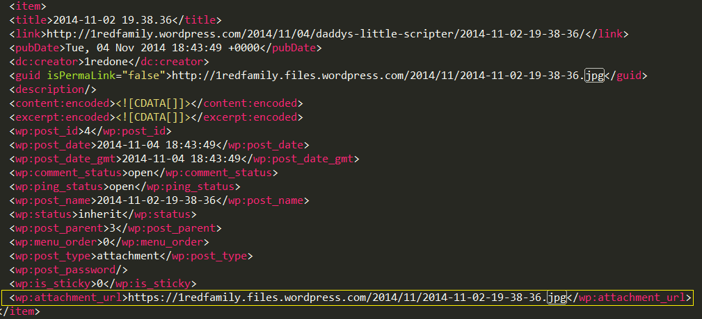
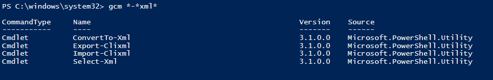
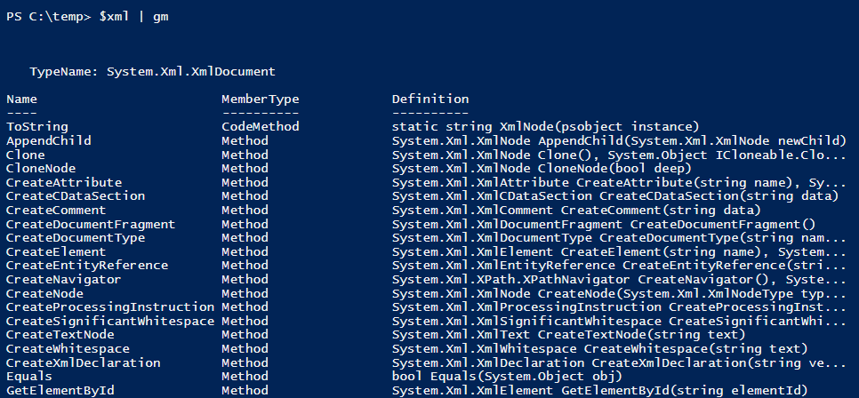
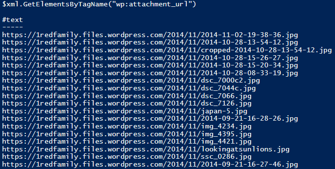
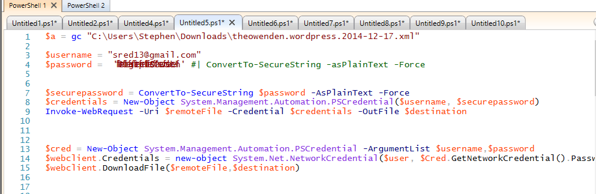
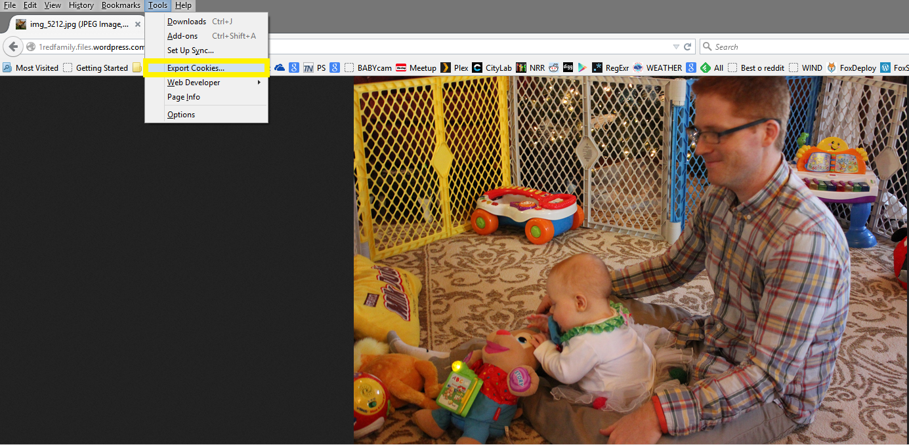

XML has been around for a LONG time. But just like working with HTML, it still kind of stinks. If you want to reach into a file and pull out values within certain tags, you'd better become a pro with Xpath or be prepared to create some REALLY ugly Regex. For instance, if we wanted to grab the values within the tag we care about for this blog post, the regex would be this simple little number.

\[code\]<wp\\\\:attachment\_url\\b\[^>\]\*>(.\*?)</wp\\\\:attachment\_url>\[/code\]

You know what they say about using regex...

Fortunately for us, PowerShell makes it very easy to work with XML and pull out properties, and makes it super easy to do so if you take advantage of the built-in .net System.Xml.XmlDocument object type to help you parse it's values.

For this example, I wanted to make a full backup of my family Wordpress Photo site, but there was no easy way to download all of the photos from my blog posts, which is a necessity to transfer my content to another provider, or at least to maintain my own copy of all of my work. (Note to Wordpress.com engineers, it would be totally sweet to have the option to download my entire blog in one nice little .zip!). So if, you're curious about how to backup your WordPress blog including all media, read further!

### How to Export your files from WordPress

So, there's no option to download all of the media, but there is the option to download a Blogtitle.XML file, which you can then import into other blog providers.  Go to your Blog Dashboard, then Settings->Export.

[] At the time I took this screen shot, I had a different working title for this post\[/caption\]

 

### Scraping XML

This XML file describes the overall layout of our site, including posts, forum replies, and things like that.  It also provides the full URL of all of the media actually featured within any of your posts.   If we're good with XML parsing, we can scrape this document and pull out the URLs to all of our media featured anywhere on our site.  Here's an example of what the XML looks like, showing the layout of a normal image post on a photo centric blog.

So, Now that we've got an XML file, let's get into which commands we have available to work with XML.  If you were to do a search for Commands in PowerShell that support or have the word XML in their name, you'll only find these few:

Let's stay away from Import-CLIXml; down that path lies only sorrow.  This cmdlet is the completely wrong command to use for parsing someone else's XML files. See, these CliXML commands really expect you to take PowerShell Objects and export them using Export-CLIXML, and then to later reimport them using Import-CLIXML.   It would work for a lot of things, but it not the right command to use to Import someone else's XML.

Instead, to import those files, we'll simply take the content of the XML file, store it in a variable (in this case $xml) and be sure to cast that as \[XML\] in the process.

\[code language="powershell" light="true"\] #Cast as \[xml\] while creating the variable \[xml\]$xml = Get-Content "C:\\Users\\Stephen\\Downloads\\theowenden.wordpress.2014-12-17.xml" \[/code\]

And once that’s done a quick, Get-Member will show us that now PowerShell is parsing the content of this file successfully.

](http://foxdeploy.com/?attachment_id=1061) So many methods! Thank you PowerShell for making this easy!\[/caption\]

We're looking for a method to let us find certain elements based on the name of their tag  (the 'wp:attachment\_url' tag).  Looking through the list, one jumps out at me.  The method in question we'll use is $\_.GetElementsByTagName().  Our next step is to take a look at the XML file itself and see which tag contains the data we're interested in.

Here's a screen shot of my .xml file, I've highlighted the tagname we're interested in.

[] Yep, same screen shot as before. A rarely seen example of code reuse in the wild!\[/caption\]

 

Now, let's provide the name of the tag we want as the overload of our .Method(). If we get all a lot of URLs for images, we're good to go.

It should only take a short PowerShell hop to prepare a skeleton to download each file, we're almost done!

\[code language="powershell" light="true"\] #Cast as \[xml\] while creating the variable \[xml\]$xml = gc "C:\\Users\\Stephen\\Downloads\\theowenden.wordpress.2014-12-17.xml"

$count = $xml.GetElementsByTagName("wp:attachment\_url").Count $xml.GetElementsByTagName("wp:attachment\_url") | %{ "Downloading $i of $count" $remoteFile = $\_."#text" $destination = "C:\\Users\\Stephen\\Dropbox\\Photos\\Catherine\\$($remoteFile.Split('/')\[5\])" $destination

#ToDo: #Figure out how to download the file...should be easy, right? $i++ }

\[/code\]

### The wrinkle

I totally couldn't figure out how to do this next part in PowerShell.

I tried every variation under the sun to do this natively in PowerShell, and was never able to succeed past the WordPress logon page to download these images.  I could logon (Using the FB example), but maintaining my session and using that to execute a download as an authenticated user?  No workey.  I tried the FaceBook method from the Invoke-WebRequest help, I tried making a local $Form.Fields object and populating the values, I tried the System.Net.WebCLient class.  Like Thomas Edison, I merely found 24 ways that wouldn't work.

](http://foxdeploy.com/?attachment_id=1062) Each of these tabs contains a thing that didn't work…\[/caption\]

I even went so far as to install Fiddler and proxy my Invoke-WebRequests through it to see why in the world I couldn't maintain my session after passing authentication.  I gave the form my username and password, what more could it want from me?

### Unholy matrimony, wGet and PowerShell together

I took a different approach. I already had the framework in place to pull the image URLs out of the XML file. I had the skeleton there to act on each and save them locally. The last missing piece was a mechanism to handle downloading the files and I knew that the mystical wGet utility from Linux can handle pretty much anything under the sun.

I did it, I merged PowerShell code to automate commands going to wGet. I'm not proud of it, but it worked!

From previous experience, I knew that you could provide a cookies.txt file to wGet and it could 'Just work' and pick the right cookie for the right site.  I used the awesome Firefox plug-in 'Export Cookies' to dump all of my cookies into a C:\\temp\\cookies.txt file. If you open up the cookies.txt, you can see a LOT of session data.  You can just cull down to the site you need to perform your task, but I was lazy and provided my full 2KB cookies.txt file to wGet.

Basically, enable the plug-in, go to WordPress and login. Then hit alt on the keyboard to display the toolbar, and choose the 'Export Cookies' option.

[] Awww one of the many photos I wanted to download!\[/caption\]

You'll get a cookies.txt.  Now, pass this in your wGet --load-cookies parameter, and watch the magic.  To execute this command, you'll need to provide the following params to wget.

\[code\]wget.exe remoteFile -O localpath --no-check-certificate --secure-protocol='auto' --keep-session-cookies -U "Mozilla" --load-cookies c:\\temp\\cookies.txt\[/code\]

- $remotefile - the URL to the remote file we want to download
- o localpath - the place we want to save the file
- no-check-certificate - this one was needed as WordPress didn't have a signed cert, or something to that effect
- secure-protocol - let wGet handle figuring out which protocol to use
- keep-session-cookies - yep, we need to preserve the data for our session
- u - Useragent, we're spoofing a Mozilla user agent, as WordPress didn't like me using a PowerShell scripting agent
- load-cookies - the path to the cookies.txt file we exported earlier

Start with downloading just a single file!

\[code language="powershell" light="true"\] $xml.GetElementsByTagName("wp:attachment\_url") | Select -first 1 | %{

$remoteFile = $\_."#text" $destination = "C:\\Users\\Stephen\\Dropbox\\Photos\\Catherine\\$($remoteFile.Split('/')\[5\])" wget.exe --load-cookies c:\\temp\\cookies.txt $remoteFile -O $destination --no-check-certificate --secure-protocol='auto' --keep-session-cookies -U "Mozilla"\[/code\]

The output:

\[code\] Resolving 1redfamily.files.wordpress.com. 192.0.72.3 Connecting to 1redfamily.files.wordpress.com|192.0.72.3|:443. connected. WARNING: cannot verify 1redfamily.files.wordpress.com's certificate, issued by \`/C=US/ST=Arizona/L=Scottsdale/O=GoDaddy.com, Inc./OU=http://certs.godaddy.com/repository//CN=Go Daddy Secure Certificate Authority - G2': Unable to locally verify the issuer's authority. HTTP request sent, awaiting response. 200 OK Length: 6766012 (6.5M) \[image/jpeg\] Saving to: \`C:/Users/Stephen/Dropbox/Photos/Catherine/img\_5194.jpg' 98% 692K 0s 6500K . 99% 705K 0s 6550K 100% COMPLETE

\[/code\]

Yay! If one worked, then the same should be true for all of the rest!  Here's the code!

#### CODE

Just a warning...the output from this will be VERY ugly if you run it from within the ISE. The ISE does not appreciate wGet's method of displaying process output to the console window. If any of you can figure out how to preserve a session for a php-based logon server and to do it with only PowerShell, please let me know!

\[code language="powershell" light="true"\] #Cast as \[xml\] while creating the variable \[xml\]$xml = gc "C:\\Users\\Stephen\\Downloads\\theowenden.wordpress.2014-12-17.xml"

$count = $xml.GetElementsByTagName("wp:attachment\_url").Count $xml.GetElementsByTagName("wp:attachment\_url") | %{ "Downloading $i of $count" $remoteFile = $\_."#text" $destination = "C:\\Users\\Stephen\\Dropbox\\Photos\\Catherine\\$($remoteFile.Split('/')\[5\])" $destination

#ToDo: #Figure out how to download the file...should be easy, right? - COMPLETED! wget.exe --load-cookies c:\\temp\\cookies.txt $remoteFile -O $destination --no-check-certificate --secure-protocol='auto' --keep-session-cookies -U "Mozilla" $i++ }

\[/code\]

#### Sources

I couldn't have completed this job without the help of the forum post from the Ubuntu discussion board, 'Export Cookies' or the wGet utility. Export Cookies - https://addons.mozilla.org/en-US/firefox/addon/export-cookies/ How to use WGET to download from a site with a login - http://askubuntu.com/questions/161778/how-do-i-use-wget-curl-to-download-from-a-site-i-am-logged-into Get wGet - http://gnuwin32.sourceforge.net/packages/wget.htm
