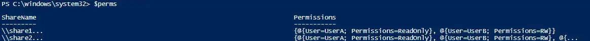
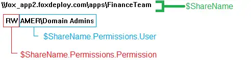
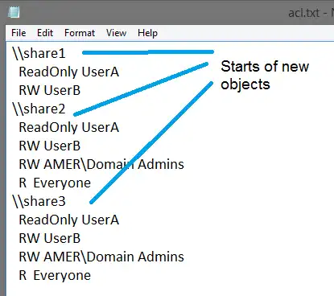
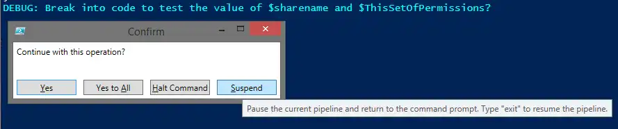
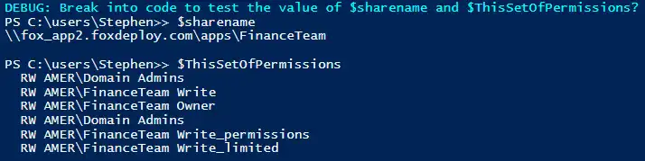
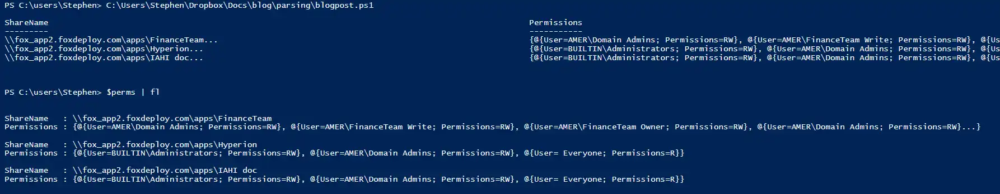

As I go from project to project, inevitably a question like this one arises:

> Stephen, I know I COULD do this by hand, but surely PowerShell can do it for me!  Help!

In this post I'll walk you through a real world example of how to parse the output of a non-PowerShell command and convert it into PowerShell objects we can work with to export reports, run SQL queries, or to do literally anything under the sun.

If you've ever needed to parse log or batch file command output and have slaved at it, hopefully this approach makes things a little easier for you.

This is part of a two-part series,  in this post we'll go step-by-step through the traditional, tried-and-true method of parsing output.  The [next post in the series](http://foxdeploy.com/2015/01/13/walkthrough-part-two-advanced-parsing-with-convertfrom-string/) is all about using Convert-FromString to parse input instead, a powerful new addition to PowerShell in version 5.0.

## The Process

First of all, you must understand that there is NO-MAGIC to this approach.  We need to look at our input data, use our minds and think of how to tell PowerShell to parse things.

The method we'll use to approach this task is pretty simple, and can be summed up in the following steps:

1. Before starting, let's not be too fancy!  Instead of trying to do this in the pipeline, make thing simple.  Export the results of whatever log or command we need to work with into a txt file first.  Later we can worry about making a slick one-liner to do this whole process.
2. Define the objects.
    - Notable Characteristics?  e.g. does a new object always begin with a share path ( for example '\\\\server\\share' would mean that a new item always starts with a double-backslash)
3. Define our properties
    - Notable Characteristics? e.g. do our properties always start with white space or a '\*' character.
4. Make liberal use of Write-Debug to work with a single object
5. Once this single object works, attack the list _en masse_!

 
## Understanding Our Target

This is a real world example, that came to me by way of a friend of mine--the guy who got me started with PowerShell in the first place--Jason Roth.

In our task, we had a very, very long list of shares in the environment and the share permissions on each.  We needed to itemize who had which permissions, and didn't want to spend all day doing so.  Furthermore, no utility that existed already could do this for us.  However, if we could parse the results out into a format PowerShell could work with, we were in the clear!

We're going to follow our own advice and not try to parse this stuff in the pipeline.  Instead, we just outputted to a .txt file using the well-known redirector character `>`

Here's an example of what the output looked like.
```
\\\\fox\_app2.foxdeploy.com\\apps\\FinanceTeam
  RW AMER\\Domain Admins
  RW AMER\\FinanceTeam Write
  RW AMER\\FinanceTeam Owner
  RW AMER\\Domain Admins
  RW AMER\\FinanceTeam Write\_permissions
  RW AMER\\FinanceTeam Write\_limited
\\\\fox\_app2.foxdeploy.com\\apps\\Marketing
  RW BUILTIN\\Administrators
  RW AMER\\Domain Admins
  R  Everyone
\\\\fox\_app2.foxdeploy.com\\apps\\HR doc
  RW BUILTIN\\Administrators
  RW AMER\\Domain Admins
  R  Everyone
```
Nothing too tricky, fairly standard Permissions listing of the ACLs on these shares.  At this phase, we should think of what we'd like the output to be.  In my case, we wanted something like this.

 The result of our parsing will be PowerShell objects with a ShareName property containing the name of the Share.  Each object will contain properties with the permissions broken up by each user, with a $user and $permissionLevel property.  Presented in table form:

<table style="direction:ltr;border-collapse:collapse;border:1pt solid #A3A3A3;" border="1" cellspacing="0" cellpadding="0"><tbody><tr><td style="vertical-align:top;width:1.6979in;padding:4pt;border:1pt solid #A3A3A3;"><p style="margin:0;font-family:Calibri;font-size:11pt;">Step</p></td><td style="vertical-align:top;width:2.1687in;padding:4pt;border:1pt solid #A3A3A3;"><p style="margin:0;font-family:Calibri;font-size:11pt;">Example</p></td><td style="vertical-align:top;width:3.9569in;padding:4pt;border:1pt solid #A3A3A3;"><p style="margin:0;font-family:Calibri;font-size:11pt;">Characteristic</p></td></tr><tr><td style="vertical-align:top;width:1.6979in;padding:4pt;border:1pt solid #A3A3A3;"><ul style="margin-left:.2458in;direction:ltr;unicode-bidi:embed;margin-top:0;margin-bottom:0;"><li style="list-style-type:none;"><ol style="margin-left:0;direction:ltr;unicode-bidi:embed;margin-top:0;margin-bottom:0;font-family:Calibri;font-size:11pt;font-weight:normal;font-style:normal;" type="1"><li style="margin-top:0;margin-bottom:0;vertical-align:middle;" value="1"><span style="font-family:Calibri;font-size:11pt;font-weight:normal;font-style:normal;">Define the Object</span></li></ol></li></ul></td><td style="vertical-align:top;width:2.1687in;padding:4pt;border:1pt solid #A3A3A3;"><p style="margin:0;font-family:Calibri;font-size:11pt;">Each share</p></td><td style="vertical-align:top;width:3.9569in;padding:4pt;border:1pt solid #A3A3A3;"><p style="margin:0;font-family:Calibri;font-size:11pt;">Start with a '\\'</p></td></tr><tr><td style="vertical-align:top;width:1.6979in;padding:4pt;border:1pt solid #A3A3A3;"><ul style="margin-left:.2458in;direction:ltr;unicode-bidi:embed;margin-top:0;margin-bottom:0;"><li style="list-style-type:none;"><ol style="margin-left:0;direction:ltr;unicode-bidi:embed;margin-top:0;margin-bottom:0;font-family:Calibri;font-size:11pt;font-weight:normal;font-style:normal;" type="1"><li style="margin-top:0;margin-bottom:0;vertical-align:middle;" value="2"><span style="font-family:Calibri;font-size:11pt;font-weight:normal;font-style:normal;">Define the properties</span></li></ol></li></ul></td><td style="vertical-align:top;width:2.1687in;padding:4pt;border:1pt solid #A3A3A3;"><p style="margin:0;font-family:Calibri;font-size:11pt;">Each user and their permissions</p></td><td style="vertical-align:top;width:3.9569in;padding:4pt;border:1pt solid #A3A3A3;"><p style="margin:0;font-family:Calibri;font-size:11pt;">Will be in-between each object (will find them between '\\')</p></td></tr></tbody></table>

To illustrate how we'll do this, let's draw a diagram of how we'll interpret these fields from our input object.

[](../assets/images/2015/01/images/parsin021.webp)

Everything that occurs between each instance of the '\\' will be considered properties of a single object.

### Breaking out the objects

Let's first load our object into a variable using get-content.

```powershell
$fileContents = Get-Content C:\\temp\\acl.txt
```

Now, to dig in by breaking our list apart into items. We can see that every set of double backslash indicates the start of a new share.

[](../assets/images/2015/01/images/parsin03.webp)

We can use the select-string command here to get instances of the double backslash pattern. Running this on our $filecontents gives us.

](../assets/images/2015/01/images/parsin04.webp) Use -SimpleMatch to keep PowerShell from treating the search query as Regex. '\\\\' in regex would be a single escaped backslash character.

 

If we explore into the properties of the output of select string, we'll see we now have a number of useful properties, including the line number on which this match occurred.

We've also completed step 1, we have our objects, the names of the shares, so we'll go ahead and save that into its own variable, for use later.

```powershell
 $sharename = $\_.Line
```

To define our properties, we'll need to loop within the text between all of these objects, so we'll do that in the next part. Your code should now look something like this.

```powershell
$fileContents = Get-Content C:\\temp\\acl.txt $fileContents | Select-String -pattern "\\\\" -SimpleMatch | ForEach-Object { $sharename = $\_.Line } 
```

### Digging into the objects

The way we'll attack this further is to use the LineNumber of where our match occurred to grab all of the text between this and the next match. There are a number of ways to do this, but I like to use our section delimiting characters (the '\\') as anchor points. Our next step will be to grab all of the occurrences of delimiters and find the one which is closest to the beginning of this section:

```powershell
 $startOfThisSection = $\_.LineNumber $startOfThisSection = [int]$startOfThisSection- 1

#Get the line number of all instances of '\\\\' 
$AllInstancesOfDelimeter = $fileContents | select-string -Pattern "\\\\" -SimpleMatch | select -expand LineNumber

#Get the closest '\\\\' to the beginning of my config 
$endOfThisConfigSec = ($AllInstancesOfDelimter | ?{ $\_-ge (($startOfThisSection)+1) })[1].LineNumber
```

At this point, we've got our input broken into three objects, so we'll need to delve into our object using the Write-Debug command to set a break point. We'll add a Write-Debug right after the above codeblock, and then set our console $DebugPreference = 'Inquire'.

Now, to test if this works, we'll need to direct our code to get the lines starting with the '\\' line of this section, but omit the first line(because that line is returned in this $match object, which we're using for the name of our $sharename), then grab all lines between the $startofThisSection and the next instance of the '\\' delimeter. We'll use array subindexing ($array[$arrayItem] ) to grab the particular entries.

```powershell
$filecontents = $filecontents.Split("\`n")

$fileContents | select-string -Pattern "\\\\" -SimpleMatch | % {

$permissions = @() $sharename = $\_.Line $startOfPermissionConfig = $\_.LineNumber 

#"Range begins on line $startOfPermissionConfig" 
$startOfPermissionConfig = [int]$startOfPermissionConfig - 1

#Get all instances of '\\\\' 
$endOfConfigSection = $fileContents | select-string -Pattern "\\\\" -SimpleMatch | select LineNumber -expand LineNumber

#Get the closest '\\\\' to the beginning of my config 
$endOfThisConfigSec = ($endOfConfigSection | ?{ $\_-ge (($startOfPermissionConfig)+1) })[1].LineNumber

#Get all lines from $startofPermissionConfig to 
$endOfThisConfigSection $ThisSetOfPermissions = $fileContents[([int]$startOfPermissionConfig..([int]$endOfThisConfigSec-2))]

#if specified, grab the defaultrouter $ThisSetOfPermissions = 
$ThisSetOfPermissions | select -Skip 1

Write-Debug "Break into code to test the value of \`$sharename and \`$ThisSetOfPermissions?"

} 
```

### Using Write-Debug to suspend our code, Matrix style

Now, when we run our code, we'll be prompted by line 23 to Halt, Continue or Suspend this command.

**Using Suspend while in a code loop is awesomely powerful!** It allows you near Neo-level powers to jump into the command line and access the $\_ object in real time, and see which objects exist in the pipeline. Instead of assigning an outside object the values of a point-in-time slice of your script, you can play with the results in real time!

[caption id="attachment\_5130" align="alignnone" width="500"] How it feels to 'pause time' via Suspend

PowerShell v5 preview allows you to jump directly into debug mode while using the ISE by hitting  **Control+B,** so you don't even have to set a Write-Debug breakpoint.  However, for ease and backwards compatibility, I like to leave Write-Debug statements liberally left in my code, which I can access using either the -Debug switch on a function or bound script, or by setting my $DebugPreference manually.  There are nearly limitless options to the troubleshooting and outcomes you can create when using Suspend.

When you run code with a $DebugPreference set to Inquire, you'll get a nice prompt and console output with the message you left behind.  Save your future self from confusion and make sure to mention which variable you should test at this point in time.

[](../assets/images/2015/01/images/parsing05.webp)

So, to check our values of $sharename and $ThisSetOfPermissions.

 See line 2 with the >> mark? You'll notice that you're in a suspended command line when you see the Console Prompt icon change into a '>>' character.

Alright, the final step now is to iterate through our $ThisSetOfPermissions and assign each of these lines to be a new PowerShell custom object. We'll collect all of these together into a $permissiosn array and then publish them as one $sharename object with a mult-valued $permissions property

### Assigning Properties

Now that we know our $TheSetOfPermissions will contain the Permissions for the Share, we just need to iterate through them. A single $permission will look like this.

`RW AMER\\Domain Admins`

Working in the Suspended command line makes this very easy to hack apart our entries and assign them to variables.  Here's the code, and then I'll talk you through what it does:

```powershell  

ForEach ($permission in $ThisPermissionsList){ 
  write-debug "Experiment with \`$permission to split and assign the entries on the line" 
  $access =$permission.Trim().Split(' ')[0] 
  $user   =($permission.Trim().Split(' ') | Select -skip 1) -join ' ' 
  $permissions += [pscustomobject]@{User=$user;Permissions=$access} 
} 
```

We need to get rid of the leading spaces with a .Trim() sub-expression method call and then use .Split(' ') to split on spaces, and set the first value that we get back as our $access object (line 3).  Then, we'll collect all of the remaining properties from the .Split(' ') and join them with a 'space' and assign that to a $user object (line 4).  Finally, we'll collect and add them both to a $permissions object that reflects all of the $permission entries in $ThisPermissionsList.

### Wrapping it up

When we're done with the permissions loop above, we'll collect all of them into another Custom Object, this one having a $sharename, and $permissions property.

```powershell  
 $permissions += [pscustomobject]@{User=$user;Permissions=$access} 
```

There is a pitfall you would run into with this particular example.  When you get to the last permission entry and there are no ending entries in the list (e.g. when you get to the last entry and it goes to look for the next delimiter after itself, there won't be one) the code would dump out on you and give you a mangled final object  that contains every object in the list, with bad formatting. To get away from that, I added an extra piece of logic on line 20, that if this is the last delimiter in the list, then grab every non-whitespace line in the remainder of the list and return that for $ThisPermissionsList.

### The Code

```powershell 
$filecontents = $filecontents.Split("\`n")

$fileContents | select-string -Pattern "\\\\" -SimpleMatch | % {

$permissions = @() $sharename = $\_.Line #<##experimental zone #Get Starting line of Permission Pool 
$startOfThisSection = $\_.LineNumber

#"Range begins on line $startOfThisSection" 
$startOfThisSection = [int]$startOfThisSection - 1

#Get all instances of '\\\\' 
$allInstanceOfDelimiter = $fileContents | select-string -Pattern "\\\\" -SimpleMatch | select -expand LineNumber

#Get the closest '\\\\' to the beginning of my config 
$endOfThisConfigSec = ($allInstanceOfDelimeter | ?{ $\_-ge (($startOfThisSection)+1) })[1]

if ($endOfThisConfigSec -eq $null) {$endOfThisConfigSec = $fileContents.Count}

#Get all lines from $startOfThisSection to 
$endOfThisConfigSection $ThisSetOfPermissions = $fileContents[([int]$startOfThisSection..([int]$endOfThisConfigSec-2))]

#We need to skip the first entry, to ensure that our sharename isn't included in the results 
$ThisSetOfPermissions = $ThisSetOfPermissions | select -Skip 1

Write-Debug "Break into code to test the value of \`$sharename and \`$ThisSetOfPermissions?"

ForEach ($permission in $ThisSetOfPermissions){ Write-Debug "Experiment with \`$permission to split and assign the entries on the line" 
$access =$permission.Trim().Split(' ')[0] 
$user =($permission.Trim().Split(' ') | Select -skip 1) -join ' ' 
$permissions += [pscustomobject]@{User=$user;Permissions=$access} }

[pscustomobject]@{ShareName=$sharename;
  Permissions=$permissions} }
```

### The Results

[](../assets/images/2015/01/images/parsing07.webp)

I hope you guys enjoyed this walk-through and that it helps you the next time you have to parse output from a non-PowerShell command, or are expected to flex your PowerShell wizardry and parse plaintext.