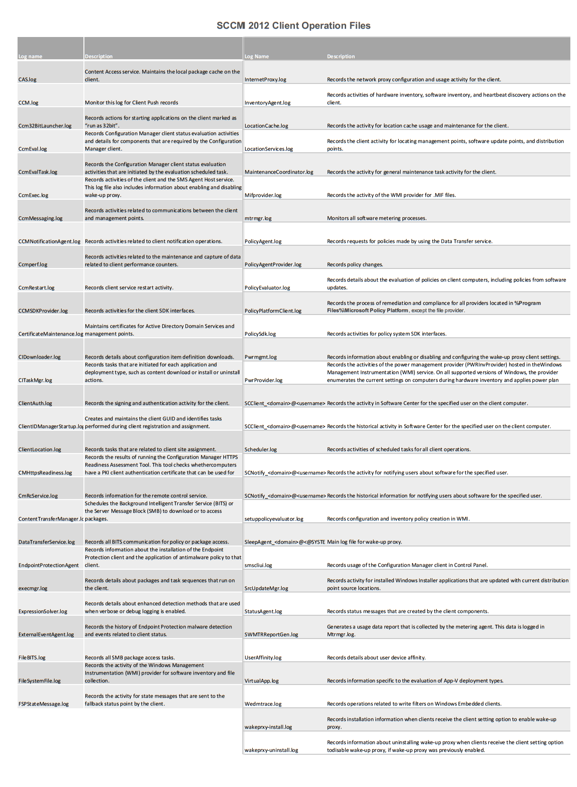

)

This post is part of the 'Scripting SCCM' series on FoxDeploy, click the banner for more!  

* * * 

Jumping back into the SCCM Saddle, I noticed that I could really benefit from a printable SCCM reference guide.  I decided to whip one up, using the data from the Technet page.

Print up this full-sized .png or download the PDF Below.

 Printable SCCM 2012 Log File Chart and Reference Guide

[SCCM 2012 Logs Chart](images/sccm-2012-logs-chart.pdf)
