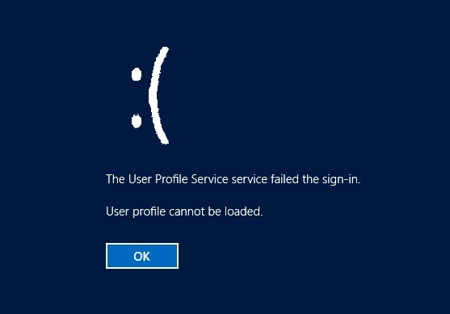

I've seen one too many servers hobbled by a run-away IIS installation. By default, if IIS is enabled and allowed to store its log files, it's only a matter of time before it consumes every scrap of space on the C:\\, leaving no room even for a user profile to be created! When this happens, no one can log onto the machine who hasn't already stored their profile before. It's sad. It's so sad, it even has a frowny face on Server 2012 systems.



Never again will IIS be allowed to tyrannically absorb all file system space! I wrote this script for a client to remove IIS files older than 30 days. Update the $LogPath to point it at your IIS log's directory, change the $maxDaystoKeep value and the $outputPath value to tell the script where to put your logs. If files exist that are older than 30 days, they'll be tossed, and a nice log entry created. If not, an entry will be added to the log stating 'no files to delete today' instead.

```powershell    
$LogPath = "C:\\inetpub\\logs" 
$maxDaystoKeep = -30 
$outputPath = "c:\\CleanupTask\\Cleanup\_Old\_logs.log"

$itemsToDelete = dir 
$LogPath -Recurse -File \*.log | Where LastWriteTime -lt ((get-date).AddDays($maxDaystoKeep))

if ($itemsToDelete.Count -gt 0){ 
  ForEach ($item in $itemsToDelete){ 
    "$($item.BaseName) is older than $((get-date).AddDays($maxDaystoKeep)) and will be deleted" | Add-Content $outputPath
    Get-item $item | Remove-Item -Verbose 
    } 
  } 
  ELSE{ 
    "No items to be deleted today $($(Get-Date).DateTime)" | Add-Content $outputPath
     }

Write-Output "Cleanup of log files older than $((get-date).AddDays($maxDaystoKeep)) completed..." start-sleep -Seconds 10
```

I deployed this as a Scheduled Task and it's running wonderfully thus far. Enjoy!
