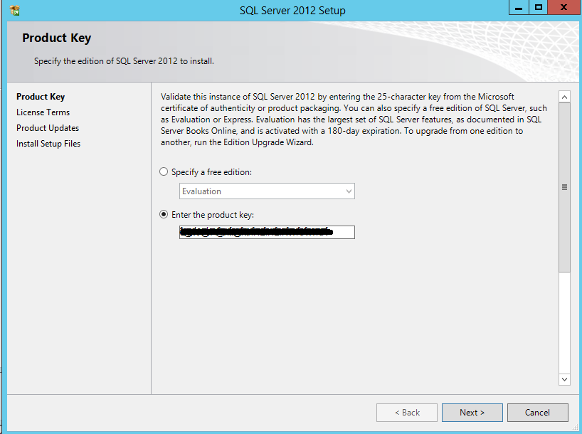

Have you ever wondered what happens when you install SCCM 2012 or 2007 on top of SQL and choose 'Evaluation mode', then forget to enter the SQL key?

## SQL will turn off the SQL Database Service on day 180, and never turn back on until you license it

How's _that_ for getting your attention?

Recently at a client, my contact was searching for their install keys, and promised to provide them later. No problem, I said, and proceeded to install both ConfigMgr 2012 R2 and SQL 2012 SP1 in evaluation mode. Typically what would happen here is that after a week or so, the VAR would get back to us with some keys...This time however...

The big rub was that this was an educational institute. They are sold licenses in different quanities and at different rates than your typical enterprise or SMB, the sorts of customers I deal with much more often. Those larger firms often buy a bundle of SQL licenses, and I'd just use one of them, which would get re-added / comped to their license pool the next time they re-upped their licenses. Schools don't typically need SQL Server, relying instead on Postgresql or MySQL (shudder) or even worse, Oracle.

I contacted Microsoft about my dilemma and posted online, I was told that System Center _does include_ a special SQL installer that won't prompt you for a key, meaning that there are no install keys for me to find in my Volume License account. What should happen is that if you use the right iso, it will contain your own license key for SQL pre-embedded, and you can actually see it when you run the installer.  However, this installer will detect pre-existing SQL features, and will dump/not display the license info if it detects any.

When I posted online about it people told me to backup my SQL Server DBs, delete my SQL install, then reinstall using the special installer ISO (and hope that SCCM's accounts restore without any pain).

Thanks to the help of my friend, MCT and SQL Badass [Sassan Karai](https://twitter.com/SassanKarai), we found a better way.

### The problem

Your System Center license from Microsoft includes SQL install rights, but you've installed SQL using different media and don't have another Enterprise or Standard key to use. Additionally, if you try to run a new install side-by-side, the SQL Server installer will detect a pre-existing instance and **NOT** display your license key.

### The Solution

Setup a clean VM or other server and run the installer, using the special ISO you'll get from your volume license account under System Center 2012 R2 Client License (or something similar). This time, when the installer runs and gets to the product key, you can see your special embedded key!

 Thank God for this embedded key!

I'm not certain how it's done, but somehow when you download your ISO from Volume Licensing, your unique key is embedded into the ISO. Very cool technology.

Anyway, if you find yourself with SCCM installed on a SQL instance stuck in evaluation mode, and don't have any other keys to use, and don't want to reinstall it all, try this method. It works, can save you a full rebuild **AND** it also uses the key you're legally entitled too.

Keep in mind, your license from MS only entitles you to run SQL in service of System Center, and not for any other reason. If you want to use SQL Server for something else, call Microsoft and get a license for it!