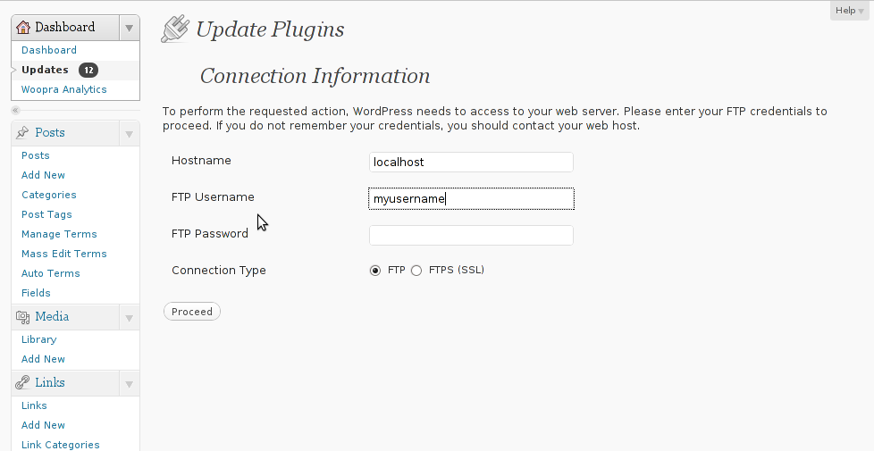
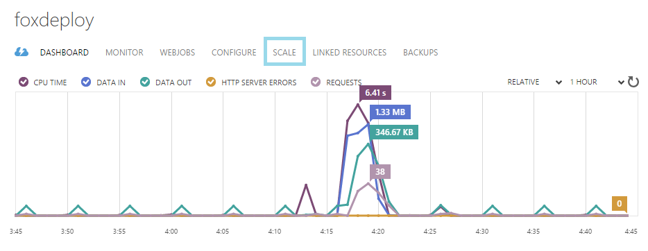
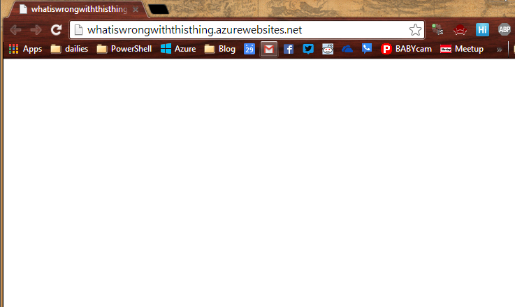
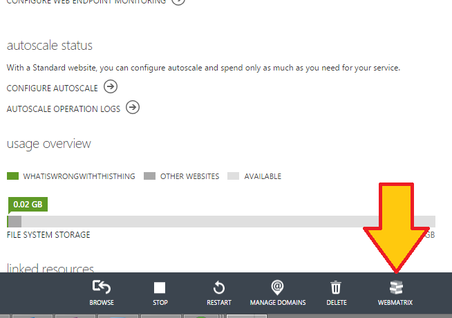
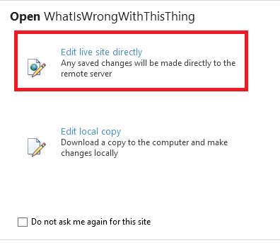
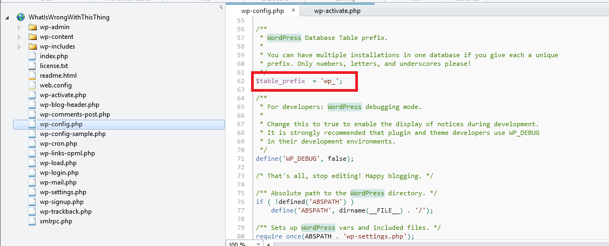
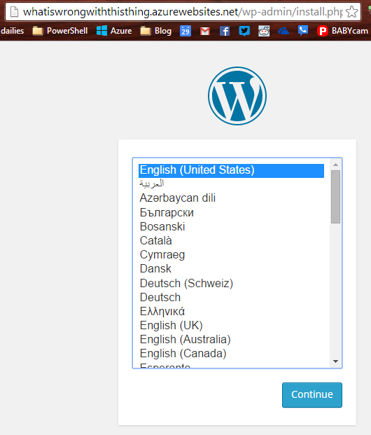

I've recently been in the process of migrating my blog off of WordPress.com hosting to my own WordPress.org account.  I tried a few things, a number of which did not work well, and I hope to help you avoid them if you try the same thing too.

## After installing WordPress on a localhost / Linux LAMP setup (Linux Apache MySql PhP) you're prompted for credentials when uploading content or plugins

This one is super annoying.  You'll basically see a message like this whenever you try to install a new plug-in, and have to put in your  Linux credentials.

 Whoa whoa whoa, contact my host? I am the host. Uh-oh.

**\--Whats going wrong**

What happens here is that if you follow the [instructions in this page for](https://www.digitalocean.com/community/tutorials/how-to-install-wordpress-on-ubuntu-12-04) setting up WordPress on a LAMP stack, you'll end up with WordPress installed to /var/www and all of the files and folders there owned by your user account.  This means that when you try to upload files, Apache, the Linux Web Service, which runs with the user account www-data will not have any permission to this path.  Hence the prompt for credentials.

**\--How to fix it**

This is simple.  In your Linux/Ubuntu system, open terminal.  If you've got an Azure Ubuntu VM like me, connect via SSH using Putty.

**CD to your WordPress directory, most likely /var/www**

Run the following commands

```
chown www-data * chown www-data */* chown www-data */*/*
```

Thanks to [fkoosna for this answer](https://wordpress.org/support/topic/failed-to-connect-to-ftp-server-localhost21-3).

## You setup an Azure WordPress Website using the quick create option from the Azure Store and WPAdmin / Dashboard and page loads are slow

This one really stinks. You'll get eight or nine second pages loads (shoot for under two!) and doing work to your site is a slog, because the page loads so slowly.

When you setup an Azure WordPress site using quick create from the Azure store, you'll end up with a 'shared' website, meaning that your WordPress instance runs alongside other sites competing for resources.  You also generally have very little control over the site, as you're using Platform as a Service (PaaS).

**\--What's going wrong**

Chances are that one of the other tennants in your shared host is being unruly and has lots of scripts running or other intense server behavior.  Azure will attempt to quash bad activity like that, but in the end can only do so much.  When you're ready to move to the big leagues and have dedicated hosting for your site...

**\--How to fix it**

The simple fix to this issue is to simply upgrade your instance to a Basic or Standard instance, which moves you into infrastructure as a service (IaaS) in which you now have a VM you can work with and tweak.

Login to the [Azure porta](https://manage.windowsazure.com/#Workspaces/WebsiteExtension)l and click on Web Sites, then click your desired site and choose **Scale**

 

]

On this page, keep in mind your budget.  As soon as we click from Free/Shared and move up to Basic, we're talking about a full VM tier here.  This can run about $35 bucks a month.  That's more than twenty dollars (which is my '_uh, maybe I should pay attention to this_' threshold).  If you're on a totally free account, you'll have to remove the spending limit, or you'll basically have a VM immediately turn off and not work anymore.  Goodbye website.

[[blog_UpgradingToBasicInstance1](../assets/images/2015/02/images/blog_upgradingtobasicinstance1.png)]
 

On this page, we can also configure Autoscaling, if we want to allow our site to scale up and out as needed.  Keep in mind that you'll have to do a bit of work to make this function.  Azure can't magically code-in scale-out support for you.

## When setting up additional Azure websites after scaling up **the WordPress installer does not launch**

This one took me a while to figure out.  I was creating blog sites for my wife, and in the process of spinning one up in the Azure portal, I would point them to an existing MySql (or SQL Server, if you're using Brandoo Wordpress) db, expecting to colocate all of my blogs in one instance of SQL that I keep clean.


So, I'm making a new WordPress site just to show this to you.

](http://foxdeploy.com/2015/02/20/migrating-to-your-own-wordpress-org-account-things-that-will-suck-and-how-to-avoid-them/blog_whatiswrongwiththis1/) Alright, lets see if it happens again.

The site is built, let's see what happens when I go to the URL.

](http://foxdeploy.com/2015/02/20/migrating-to-your-own-wordpress-org-account-things-that-will-suck-and-how-to-avoid-them/blog_whatiswrongwiththis2/) Um, shouldn't there be something here?

**\--What's going wrong?** 

The first time that a WordPress instance is created, it will attempt to connect to and use MySQL and initiate a few tables, things like that.  However, if another blog has already been setup before and has permissions and data in those tables, the Wordpress install will stall out!  Specifically, there is a setting we need to change to allow our WordPress installer to spin up some new tables in our existing MySQL DB.

**\--How to fix it?**

This was one I never would have solved if not for this blog post (insert link here later when I find it!).  We need to edit the wp-config.php file, which has a number of useful settings we can change to help shape and control the way that WordPress runs.  We need to address line 65 on this file, $dbPrefix, because our first blog instance is already using that prefix, preventing the installer from running.

Assuming you're using Azure Websites, we'll use the very, very very useful Webmatrix tool to work with an online copy of our site.  From the Website window, click WebMatrix

[](http://foxdeploy.com/2015/02/20/migrating-to-your-own-wordpress-org-account-things-that-will-suck-and-how-to-avoid-them/blog_whatiswrongwiththis3/)

Now, choose Edit Live Site Directly.

[](http://foxdeploy.com/2015/02/20/migrating-to-your-own-wordpress-org-account-things-that-will-suck-and-how-to-avoid-them/blog_whatiswrongwiththis4/)

This gives us a nice way to upload files without resorting to FTP, and can be used to backup your site as well!  You can even run the site off of your laptop or PC if you choose to 'Edit Local Copy'. We need to edit the wp-config.php file, which executes and sets up our blog for us by running the WordPress installer.

Skip down to about line 62, and look for the line beginning

```php
$table\_prefix = 'wp\_';
```


Change this prefix to be anything else in the world, and you're set!



Hit Control+S to save the change...

[](http://foxdeploy.com/2015/02/20/migrating-to-your-own-wordpress-org-account-things-that-will-suck-and-how-to-avoid-them/blog_whatiswrongwiththis6/)

then hit F5 in your browser



## But wait, there's more!

I'm still not done with my migration.  I'll let you know if I run into any other really fun problems that destroy my blog along the way.  I'll tell you that deciding to move to my own hosting opened up a huge can of worms with regards to minifying CSS and JavaScript, and suddenly worrying about PageSpeed and things like that.  I'm not certain yet if I'll continue trying to host my own site, but the learning alone has been worth it.
