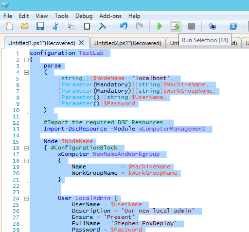

[](http://foxdeploy.com/learning-dsc-series/)

This three part series is going to be about twenty parts at the rate I keep forgetting things.

We left off in our last episode with creating our local user, we'll build on last week's config by adding our user to the admin group, to kick things off.

By now the process should be familiar:

- Run Get-DSCResource to see which configuration items are available
- Be lazy and run Get-DscResource Group | select -expand Properties | Select -expand Name | ForEach { "$\_=\`"\`"" } to get our copy-paste output of the items we need to configure for that resource
- Copy and paste this into our Configuration Block, below our previous item

Being that we want to configure Groups, we'll search for Groups...

```powershell  
Get-DscResource Group | select -expand Properties | Select -expand Name |  ForEach { '$_=`'`'' } 
GroupName=''
Credential=''
DependsOn=''
Description=''
Ensure=''
Members=''
MembersToExclude=''
MembersToInclude=''
```

And we see all of the items for the Group Resource. We'll lazily copy and paste this as a new configuration item, to add that at the bottom of our Node $NodeName {#confirguration block}

Now, here are the values you'll want to include.

```powershell   
Group AddToAdmin{
             #we want to add the user to the built-in Admin group
            GroupName='Administrators'   
            #we want this to execute after the user is created
            DependsOn= '[User]LocalAdmin' 
            #the other alternative is Absent, which would remove this user
            Ensure= 'Present'
            #we can reuse the same value for our User creation config,
            MembersToInclude=$UserName
```

So, we've updated our Configuration. Now we select the whole configuration to reload it into memory by highlighting the whole thing and hitting F8.

 Pro-tip, click a line or highlight many lines and hit F8 to execute just that part of your script

Alright, let's invoke it...

```powershell  
TestLab -MachineName DSCDC01 -WorkGroupName TESTLAB `
  -Password (Get-Credential -UserName 'FoxDeploy' -Message 'Enter New Password') `
  -UserName 'FoxDeploy' -ConfigurationData $configData
 
Start-DscConfiguration -ComputerName localhost -Wait -Force -Verbose -path .\TestLab
```

And the results

```
[[xComputer]NewNameAndWorkgroup] Checking if computer name is DSCDC01
[[xComputer]NewNameAndWorkgroup] Checking if workgroup name is TESTLAB
[[xComputer]NewNameAndWorkgroup]  in 0.2180 seconds.
[[xComputer]NewNameAndWorkgroup]
[[xComputer]NewNameAndWorkgroup]
[[User]LocalAdmin]
[[User]LocalAdmin]
[[User]LocalAdmin] A user with the name FoxDeploy exists.
[[User]LocalAdmin] The value of the Password property does not match.
[[User]LocalAdmin]  in 2.5350 seconds.
[[User]LocalAdmin]
[[User]LocalAdmin] Configuration of user FoxDeploy started.
[[User]LocalAdmin] Performing the operation 'Set' on target 'User: FoxDeploy'.
[[User]LocalAdmin] User FoxDeploy properties updated successfully.
[[User]LocalAdmin] Configuration of user FoxDeploy completed successfully.
[[User]LocalAdmin]  in 2.4330 seconds.
[[User]LocalAdmin]
[[Group]AddToAdmin]
[[Group]AddToAdmin]
[[Group]AddToAdmin] A group with the name Administrators exists.
[[Group]AddToAdmin] Resolving Administrator as a local account.
[[Group]AddToAdmin] Resolving foxdeploy as a local account.
[[Group]AddToAdmin] At least one member FoxDeploy of the provided MembersToInclude parameter does not have a match in the existing grou
p Administrators.
[[Group]AddToAdmin]  in 2.7040 seconds.
[[Group]AddToAdmin]
[[Group]AddToAdmin] Performing the operation 'Set' on target 'Group: Administrators'.
[[Group]AddToAdmin] Resolving foxdeploy as a local account.
[[Group]AddToAdmin] Group Administrators properties updated successfully.
[[Group]AddToAdmin]  in 2.4810 seconds.
```

](../assets/images/2015/03/images/user_go_1.png) And our new user is now in the local admins group too!

Man, this is so much fun, I love it.

Join us next post as we escalate this machine to make it a Domain Controller!

**The Full code**

```powershell
configuration TestLab 
{ 
    param
    ( 
        [string[]]$NodeName ='localhost', 
        [Parameter(Mandatory)][string]$MachineName, 
        [Parameter(Mandatory)][string]$WorkGroupName,
        [Parameter()][string]$UserName,
        [Parameter()]$Password
    ) 
        
    #Import the required DSC Resources  
    Import-DscResource -Module xComputerManagement 
   
    Node $NodeName
    { #ConfigurationBlock 
        xComputer NewNameAndWorkgroup 
        { 
            Name          = $MachineName
            WorkGroupName = $WorkGroupName
        }
         
         
        User LocalAdmin {
            UserName = $UserName
            Description = 'Our new local admin'
            Ensure = 'Present'
            FullName = 'Stephen FoxDeploy'
            Password = $Password
            PasswordChangeRequired = $false
            PasswordNeverExpires = $true
            DependsOn = '[xComputer]NewNameAndWorkGroup'
        }
 
        Group AddToAdmin{
            GroupName='Administrators'
            DependsOn= '[User]LocalAdmin'
            Ensure= 'Present'
            MembersToInclude=$UserName
 
        }
    #End Configuration Block    
    } 
}
 
$configData = 'a'
 
$configData = @{
                AllNodes = @(
                              @{
                                 NodeName = 'localhost';
                                 PSDscAllowPlainTextPassword = $true
                                    }
                    )
               }
 
#See whats needs to be configured
# Get-DscResource User | select -ExpandProperty Properties | select -expand name
 
TestLab -MachineName DSCDC01 -WorkGroupName TESTLAB -Password (Get-Credential -UserName 'FoxDeploy' -Message 'Enter New Password') -UserName 'FoxDeploy' -ConfigurationData $configData
 
Start-DscConfiguration -ComputerName localhost -Wait -Force -Verbose -path .\TestLab
```

- [Step 1 Getting Started, renaming our machine and joining a workgroup](http://foxdeploy.com/2015/03/20/part-i-building-an-ad-domain-testlab-with-dsc/ "Part I : Building an AD Domain Testlab with DSC")
- [Step 1.5 Creating our first local user](http://foxdeploy.com/2015/03/26/part-i-5-creating-a-user-for-our-testlab-with-dsc/ "Part I.5: Creating a user for our Testlab with DSC")
- This Post - [Step 2 Making our user a local administrator](http://foxdeploy.com/2015/03/31/building-on-our-configuration-from-last-week-we-add-our-user-to-the-local-admin-group-using-dsc/)
- [Step 3 Making our system a Domain Controller](http://wp.me/p3Q7Nu-zr)
