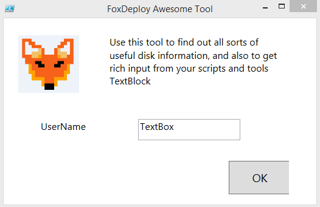
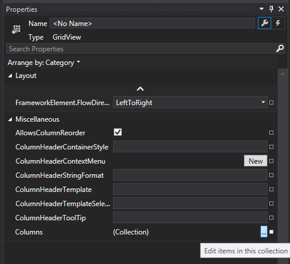
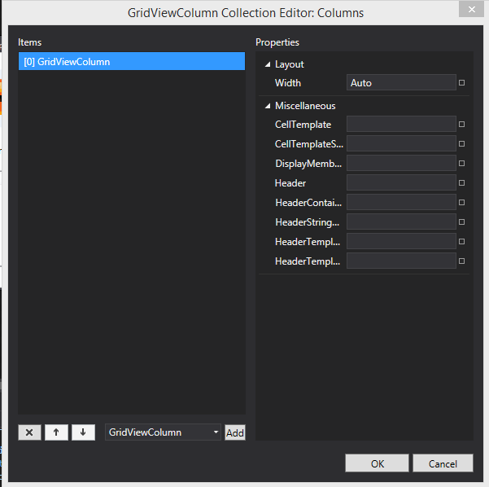
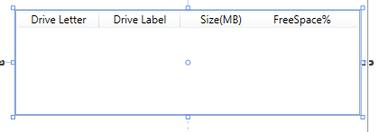
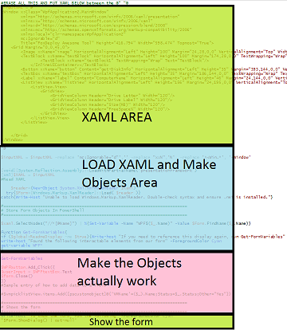

[](/series/LearningGUIs)

**This post is part of the Learning GUI Toolmaking Series, here on FoxDeploy. Click the banner to return to the series jump page!**

* * *

I got a lot of feedback last time, everyone wants the rest of the series, and you guys want it now! So I'm skipping my normal 1,000 word limit for this post and making this bad-boy LONG! There will still be a part three where I'll show you how to use some of the trickier form elements. Some of them are absolute hacks to make them work in PowerShell, so if you're the god of XAML and WPF, please have mercy on us mere-mortals and add some comments to let us know how I ought to be doing it.

Let's jump back in and take our finished XAMl from last time and put it into PowerShell.

## Whoa whoa, what's XAML

I don't know if you noticed this window. This whole time we've been adding elements, dropping boxes and text and things like that, it's been updating in real time!

  

The language here is XAML, (Extensible Application Markup Language) which is a Microsoft language built on XML to make very small but effective applications easily. We'll copy this code, but first, we need to make some changes to it before it will 'just work'.

If you want to use my example as the base for your GUI, you can copy this right into Visual Studio:




Basically, we need to remove some properties from the window declaration, and also remove the x: before each name. But don't do all of that by hand, just copy and paste it into this little blob I've made for you :)

## Importing this into PowerShell


 
_Updated January 2018 with better error catching!_

If you've taken a look at the blog article on the MS site which I linked last week, some of the above might look very familiar. In fact, I've added a bit of extra output to help us in troubleshooting (by dumping a list of all of the variables relating to objects on our form) and made this into a snippet, which you can download and embed in your own ISE.

That's a lot of code, but you only need to copy and paste your XAML from VisualStudio to PowerShell in between the here-string.

> What's a here-string?

_If you've never heard of a here-string, it’s a programming term for a multi-line variable that maintains spacing and allows for variable expansion. Long-story short, it's the @" "@ above._

When you've copied and pasted your XAML into the here-string above and hit F5 in the PowerShell ISE (or wherever you edit scripts), you'll see the following:


Our tool has scanned through the GUI and created hooks associated with every interactable element on the screen. We can now make changes to these things with code, just by changing their objects. This little display here is actually a function embedded in the code. You can run it again later if you forget the variable names by running Get-FormVariables.

As you see above, if we want to run the GUI, we just type in

```powershell   
>$Form.ShowDialog() | Out-Null

```



## Changing values on the GUI is easy!

Now, what if we wanted to do something a bit more complex, like change the value of the Text where it says 'TextBox'.

We need to hook into the properties that the tool displayed to us earlier. In this case, the name is $WPFTextBox. This is an object which this refers to the object on our form. That means we can change the text just by looking for a .text property on this object.

```powershell  
$WPFtextBox.Text >TextBox
```

If we change this with a simple equals statement…

```powershell  
$WPFtextbox.Text = 'Hello World'
```

[](http://foxdeploy.com/2015/04/16/part-ii-deploying-powershell-guis-in-minutes-using-visual-studio/hello-world/)

This is the basic flow we'll take to interact with all of our GUIs hence-forth. Draw something cool in Visual Studio, copy and paste it into the snippet, then run Get-FormVariables and see what the name is for our new cool GUI features (they're called 'Form controls' if we want to be specific). Then look at the new object and see what it's properties and methods are.

## But it doesn't work...

One last thing before we fully upgrade this into an awesome tool, let's try clicking the OK Button.

Nothing happens! Here's why: by default, we need to give our button an action to run when we click it. You do this using the Add\_Click() method, which lets us put a {script-block} into the () overload, which will be executed when the user clicks a button. This makes our buttons a great place to setup hooks if we want to grab the values from a box.

For instance, if we want our OK button to just close our form, we run this little number

> $WPFbutton.Add\_Click({$form.Close()})

After the form has closed, the value of all of these objects in the form still persist, so if the user made typed something like 'YoDawg' into our textbox, we can get it once the form is gone by running:

$WPFtextBox.Text

> YoDawg

Alright, let's make this into a WMI info gathering tool.

## Building a better WMI tool

I've got a tool that I walk people through making in my Learning PowerShell bootcamp course (if you want me to come deliver one at your company, send me a message!), in which we learn how to query WMI/CIM and then expand from there and make it do cool fancy stuffs. The output of the tool at the end of the day looks like this. 

[](http://foxdeploy.com/2015/04/16/part-ii-deploying-powershell-guis-in-minutes-using-visual-studio/driveinfo/)

We can make a GUI version of this by adding a ListView, which is pretty much embedding something like an Excel datasheet into this GUI. To do this, click ListView in the ToolBox and drag it to your form and size appropriately. You'll notice that I also made a few tweaks to the layout to better fit what we want this tool to do.

[](http://foxdeploy.com/2015/04/16/part-ii-deploying-powershell-guis-in-minutes-using-visual-studio/layout-pregridview/)

You can just barely make it out, but there is a grid there now, waiting to receive our beautiful rows and columns. Let's add some stuff, just a warning, this can be a bit tricky at first.

In Visual Studio, in the XAML, click the GridView Tag.

[](http://foxdeploy.com/2015/04/16/part-ii-deploying-powershell-guis-in-minutes-using-visual-studio/layout-click-gridview/)

In properties on the right, click 'Columns'

[](http://foxdeploy.com/2015/04/16/part-ii-deploying-powershell-guis-in-minutes-using-visual-studio/layout-addcolumns/) 

This will bring up the Column collection editor

[](http://foxdeploy.com/2015/04/16/part-ii-deploying-powershell-guis-in-minutes-using-visual-studio/column-editor/)

Now, in this area, you'll want to click the 'Add' button and change the width to about 100 for each, and specify the column name in the Header Box. I'll add one each for each of the fields my tool returns:

• Drive Letter • Drive Label • Size(MB) • FreeSpace%

As before, you can change the font by clicking on the area with text, then go to Properties>Text on the right side of the screen. When finished you should have something like this:

[](http://foxdeploy.com/2015/04/16/part-ii-deploying-powershell-guis-in-minutes-using-visual-studio/columns/)

If we want to make our buttons and form actually work though, we'll need to hook into the form again, as we did previously.

## Making all of the new stuff work

If you want to catch up with where we are now in the walkthrough, get this stuff:

https://gist.github.com/1RedOne/482fbcfdb6a081bafa1625fdb9e21249

If you scroll to the bottom, just below Get-FormVariables, you'll see an example of how to add data to a field. This part of our script is where the XAML has been parsed, and objects have been created to hook into them. This is where we'll need to put our magic sauce to make the buttons and fields work and do cool things.

[](http://foxdeploy.com/2015/04/16/part-ii-deploying-powershell-guis-in-minutes-using-visual-studio/where-to-make-changes/)

So, scroll down to the 'Make the Objects Actually Work' area.

First things first, take this snippet of code which accepts a computer name and returns the disk information:

```powershell 
Function Get-DiskInfo {
param($computername =$env:COMPUTERNAME)
 
Get-WMIObject Win32_logicaldisk -ComputerName $computername | 
  Select-Object @{Name='ComputerName';Ex={$computername}},`
          @{Name=‘Drive Letter‘;Expression={$_.DeviceID}},`
          @{Name=‘Drive Label’;Expression={$_.VolumeName}},`
          @{Name=‘Size(MB)’;Expression={[int]($_.Size / 1MB)}},`
          @{Name=‘FreeSpace%’;Expression={[math]::Round($_.FreeSpace / $_.Size,2)*100}}
        }
```

Here is what to do next.

- **I want my textbox to default to displaying my computer name**
- I want to add a trigger that when I click the Get-DiskInfo button, it should run the Get-DiskInfo function, using the computer name specified in the textbox
- Finally, I want to take the objects I get from that and for each of them, add a new row to my ListView area

Change your code to the following, beginning on line 61 (or just below Get-FormVariables)

```powershell
Function Get-DiskInfo {
param($computername =$env:COMPUTERNAME)
 
Get-WMIObject Win32_logicaldisk -ComputerName $computername | 
  Select-Object @{Name='ComputerName';Ex={$computername}},`
          @{Name=‘Drive Letter‘;Expression={$_.DeviceID}},`
          @{Name=‘Drive Label’;Expression={$_.VolumeName}},`
          @{Name=‘Size(MB)’;Expression={[int]($_.Size / 1MB)}},`
          @{Name=‘FreeSpace%’;Expression={[math]::Round($_.FreeSpace / $_.Size,2)*100}}
        }
 
$WPFtextBox.Text = $env:COMPUTERNAME
 
$WPFbutton.Add_Click({
Get-DiskInfo -computername $WPFtextBox.Text | % {$WPFlistView.AddChild($_)}
})
```

Let's run it and see what happen's when you click the button.

## If it breaks in a new way, I call that progress

[](http://foxdeploy.com/2015/04/16/part-ii-deploying-powershell-guis-in-minutes-using-visual-studio/layout-almost-there/)

Well, crap. Adding new rows worked, but now every column has the output for every property. This is happening because, very similar to when you work with the pipeline in PowerShell or make a function, you have to tell PowerShell how to bind to values.

To fix this, go up to your XAML for your GridView Columns and add a DisplayMemberBinding Property like this. Make sure if you're deviating from the walkthrough and doing your own thing to pick names that make sense. If your name has a space in it, use single quotes around it.

https://gist.github.com/1RedOne/b206eb919f97f5df0036e2a6a4610b0d

And the finished product:

[](http://foxdeploy.com/2015/04/16/part-ii-deploying-powershell-guis-in-minutes-using-visual-studio/done/)

## Whats up next?

Alright guys, I want to thank you for sticking with me to the end of this VERY long blog post. I hope you enjoy it and will use this technique to make some awesome GUIs of your own.

Join me for my post next time on this topic, part III in the GUI series, in which we dig into how to add some of the cooler and more difficult features to our GUI, like a tabbed interface (to get other WMI values) and how to use checkboxes and radio buttons, dropdown boxes and more!

[Part III - Using Advanced GUI Elements in PowerShell](https://foxdeploy.com/2015/05/14/part-iii-using-advanced-gui-elements-in-powershell/)

Final XAML Code here

https://gist.github.com/1RedOne/effdf04ad4c9b199bd4767e1e2fca68f

Full PowerShell Code here

```powershell 

#place your XAML below
$inputXML = @"
"@       
 
$inputXML = $inputXML -replace 'mc:Ignorable="d"','' -replace "x:N",'N'  -replace '^<Win.*', '<Window'
 
[void][System.Reflection.Assembly]::LoadWithPartialName('presentationframework')
[xml]$XAML = $inputXML
#Read XAML
 
    $reader=(New-Object System.Xml.XmlNodeReader $xaml)
try{$Form=[Windows.Markup.XamlReader]::Load( $reader )}
catch{Write-Warning "Unable to parse XML, with error: $($Error[0])`n Ensure that there are NO SelectionChanged properties (PowerShell cannot process them)"
    throw}
 
#===========================================================================
# Load XAML Objects In PowerShell
#===========================================================================
 
$xaml.SelectNodes("//*[@Name]") | %{"trying item $($_.Name)";
    try {Set-Variable -Name "WPF$($_.Name)" -Value $Form.FindName($_.Name) -ErrorAction Stop}
    catch{throw}
    }
Function Get-FormVariables{
if ($global:ReadmeDisplay -ne $true){Write-host "If you need to reference this display again, run Get-FormVariables" -ForegroundColor Yellow;$global:ReadmeDisplay=$true}
write-host "Found the following interactable elements from our form" -ForegroundColor Cyan
get-variable WPF*
}
 
Get-FormVariables
 
#===========================================================================
# Actually make the objects work
#===========================================================================
 
Function Get-DiskInfo {
param($computername =$env:COMPUTERNAME)
 
Get-WMIObject Win32_logicaldisk -ComputerName $computername | 
Select-Object @{Name='ComputerName';Ex={$computername}},`
              @{Name=‘Drive Letter‘;Expression={$_.DeviceID}},`
              @{Name=‘Drive Label’;Expression={$_.VolumeName}},`
              @{Name=‘Size(MB)’;Expression={[int]($_.Size / 1MB)}},`
              @{Name=‘FreeSpace%’;Expression={[math]::Round($_.FreeSpace / $_.Size,2)*100}}
            }
 
$WPFtextBox.Text = $env:COMPUTERNAME
 
$WPFbutton.Add_Click({
$WPFlistView.Items.Clear()
start-sleep -Milliseconds 840
Get-DiskInfo -computername $WPFtextBox.Text | % {$WPFlistView.AddChild($_)}
})
#Sample entry of how to add data to a field
 
#$vmpicklistView.items.Add([pscustomobject]@{'VMName'=($_).Name;Status=$_.Status;Other="Yes"})
 
#===========================================================================
# Shows the form
#===========================================================================
write-host "To show the form, run the following" -ForegroundColor Cyan
$Form.ShowDialog() | out-null

```

[Link to the ISE Snippet](http://foxdeploy.com/resources/ise-snippets/ "ISE Snippets")
