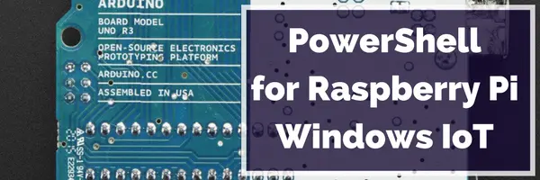

This is part of the **Learning Raspberry Pi Series** here on FoxDeploy.com. Click the banner for more Raspberry Pi and Windows!

* * *

**Symptom**

You're like me, and super excited to start playing with Windows 10 for the Internet of Things (IoT) on your Rasperry Pi 2.  But when running [the DISM commands from this post](http://ms-iot.github.io/content/win10/SetupRPI.htm), you see the following error:

 The drive cannot find the sector requested

**Reason**

This is sort of a very opaque error, and in this case, double-check that you're using a big enough SD card.  As it turns out, I accidentally picked up a 4 GB card, which is too small!  I think the specific cause of this error comes from the fact that the image in question won't actually fit on a card smaller than 8 GB, and thus the Deployment Image Servicing Management tool craps out trying to write to that sector.

**Solution**

Buy a bigger SD Card!  [Here's one which will work perfectly](http://amzn.to/1I2xN1M)!  When you're buying a Micro SD card, don't cheap out.  The quality matters and the class (the bin rate) of the card definitely matters.  Smaller cards are virtually identical to the larger capacity SD cards and the only difference is physical imperfections in the card, which can mean an earlier fail rate and other problems.