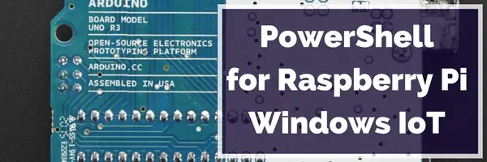
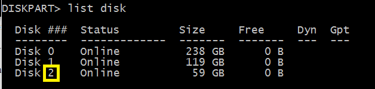
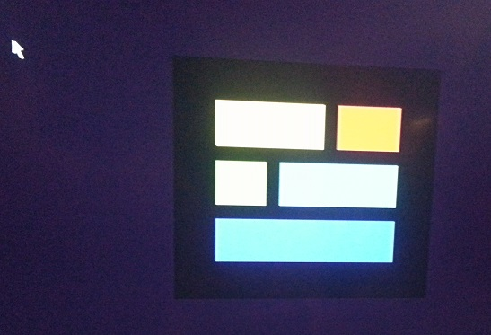
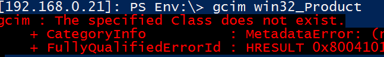

[](/series/LearningRaspberryPi)

This is part of the **Learning Raspberry Pi Series** here on FoxDeploy.com. Click the banner for more Raspberry Pi and Windows!

* * *

If you're like me, you got really excited to hear about the possibilities of running Windows 10 IoT preview on your Raspberry Pi 2.  I actually bought one just for a blog series on PowerShell and Raspberry Pi, so stay tuned for more!  Note: I did all of this while drinking some brewskies the other night.  If I can do it mildly intoxicated, then you can definitely do it sober.

### What you'll need

- Laptop / Desktop running Windows 10 Preview, can't be a VM as you'll need hardware access
- RaspBerry Pi 2:
    - [Base model](http://amzn.to/1E9uGQ5)
    - [Fancy Smancy kit](http://amzn.to/1E9v2Ge) - I bought this one.  You'll _really_ want to put a heat sink on the CPU and GPU, this thing gets super hot.  This kit includes it.
- [8 GB or higher Class 10 Micro SD Card](http://amzn.to/1KGOdMY).  Don't buy an off-brand or you're begging for pain!
- Sign-up for the [Windows Connect Program here](https://connect.microsoft.com/windowsembeddediot/SelfNomination.aspx?ProgramID=8558) and click through all of the EULAs to enable the download tab.  Download the .zip file and unzip it.
- Optional : SD Card reader if you don't have one

### How to get it up and running

1. Download the .ffu file listed above.
2. Go to your Win 10 preview machine, use DiskPart to figure out which disk your SD Card is.  This will likely be the smallest disk when you run diskpart - List Disk .  Grab the disk number.
    
     Whoa Stephen, 64 GB, you must be a baller. That's right, I make literally upwards of $8 an hour.
3. Change into the directory where you put your .ffu file
4. Run this cmd
    
    `dism.exe /Apply-Image /ImageFile:flash.ffu /ApplyDrive:\\\\.\\PhysicalDriveN /SkipPlatformCheck`

    
5. When you see 100% you're done!  Put the SD Card in your Raspberry Pi 2 and boot her up.

### What's it like?

Plug in, connect network and boot.  Done.  It takes forever to boot, like five mins.  You'll first see a random Blue debugging screen with some clickable elements that don't actually work.

 You can click these on the left, 'App' and 'MiraCast/View' but they don't actually do anything

You can ignore that, and then the system will reboot, showing you the cool new logo of Windows 10 IoT.



> Man, FoxDeploy, this is a terrible screen shot. Were you drunk taking a picture of your TV? Uh...yes. Yes I was.

Eventually you'll end up on a page like this, showing you the IP to manage this bad boy.


There is a program you can also find in the .zip from earlier, which runs only on Windows 10 PCs.  It looks like this.

[](http://foxdeploy.com/2015/05/04/super-fast-walkthrough-running-win10-preview-on-raspberry-pi-2-and-whats-it-like/iotwatcher_nocontextmenu/)

You can right-click items here to jump into a network Share, or open a Web browser.

[](http://foxdeploy.com/2015/05/04/super-fast-walkthrough-running-win10-preview-on-raspberry-pi-2-and-whats-it-like/iotwatcher/)

You can open that IP in your browser for a very useful web management tool.

 You can also check process performance, which shows you a very sexy looking performance graph viewer


 How'd you put load on the Pi? By launching a PowerShell session.

Remote PowerShell works, just add the PC to your trustedHosts like using the WSman Cmdlets, and if you're remoting from Win10, disable the PS ReadLine module (it will cause errors).  [For more info, follow the guide here](http://ms-iot.github.io/content/win10/samples/PowerShell.htm).

Remoting performance to the Reaspberry Pi is very, very slow.  VERY slow.  But it's a work in progress.

My transcript of how I connected:

```powershell    
set-Item WSMan:\\localhost\\Client\\TrustedHosts 10.63.30.54

WinRM Security Configuration. This command modifies the TrustedHosts list for the WinRM client. The computers in the TrustedHosts list might not be authenticated. The client might send credential information to these computers. Are you sure that you want to modify this list? \[Y\] Yes \[N\] No \[S\] Suspend \[?\] Help (default is "Y"): y 

PS C:\\WINDOWS\\system32> Enter-PSSession -ComputerName 10.63.30.54 -Credential 10.63.30.54\\Administrator \[10.63.30.54\]: PS C:\\Users\\Administrator\\Documents> 
```

Digging into the covers, you'll see some weirdness...like no MSI class or Win32\_Product classes :(

[](http://foxdeploy.com/2015/05/04/super-fast-walkthrough-running-win10-preview-on-raspberry-pi-2-and-whats-it-like/nomsiclass/)

### What's next?

Well, from here on in, we'll try to find some cool stuff on the Raspberry Pi.  My next to-do's include finding temperature sensors, if they exist, and finding some other cool stuff we can run on the Pi from remote PowerShell.
